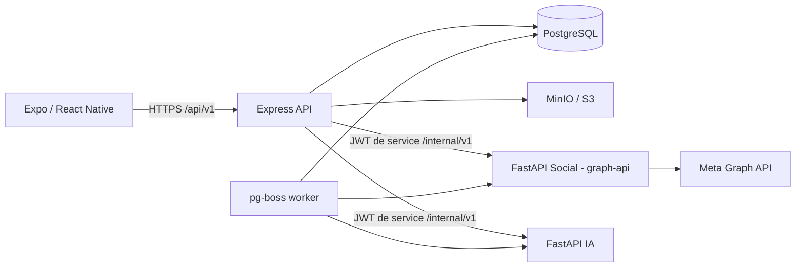

# Décisions d'architecture — Sprint 01

## Décisions validées

| ID | Décision | Motif |
|---|---|---|
| ADR-01 | Un monorepo avec les services sous `services/` | Le mobile et `graph-api` sont déjà côte à côte ; cette organisation simplifie les contrats, Compose et la CI sans réécrire l'existant. |
| ADR-02 | Express est la seule façade publique mobile | Le mobile n'accède ni directement à PostgreSQL ni à Meta. L'API porte l'authentification, l'autorisation et le contrat `/api/v1`. |
| ADR-03 | `graph-api` reste le service social FastAPI | Les fonctions Facebook existantes sont conservées derrière des routes internes versionnées. |
| ADR-04 | Un FastAPI IA séparé | L'entraînement, les dépendances NLP et les temps de calcul ne doivent pas coupler l'API publique. |
| ADR-05 | PostgreSQL + Prisma | Prisma est le seul propriétaire des migrations de données métier côté TypeScript. |
| ADR-06 | pg-boss pour les travaux différés | Les publications, synchronisations et retries sont persistants dans PostgreSQL ; aucun job n'est confié au téléphone. |
| ADR-07 | MinIO compatible S3 pour le local | Les médias sont gérés hors de PostgreSQL et pourront être déplacés vers S3 en staging/production. |
| ADR-08 | MVP média = images JPEG, PNG et WebP | Les vidéos et carrousels restent hors du MVP du Sprint 04 jusqu'à validation des capacités Meta. |
| ADR-09 | Langues UI : français, anglais, arabe ; IA MVP : français | L'UI expose déjà ces trois langues. Au Sprint 09, l'IA doit annoncer une indisponibilité ou faible confiance hors français, plutôt que simuler une qualité non validée. |

## Topologie cible

## Limites de confiance

- Les JWT utilisateur ne sont acceptés que par l'API Express.
- Les échanges Express ↔ Social et Express/worker ↔ IA utiliseront des JWT de service avec `aud`, scopes et courte durée de vie.
- Les tokens Meta restent chiffrés côté serveur et ne transitent jamais vers le mobile.
- Les routes Facebook héritées restent disponibles temporairement pour compatibilité, mais les nouveaux appels passeront par `/internal/v1` après le Sprint 05.

## Environnements

| Environnement | Usage | Données externes |
|---|---|---|
| Local | Compose, données de démonstration et `AI_MODEL_MODE=stub` | aucun appel Meta requis |
| Staging | Recette, callbacks OAuth et webhooks dédiés | comptes et application Meta de test |
| Production | Exploitation | secrets injectés, HTTPS, monitoring et sauvegardes |

## Questions clôturées ou reportées sans bloquer le Sprint 02

- La structure est un monorepo : décision ADR-01.
- Le périmètre MVP média et IA est fixé par ADR-08 et ADR-09.
- La version et les permissions Meta ne sont pas devinées : leur vérification est une tâche explicite du Sprint 06/07, avant toute mise en production de ces intégrations.
