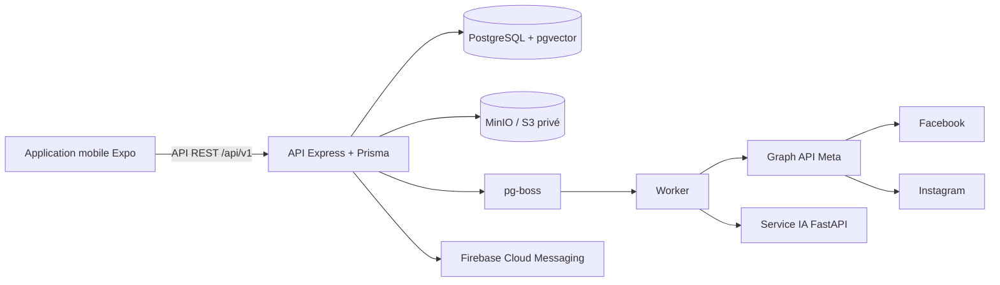

# Hootly — documentation des fonctionnalités

> **État de la documentation :** version correspondant au code présent dans le dépôt au 14 septembre 2026.  
> Hootly est une application de gestion de communauté qui centralise les publications, les commentaires, les comptes Meta, l’assistance IA, la base de connaissances, les notifications et les indicateurs de performance.

Cette page décrit le comportement réellement disponible dans l’application mobile Expo et dans les services du monorepo. Les éléments explicitement signalés comme une limite ou une option de configuration ne doivent pas être considérés comme disponibles dans toutes les installations.

## 1. Vue d’ensemble

Hootly suit ce flux :



- **Mobile** : interface de connexion, tableau de bord, publications, calendrier, commentaires, réponses IA, analytics et paramètres.
- **API publique** (`services/api`, port 3000) : authentification, contrôle d’accès par marque, règles métier et persistance.
- **Worker** (`services/worker`, port 3001) : publications planifiées, synchronisations, analyses et notifications asynchrones.
- **Passerelle sociale** (`graph-api`, port 8000) : OAuth, publication et lecture des données Facebook/Instagram.
- **Service IA** (`services/ai-service`, port 8080) : analyse des commentaires, génération de réponses, sécurité et RAG.
- **Stockage** : PostgreSQL pour les données métier, pgvector pour les embeddings, MinIO/S3 pour les médias privés.

## 2. Démarrer l’application

### Installation locale

À la racine du dépôt :

```powershell
Copy-Item .env.example .env
Copy-Item social-media/.env.example social-media/.env
npm --prefix services/api install
npm --prefix services/worker install
npm --prefix social-media install
./scripts/start.ps1
./scripts/seed.ps1
```

Le mobile se lance ensuite avec :

```powershell
npm --prefix social-media start
```

Modifier `social-media/.env` si nécessaire pour définir `EXPO_PUBLIC_API_URL` selon l’émulateur ou l’appareil utilisé.

Adresses locales :

| Service | Adresse |
|---|---|
| API | `http://localhost:3000` |
| Graph API | `http://localhost:8000` |
| IA | `http://localhost:8080` |
| Worker | `http://localhost:3001` |
| MinIO | `http://localhost:9000` |

Sur émulateur Android, l’URL de l’API est généralement `http://10.0.2.2:3000`. Sur un téléphone physique, elle doit pointer vers l’adresse IP LAN de la machine qui exécute l’API.

Le jeu de données de démonstration crée l’utilisateur `lea@studio-vega.fr` avec le mot de passe `ChangeMe123!` et la marque **Studio Vega**. Il ne crée pas de compte Meta réel. Pour tester les publications sans identifiants Meta, régler `SOCIAL_PROVIDER_MODE=mock` dans `.env`.

### Vérifications utiles

```powershell
./scripts/verify-readiness.ps1
./scripts/test.ps1
npm --prefix social-media run typecheck
npm --prefix social-media run lint
```

## 3. Accès et rôles

Chaque donnée est rattachée à une marque active. L’API vérifie l’appartenance et le rôle côté serveur ; un `brandId` envoyé par le mobile ne suffit jamais à obtenir un accès.

| Rôle | Lecture | Publications, commentaires, synchronisation | Réglages IA et marque | Archivage de la marque |
|---|---:|---:|---:|---:|
| `VIEWER` | Oui | Limité à la lecture | Non | Non |
| `COMMUNITY_MANAGER` | Oui | Oui | Non | Non |
| `ADMIN` | Oui | Oui | Oui | Non |
| `OWNER` | Oui | Oui | Oui | Oui |

Les routes d’une marque inexistante ou inaccessible répondent `404` afin de ne pas révéler son existence. Les modifications concurrentes des réglages IA utilisent une version attendue et renvoient `409` en cas de conflit.

## 4. Fonctionnalités mobiles

### 4.1 Connexion et compte

Écrans : `/register`, `/login`, `/forgot-password`, `/reset-password`, `/profile`, `/settings/security`, `/settings/delete-account`.

- Création de compte avec prénom, nom, adresse e-mail, mot de passe (au moins 8 caractères, avec majuscule, minuscule et chiffre), langue (`fr`, `en`, `ar`) et fuseau IANA.
- Connexion, renouvellement automatique de session et déconnexion.
- Mot de passe oublié et réinitialisation par jeton. La demande de réinitialisation renvoie toujours un message générique afin de ne pas divulguer si l’adresse existe.
- Modification du profil : prénom, nom, nom affiché, téléphone, langue et fuseau horaire.
- Gestion des sessions : liste des sessions, révocation d’une session ou de toutes les autres sessions.
- Changement de mot de passe.
- Suppression du compte après confirmation du mot de passe. Les sessions sont révoquées ; les publications planifiées et les comptes sociaux détenus exclusivement par l’utilisateur sont traités par le serveur selon les règles de conservation.
- Les jetons d’accès sont conservés dans SecureStore sur mobile (sessionStorage sur le Web). Le refresh token est rotatif et n’est jamais journalisé.
- Après une réponse `401`, le client tente une seule fois de renouveler l’access token ; si le renouvellement échoue, la session locale est vidée.

### 4.2 Accueil et tableau de bord

Écran : `/home`.

L’accueil affiche pour la marque active :

- le nombre de publications planifiées ;
- les commentaires nouveaux et prioritaires ;
- les réponses IA en attente de décision ;
- les commentaires prioritaires à traiter ;
- les prochaines publications ;
- les comptes sociaux connectés et les comptes nécessitant une reconnexion ;
- un résumé analytics, avec la date de dernière synchronisation ;
- des raccourcis vers créer une publication, le calendrier, les commentaires, les comptes sociaux et la synchronisation.

Les valeurs absentes sont affichées **Non disponible** et ne sont jamais remplacées par un zéro fictif. Les boutons de simulation des états (hors ligne, erreur de lecture, IA indisponible) sont réservés au développement.

### 4.3 Marques et réglages IA

Écran : `/settings/brand`.

Une marque possède une identité (nom, description, secteur et langue principale) et des règles de rédaction :

- ton professionnel, amical, empathique, formel ou personnalisé ;
- degré de formalité et usage des emojis ;
- longueur courte, moyenne, longue ou libre ;
- formule d’accueil et de conclusion ;
- termes interdits et termes recommandés ;
- consignes générales, traitement des réclamations, urgences, support et escalade.

Il est possible de créer une marque lorsqu’aucune marque active n’existe et de changer de marque active lorsqu’un compte en possède plusieurs. Les réglages IA sont versionnés pour éviter qu’une sauvegarde écrase une modification plus récente.

### 4.4 Connexion Facebook et Instagram

Écrans : `/settings/social-accounts`, `/oauth/callback`.

- Connexion Facebook ou Instagram par OAuth dans le navigateur système.
- Facebook découvre les Pages accessibles et les comptes Instagram professionnels liés à ces Pages.
- Instagram Login direct est également prévu pour le parcours sans Page, si l’application Meta correspondante est configurée.
- Affichage du réseau, du nom du compte, de son état et des permissions accordées ou refusées.
- Synchronisation manuelle, renouvellement des permissions et reconnexion lorsqu’un jeton expire.
- Déconnexion avec confirmation ; le serveur révoque le compte et supprime le jeton chiffré.
- États pris en charge : connecté, en renouvellement, expiré, reconnexion requise, révoqué et déconnecté.

Les jetons Meta sont chiffrés en AES-256-GCM côté serveur. Ils ne sont jamais envoyés ni stockés dans le mobile. Les opérations de connexion, synchronisation et suppression exigent au minimum le rôle `ADMIN`.

### 4.5 Publications

Écrans : `/publications`, `/publications/new`, `/publications/[id]`, `/publications/[id]/edit`, `/publications/[id]/schedule`.

#### Création

Le compositeur permet de saisir :

- un texte de 1 à 5 000 caractères ;
- des hashtags (jusqu’à 30, 80 caractères chacun) ;
- une image ;
- une ou plusieurs cibles parmi Facebook et Instagram ;
- un texte adapté par réseau lorsque le contenu diffère entre les cibles.

Actions disponibles : enregistrer comme brouillon, planifier, publier immédiatement, générer des hashtags, revenir sans perdre silencieusement les modifications et confirmer une publication immédiate.

La génération de hashtags est effectuée par le serveur à partir du texte, des mots-clés de la marque et des hashtags déjà conservés. Elle n’invente pas de thème absent du contenu.

#### Cycle de vie

Les états sont `draft`, `scheduled`, `publishing`, `published`, `partially_published`, `failed` et `cancelled`.

- Un brouillon peut être modifié ou supprimé.
- Une publication planifiée peut être modifiée ou annulée ; l’annulation la remet en brouillon.
- Une publication en cours ou déjà publiée n’est plus modifiable. Une publication publiée peut être dupliquée.
- Une publication partiellement publiée ou en échec expose le statut et l’erreur de chaque cible, le nombre de tentatives et une action de relance.
- La publication immédiate et la relance renvoient `202 Accepted` et un `jobId` ; le worker effectue ensuite l’envoi.
- Une clé `Idempotency-Key` empêche un double envoi accidentel pendant 24 heures.

La fiche détail affiche le texte, les médias, les hashtags, le fuseau, les dates, les cibles, les erreurs, les tentatives, les commentaires liés et les métriques disponibles. Elle donne accès à modifier, planifier, publier, relancer, dupliquer, supprimer et ouvrir les analytics de la publication.

### 4.6 Médias

Écran : `/media-picker`.

- Sources disponibles : galerie et appareil photo.
- Formats acceptés : JPEG, PNG et WebP.
- Taille maximale : 8 Mo.
- Dimensions minimales : 320 × 320 pixels.
- Barre de progression pendant l’upload multipart.
- Une marque active est requise pour déposer le média.
- Le média n’est lié au brouillon qu’après confirmation de l’upload serveur.
- Les fichiers sont stockés dans un bucket privé ; le mobile reçoit des URL signées temporaires.
- Le périmètre actuel est limité à **une image par publication**.

### 4.7 Planification et calendrier

Écrans : `/calendar`, `/publications/[id]/schedule`.

- Choix d’un jour, d’une heure par pas de 30 minutes et du fuseau horaire.
- Vue mensuelle avec points de statut et vue journalière avec la liste des publications.
- Navigation mois précédent, mois suivant et retour à aujourd’hui.
- Création d’une publication depuis le calendrier et accès à la fiche d’une publication.
- Une date passée est refusée ; le serveur convertit l’heure locale en instant ISO avant de créer le job.
- Le formulaire expose un choix de rappel avant envoi. L’endpoint de planification actuel persiste toutefois uniquement la date, l’heure et le fuseau ; aucun rappel distinct n’est encore envoyé.

### 4.8 Boîte de réception des commentaires

Écrans : `/comments`, `/comments/[id]`, `/comments/[id]/history`.

La liste permet de rechercher dans l’auteur ou le texte et de filtrer par :

- réseau Facebook/Instagram ;
- publication ;
- sentiment positif, neutre ou négatif ;
- intention (question, réclamation, demande d’information, affirmation ou autre) ;
- priorité faible, moyenne ou haute ;
- statut nouveau, traité, ignoré ou escaladé ;
- tri récent ou priorité.

Une synchronisation manuelle est possible. La synchronisation automatique et les webhooks Meta alimentent la même boîte de réception ; les événements reçus deux fois sont dédupliqués.

La fiche d’un commentaire montre la publication d’origine, l’auteur, la date, le statut, l’analyse IA, le niveau de confiance, l’urgence, la sensibilité, l’action recommandée et l’historique. Les actions sont analyser, réanalyser, marquer traité, ignorer ou escalader (avec confirmation).

### 4.9 Réponses assistées par IA

Écran/modal : `/comments/[id]/response`.

Le community manager peut :

- générer ou régénérer une proposition ;
- choisir la langue (automatique, français, anglais, arabe), le ton et une consigne ;
- éditer une réponse de 500 caractères maximum ;
- consulter les avertissements de sécurité ;
- voir les sources RAG utilisées (titre, score et exemples similaires) ;
- enregistrer un brouillon, rejeter la proposition ou fournir une note de 1 à 5 et un motif ;
- valider une modification puis approuver et envoyer.

Le texte original généré, les versions éditées et le texte final sont conservés. Un texte bloqué par la sécurité ne peut pas être approuvé tant qu’il n’est pas corrigé. Les termes interdits demandent une confirmation supplémentaire. L’envoi au réseau social ne peut être déclenché qu’après une approbation serveur ; la réponse n’est jamais envoyée directement par le service IA.

L’historique `/comments/[id]/history` est en lecture seule et permet de comparer la proposition initiale, les versions et le texte envoyé.

### 4.10 Base de connaissances et RAG

Écrans : `/knowledge`, `/knowledge/[id]`.

- Création et modification d’une entrée texte.
- Import PDF, DOCX, TXT ou CSV depuis le sélecteur de documents.
- Types : FAQ, produit, service, politique, SAV, consigne, ton de marque ou autre.
- Marquage **interne** : utilisable par l’équipe, mais exclu des réponses publiques.
- Statuts d’indexation : `PENDING`, `INDEXING`, `READY`, `FAILED`.
- Affichage du nombre de passages et de l’erreur d’import éventuelle.
- Réindexation et suppression.

Les documents sont découpés et vectorisés avec `intfloat/multilingual-e5-small` (vecteurs de dimension 384). Le seuil par défaut est `RAG_MIN_SIMILARITY=0.86`, avec au plus 10 résultats (5 pour une génération). Le score mesure la proximité sémantique, pas la véracité de la source. Si le contexte est insuffisant, la réponse reçoit un avertissement bloquant au lieu d’être présentée comme certaine.

Un import est limité à 10 MiB, à 250 000 caractères extraits, à 200 pages pour un PDF et à 256 passages indexés. Les PDF scannés nécessitant de l’OCR ne sont pas exploitables ; le binaire original n’est pas conservé après extraction.

### 4.11 Analytics

Écrans : `/analytics`, `/analytics/publications/[id]`.

Filtres globaux : période de 7, 30 ou 90 jours et réseau tous, Facebook ou Instagram.

Indicateurs disponibles lorsque Meta les fournit : réactions, commentaires, partages, portée, impressions et engagement. L’écran propose aussi :

- évolution des interactions sur quatre semaines ;
- répartition des sentiments ;
- commentaires négatifs et urgents ;
- réponses générées et envoyées ;
- publications les plus performantes ;
- comparaison Facebook/Instagram ;
- date de dernière synchronisation et permissions manquantes.

La page d’une publication reprend ses métriques par réseau, ses commentaires, le sentiment, les urgences et les réponses. Les métriques non accessibles sont explicitement signalées comme indisponibles.

### 4.12 Notifications

Écrans : `/notifications`, `/settings/notifications`.

La boîte de réception possède les filtres toutes, non lues, prioritaires et erreurs. Chaque notification peut être marquée comme lue, ou toutes peuvent l’être en une action. Un appui ouvre la ressource concernée (commentaire, publication ou réglage des comptes sociaux).

Préférences disponibles :

- commentaires négatifs, urgents et prioritaires ;
- nouvelle réponse IA ;
- publication réussie, échouée ou partielle ;
- jeton arrivant à expiration ou expiré ;
- échec de synchronisation ;
- seuil minimal de priorité ;
- plages silencieuses prédéfinies ;
- son et vibration.

Les événements sont dédupliqués par `eventId`. Firebase Cloud Messaging est un canal de livraison facultatif ; l’API et la base restent la source de vérité.

Le type d’événement `sync_failed` est prévu dans les préférences et dans le routage, mais aucun producteur métier dédié ne le déclenche encore dans la version actuelle.

Le bouton de notification de test présent dans les réglages affiche une confirmation locale ; il ne constitue pas un test d’envoi FCM de bout en bout.

### 4.13 Paramètres, confidentialité et mentions légales

Depuis `/settings`, l’utilisateur accède au profil, à la sécurité, à la marque et aux réglages IA, à la base de connaissances, à la qualité IA, aux comptes sociaux, aux notifications, au calendrier, aux conditions d’utilisation, à la politique de confidentialité et à la suppression du compte.

Les écrans de conditions et de confidentialité sont disponibles en contenu statique. Le bouton **Exporter mes données** affiche actuellement une confirmation locale indiquant qu’un e-mail sera envoyé ; aucun endpoint d’export automatisé n’est encore branché.

## 5. API publique

Toutes les routes mobiles sont préfixées par `/api/v1`. Une réussite utilise l’enveloppe `{ data, meta: { requestId } }`. Les listes ajoutent une pagination ; une erreur utilise `{ error: { code, message, details?, requestId } }`.

| Domaine | Routes principales |
|---|---|
| Authentification | `/auth/register`, `/login`, `/refresh`, `/logout`, `/me`, `/forgot-password`, `/reset-password`, `/change-password`, `/sessions`, `/account` |
| Profil | `/profile`, `/profile/preferences`, `/profile/avatar` |
| Marques | `/brands`, `/brands/:brandId`, `/brands/:brandId/activate`, `/brands/:brandId/ai-settings` |
| Médias | `POST /media`, `GET/DELETE /media/:id` |
| Publications | `/publications`, `/publications/counts`, `/publications/:id`, `/publications/:id/schedule`, `/publications/:id/publish`, `/publications/:id/retry` |
| Calendrier | `/calendar` |
| Comptes sociaux | `/social-accounts`, `/:provider/connect`, `/oauth/status`, `/:id/sync`, `/:id` |
| Commentaires | `/comments`, `/comments/counts`, `/comments/sync`, `/comments/:id`, `/comments/:id/history`, `/comments/:id/status`, `/comments/:id/analyze`, `/comments/:id/reanalyze`, `/comments/:id/escalate`, `/comments/:id/reply` |
| Réponses IA | `/response-suggestions` et l’alias `/ai/responses` : création, liste, édition, approbation, rejet, régénération |
| Hashtags | `POST /publications/generate-hashtags` |
| Connaissances | `/knowledge`, `/knowledge/:id`, `/knowledge/:id/reindex` |
| IA / RAG | `/ai/retrieve`, `/ai/feedback/stats`, `/ai/feedback/dataset` |
| Notifications | `/notifications`, `/notifications/unread-count`, `/notifications/:id/read`, `/notifications/read-all`, `/device-tokens`, `/notification-settings` |
| Analytics | `/analytics/sync`, `/analytics/summary`, `/analytics/timeline`, `/analytics/top-publications`, `/analytics/networks-comparison`, `/analytics/sentiments`, `/analytics/priorities`, `/analytics/publications/:publicationId` |
| Dashboard | `/dashboard/summary`, `/dashboard/priority-comments`, `/dashboard/upcoming-publications` |

Codes d’erreur fréquents : `validation_failed` (400), `authentication_required` ou `token_expired` (401), `forbidden` (403), `not_found` (404), `conflict` ou `idempotency_conflict` (409), `unprocessable` (422), `rate_limited` (429), `provider_unavailable` (502–504), `media_too_large` (413), `media_type_not_allowed` (415), `media_not_ready` (422), `storage_unavailable` (503) et `ai_unavailable` (503).

Les sondes `/health`, `/ready` et `/openapi.json` sont hors versionnement. Les routes interservices utilisent `/internal/v1` et un JWT de service distinct du JWT mobile.

## 6. Traitements asynchrones et fiabilité

Le worker utilise pg-boss et les files suivantes :

- `publish-scheduled-publication` ;
- `publish-publication-now` ;
- `retry-failed-publication` ;
- `cleanup-temporary-media` ;
- `refresh-expiring-oauth-tokens` ;
- `sync-social-comments` ;
- `analyze-social-comments` ;
- `sync-social-metrics`.

Les publications sont verrouillées par cible, avec une clé d’idempotence par tentative. Les erreurs temporaires sont réessayées avec un délai de 1 minute, 5 minutes, 15 minutes puis 1 heure, jusqu’à cinq tentatives. Les états intermédiaires restent visibles dans l’application.

La synchronisation des commentaires combine les webhooks Meta et une tâche de rattrapage périodique (environ 15 minutes). Les synchronisations de métriques sont lancées depuis l’analytics. Les notifications sont créées par l’API via une route interne appelée par le worker.

## 7. IA, modèles et sécurité

### Analyse des commentaires

Le modèle local est entraîné à partir de `services/ai-service/dataset/comments.v1.jsonl`. Il produit sentiment, intention, priorité, confiance, urgence, sensibilité, action recommandée, explication et signaux détectés. La confiance est la plus faible des confiances sentiment/intention ; elle ne constitue pas une garantie de vérité.

### Génération

`AI_GENERATION_MODE=local` utilise le générateur déterministe piloté par les paramètres de marque et fonctionne sans accès réseau. `AI_GENERATION_MODE=llm` peut utiliser Claude si `ANTHROPIC_API_KEY` est configurée ; le service revient automatiquement au générateur local en cas d’indisponibilité.

Le service IA n’a aucun accès direct aux comptes sociaux. Il propose et contrôle du texte ; seul l’endpoint d’approbation puis `/comments/:id/reply` peut déclencher l’envoi.

### Contrôles appliqués

- longueur maximale de 500 caractères ;
- termes interdits ;
- contenu bloqué ou nécessitant une confirmation ;
- contexte RAG insuffisant ;
- conservation de la proposition initiale, des sources et des versions humaines ;
- statistiques de qualité : générées, acceptées, éditées, rejetées, régénérées, confiance, distance d’édition, durée et notation.

## 8. Intégrations sociales

La passerelle `graph-api` expose les opérations Facebook et Instagram et conserve un connecteur commun :

- publication d’une image Instagram via création de conteneur, attente de l’état `FINISHED`, puis `media_publish` ;
- publication Facebook et lecture des commentaires/réponses ;
- métriques, insights et statistiques lorsque les permissions Meta le permettent ;
- webhooks de commentaires et renouvellement des jetons ;
- pagination par curseur.

Les anciennes routes publiques `/facebook/*` restent présentes pour compatibilité. Le mobile utilise les routes Express `/api/v1`; les routes interservices `/internal/v1` sont protégées par audience JWT de service.

Ces routes de compatibilité couvrent également les posts, les publications planifiées, les commentaires et réponses, les statistiques/insights, les statistiques du community manager et les stories. Elles ne sont pas accessibles depuis la navigation mobile actuelle.

En mode `mock`, les marqueurs de démonstration permettent de reproduire des erreurs : `[[TIMEOUT]]`, `[[FAIL_TEMP]]`, `[[FAIL_PERM]]`, `[[FAIL_FACEBOOK]]` et `[[FAIL_INSTAGRAM]]`.

## 9. Configuration opérationnelle

Les variables principales sont :

| Variable | Rôle |
|---|---|
| `DATABASE_URL` | PostgreSQL |
| `SOCIAL_SERVICE_URL`, `AI_SERVICE_URL`, `API_SERVICE_URL` | communication entre services |
| `SOCIAL_PROVIDER_MODE` | `live` pour Meta, `mock` pour la démonstration |
| `FACEBOOK_APP_ID`, `FACEBOOK_APP_SECRET`, `INSTAGRAM_APP_ID`, `INSTAGRAM_APP_SECRET` | OAuth Meta |
| `SOCIAL_SERVICE_PUBLIC_URL`, `META_WEBHOOK_VERIFY_TOKEN` | callbacks et webhooks |
| `SERVICE_JWT_SECRET`, `JWT_ACCESS_SECRET` | authentification interservices et mobile |
| `TOKEN_ENCRYPTION_KEY_*` | chiffrement et rotation des jetons Meta |
| `S3_ENDPOINT`, `S3_PUBLIC_ENDPOINT`, `MEDIA_BUCKET`, `MEDIA_MAX_BYTES` | médias |
| `AI_GENERATION_MODE`, `ANTHROPIC_API_KEY` | génération de réponses |
| `RAG_MIN_SIMILARITY` | seuil de recherche RAG |
| `FIREBASE_PROJECT_ID`, `FIREBASE_CLIENT_EMAIL`, `FIREBASE_PRIVATE_KEY` | push FCM facultatif |

Les secrets et les fichiers `.env` ne doivent jamais être commités. En production, remplacer toutes les valeurs de développement, utiliser HTTPS pour OAuth, faire tourner les clés de chiffrement et limiter les permissions des comptes Meta.

Les routes d’identification sont limitées à 10 tentatives sur 15 minutes ; les demandes de réinitialisation sont limitées à 5 par heure. La passerelle sociale applique par défaut une limite de 120 requêtes par minute et ajoute un identifiant de corrélation `x-request-id`.

## 10. Limites connues de la version actuelle

- La source **Fichiers** du sélecteur média affiche une information de prochaine version ; galerie et appareil photo fonctionnent.
- La sélection d’un avatar est affichée dans le profil, mais l’upload binaire n’est pas implémenté dans l’écran actuel (l’API ne gère que les métadonnées).
- Le push natif est réellement enregistré sur Android. Le parcours iOS nécessite encore un projet natif et le pont APNs/Firebase correspondant.
- Les messages push sont data-only : une notification reçue recharge la ressource via REST. Une application totalement arrêtée peut nécessiter une réouverture ; le contenu métier n’est jamais considéré comme fiable dans le payload.
- Les préférences son et vibration sont enregistrées, mais ne modifient pas encore le comportement natif.
- Le bouton d’export des données est une interface d’attente et ne lance pas encore un export serveur.
- Une seule image est supportée par publication ; les carrousels, vidéos et stories ne font pas partie du compositeur mobile actuel.
- Les vraies publications et métriques Meta exigent des identifiants, permissions et comptes configurés. Les tests du dépôt utilisent des appels Meta simulés.
- L’IA locale est déterministe. Le mode LLM est optionnel et reste côté serveur ; il n’est pas nécessaire au fonctionnement hors ligne de la démonstration.
- Les métriques et scores RAG peuvent être indisponibles selon les permissions ou les données remontées par Meta ; l’application le signale explicitement.
- Les boutons de démonstration des états réseau et IA sont uniquement disponibles en développement.

## 11. Documentation technique associée

- [Contrats API](CONTRATS_API.md) — enveloppes, pagination, authentification et codes d’erreur.
- [Publications, médias et scheduler](SPRINT_04_PUBLICATIONS_MEDIAS_SCHEDULER.md).
- [OAuth et comptes multiples](SPRINT_06_OAUTH_MULTI_COMPTES_TOKENS.md).
- [Intégration Instagram](SPRINT_07_INSTAGRAM_INTEGRATION.md).
- [Webhooks et synchronisation des commentaires](SPRINT_08_WEBHOOKS_COMMENTAIRES_SYNCHRO.md).
- [NLP et analyse des commentaires](SPRINT_09_NLP_DATASET_ANALYSE.md).
- [Génération et workflow IA](SPRINT_10_LANGGRAPH_REPONSES_HASHTAGS.md).
- [Notifications Firebase](SPRINT_11_FIREBASE_NOTIFICATIONS.md).
- [Analytics](SPRINT_12_ANALYTICS_REPORTING.md).
- [RAG et feedback humain](RAG_FEEDBACK_HUMAIN.md).
