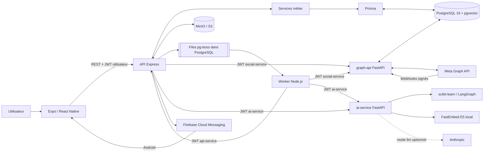

# Rapport de phase 1 — cartographie globale

Exploration réalisée sur la branche `backend-develop`, commit `ca5f7bd` (`concurrence`).

Lors de l'exploration initiale, aucun fichier n'avait été créé ou modifié et aucun build, migration, test ou appel métier vers Meta, Firebase ou Anthropic n'avait été lancé.

## 1. Résumé du projet

**CONFIRMÉ** — Hootly est un monorepo de gestion de communautés et de réseaux sociaux composé de :

- une application Expo/React Native pour Android, iOS déclaré et web ;
- une API publique Express 5 ;
- un worker Node.js utilisant pg-boss ;
- une passerelle FastAPI dédiée à Facebook, Instagram et Meta ;
- un service FastAPI d'analyse et de génération IA ;
- PostgreSQL 16 avec pgvector ;
- MinIO, utilisé comme stockage compatible S3 ;
- Firebase Cloud Messaging pour les notifications Android ;
- Docker Compose comme environnement local principal.

Le client mobile ne contacte que l'API Express. L'API et le worker appellent les deux services FastAPI avec des JWT de service. Le worker exécute les publications, synchronisations, analyses et nettoyages asynchrones.

Le point central de l'orchestration est `compose.yaml`, et les routes publiques sont montées dans `services/api/src/server.js`.

## 2. État observé : présent, configuré, utilisé et en cours d'exécution

Observation ponctuelle effectuée le **16 septembre 2026 vers 15:18, heure de Moscou**, sans démarrer de conteneur.

| Composant | Présent/configuré | Utilisé dans le code | État observé |
|---|---|---|---|
| PostgreSQL | **CONFIRMÉ** | **CONFIRMÉ** | **CONFIRMÉ EN COURS D'EXÉCUTION**, health Docker sain |
| MinIO | **CONFIRMÉ** | **CONFIRMÉ** | **CONFIRMÉ EN COURS D'EXÉCUTION**, health Docker sain |
| API Express | **CONFIRMÉ** | **CONFIRMÉ** | `running`, `healthy`, `/health` et `/ready` répondent |
| Worker | **CONFIRMÉ** | **CONFIRMÉ** | `running`, `healthy`, pg-boss `UP` |
| graph-api | **CONFIRMÉ** | **CONFIRMÉ** | `running`, `healthy`, `/ready` répond |
| ai-service | **CONFIRMÉ** | **CONFIRMÉ** | `running`, `healthy`, modèle local déclaré prêt |

Nuances importantes :

- Le `/ready` de graph-api vérifie la présence de la configuration Meta, de la base et de la clé de chiffrement, mais **n'appelle ni Meta ni PostgreSQL** : il ne prouve donc pas que Meta est actuellement joignable. Voir `graph-api/api/routes/health.py`.
- Le service IA charge réellement ses artefacts lors de `/ready`; son modèle local est donc chargeable dans le conteneur observé. Voir `services/ai-service/api/routes/health.py`.
- **Écart runtime/source confirmé** : la source définit 11 files pg-boss, incluant les trois files concurrentielles dans `services/shared/jobs.js`, mais le worker actif n'en annonce que 8. Les files `sync-competitor*` ne sont pas consommées par le conteneur actuellement actif. **PROBABLE** : l'image worker n'a pas été reconstruite depuis les changements de concurrence.

## 3. Architecture générale

```text
Utilisateur
└── Application Expo / React Native
    └── HTTPS/REST + JWT utilisateur
        └── API publique Express
            ├── Services métier + validation Zod
            ├── Prisma
            │   └── PostgreSQL 16 + pgvector
            ├── S3 SDK
            │   └── MinIO / stockage média privé
            ├── Producteur pg-boss
            │   └── Worker Node.js
            │       ├── publication et retries
            │       ├── synchronisations Meta
            │       ├── analyses de commentaires
            │       ├── métriques et concurrents
            │       └── notifications internes
            ├── JWT de service → graph-api FastAPI
            │   ├── OAuth Meta
            │   ├── Facebook Graph API
            │   ├── Instagram API
            │   ├── webhooks Meta
            │   └── accès SQL direct à PostgreSQL
            ├── JWT de service → ai-service FastAPI
            │   ├── modèles NLP scikit-learn
            │   ├── LangGraph
            │   ├── embeddings FastEmbed/E5
            │   ├── génération locale
            │   └── Anthropic optionnel
            └── Firebase Admin → FCM → Android
```

### Principes structurants confirmés

- Le mobile ne possède pas de credentials Meta et ne contacte pas les services internes.
- Prisma est propriétaire du schéma et des migrations.
- graph-api et le worker accèdent cependant directement aux mêmes tables via SQL/`pg`.
- pg-boss utilise PostgreSQL : aucun Redis n'est présent.
- Les fichiers médias sont privés et exposés au moyen d'URL signées.
- Les tokens Meta sont chiffrés au repos en AES-256-GCM.
- Les appels interservices utilisent un secret JWT commun avec audiences et scopes distincts.
- Les notifications REST/PostgreSQL restent la source de vérité ; Firebase n'est qu'un canal de livraison.

## 4. Applications et services

| Service | Technologie | Emplacement | Rôle | Preuve |
|---|---|---|---|---|
| Application Hootly | Expo 55, React Native | `social-media/` | Client mobile et web | `social-media/package.json`, `social-media/app.json` |
| API publique | Node 20, Express 5, Prisma | `services/api/` | Auth, métier, REST public, orchestration | `services/api/package.json`, `services/api/src/server.js` |
| Worker | Node 20, pg-boss | `services/worker/` | Jobs et crons | `services/worker/index.js`, `services/shared/jobs.js` |
| Passerelle sociale | Python 3.12, FastAPI | `graph-api/` | Abstraction Facebook/Instagram/Meta | `graph-api/main.py` |
| Service IA | Python 3.12, FastAPI | `services/ai-service/` | NLP, génération, RAG, explications | `services/ai-service/main.py` |
| Base relationnelle | PostgreSQL 16 | Compose + `services/postgres/` | Données métier et files pg-boss | `compose.yaml`, `services/api/prisma/schema.prisma` |
| Recherche vectorielle | pgvector 0.8.2 | Image PostgreSQL + migration | Embeddings RAG 384 dimensions | `services/postgres/Dockerfile`, migration RAG |
| Stockage objet | MinIO/S3 | Compose, API et worker | Médias et URL signées | `compose.yaml`, `services/api/src/lib/storage.js` |
| Facebook/Instagram | Meta Graph API v25 | `graph-api/modules/` | OAuth, publication, commentaires, métriques | `graph-api/core/config.py`, client Facebook |
| Notifications push | Firebase Admin + expo-notifications | API + mobile | FCM data-only, Android | `services/api/src/lib/firebase.js`, `social-media/src/lib/pushNotifications.ts` |
| Anthropic | SDK Python optionnel | `services/ai-service/modules/generation/` | Génération LLM avec repli local | `llm.py`, `provider.py` |
| Docker/Podman | Compose + PowerShell | racine, `scripts/` | Environnement local | `scripts/start.ps1` |
| Socket.IO | Contrat seulement | `contracts/socket-events.yaml` | Temps réel envisagé | **Non implémenté** |
| Java Servlet | Java legacy | `graph-api/legacy/` | Référence historique | **Inactif** |

## 5. Technologies détectées

| Technologie/version | Emplacement | Rôle/configuration |
|---|---|---|
| Expo `~55.0.28` | Mobile | Runtime et outillage |
| Expo Router `~55.0.17` | Mobile | Routage fichier, entrée `expo-router/entry` |
| React `19.2.0` | Mobile/web | UI |
| React Native `0.83.10` | Mobile | Android/iOS |
| React Native Web `0.21.2` | Mobile | Sortie web Metro |
| TypeScript `~5.9.3` | Mobile | Typage |
| Node.js 20 Alpine | API/worker | Runtime des conteneurs |
| Express `^5.1.0` | API | REST public |
| Prisma `^6.19.3` | API | ORM, migrations et seed |
| Zod `^4.4.3` | API | Validation |
| bcrypt `^6.0.0` | API | Mots de passe et hashes de tokens |
| jsonwebtoken `^9.0.3` | API/worker | JWT utilisateurs et interservices |
| pg-boss `^10.4.2` | API/worker | Files et planification |
| AWS SDK S3 `^3.1121.0` | API/worker | MinIO/S3 |
| Firebase Admin `^13.10.0` | API | FCM |
| Python 3.12 slim | Services FastAPI | Runtime |
| FastAPI `0.135.1` | graph-api/IA | APIs internes et Meta |
| Uvicorn `0.41.0` | graph-api/IA | Serveur ASGI |
| HTTPX `0.28.1` | graph-api | Appels Meta |
| psycopg 3 | graph-api | Accès SQL direct |
| cryptography 43.x | graph-api | AES-GCM pour tokens |
| scikit-learn 1.5–1.x | IA | TF-IDF et régression logistique |
| LangGraph 0.2–0.x | IA | Workflow d'assistance |
| FastEmbed 0.7.x | IA | Embeddings |
| `intfloat/multilingual-e5-small` | IA/RAG | Modèle d'embedding |
| Anthropic SDK 1.x | IA | Claude optionnel |
| PostgreSQL 16 Alpine | Base | Données et pg-boss |
| pgvector `0.8.2` | Base | Recherche cosinus |
| MinIO `RELEASE.2025-07-23...` | Infrastructure | Stockage objet |
| Node `node:test` | JavaScript | Tests API, worker et mobile |
| pytest 8.x, respx | Python | Tests FastAPI et mocks HTTP |
| OpenAPI 3.1/Postman | `contracts/` | Contrats et tests manuels |

Aucun `pom.xml` ou projet Java actif, aucun Gradle backend, aucun Redis, aucun Kafka/RabbitMQ, aucun ORM Python et aucun framework frontend web indépendant n'ont été détectés.

## 6. Arborescence fonctionnelle

```text
social-media/
├── compose.yaml                    → orchestration locale de 6 services
├── .env.example                    → configuration serveur/infrastructure
├── scripts/
│   ├── start/stop/logs             → cycle de vie Docker ou Podman
│   ├── seed                        → données de démonstration Prisma
│   ├── verify-readiness            → sondes locales
│   └── test + test-*-integration   → suites et intégrations ciblées
├── social-media/                   → application Expo
│   ├── app/
│   │   ├── (auth)/                 → login, inscription, reset
│   │   ├── (tabs)/                 → accueil, publications, commentaires,
│   │   │                              analytics, réglages
│   │   ├── publications/           → création, édition, planning, approbation
│   │   ├── comments/               → détail, historique, réponse
│   │   ├── competitors/            → suivi concurrentiel
│   │   ├── analytics/              → détails et comparaisons
│   │   ├── knowledge/              → base documentaire RAG
│   │   └── settings/               → marque, sécurité, comptes sociaux, push
│   ├── src/
│   │   ├── data/api.ts             → client REST centralisé
│   │   ├── store/                  → session et composeur
│   │   ├── components/ui/          → design system
│   │   ├── components/domain/      → composants métier
│   │   ├── lib/                    → stockage sécurisé, push, validation
│   │   └── types/                  → modèles TypeScript
│   └── test/                       → tests Node ciblés
├── services/
│   ├── api/
│   │   ├── src/{domaine}/
│   │   │   ├── routes.js           → HTTP
│   │   │   ├── schemas.js          → validation Zod
│   │   │   └── service.js          → logique métier
│   │   ├── src/lib/                → JWT, S3, FCM, jobs, clients internes
│   │   ├── prisma/                 → schéma, 13 migrations, seed
│   │   └── test/                   → tests API
│   ├── worker/
│   │   ├── index.js                → démarrage HTTP, pg-boss et crons
│   │   ├── src/                    → handlers de jobs
│   │   └── test/
│   ├── ai-service/
│   │   ├── api/routes/             → API interne
│   │   ├── modules/nlp/            → analyse ML
│   │   ├── modules/workflow/       → LangGraph
│   │   ├── modules/generation/     → local/Anthropic
│   │   ├── modules/knowledge/      → extraction, chunks, embeddings
│   │   ├── training/evaluation/    → entraînement et mesure
│   │   └── tests/
│   ├── shared/                     → files et utilitaires sans dépendances
│   └── postgres/                   → image PostgreSQL + pgvector
├── graph-api/
│   ├── api/routes/                 → Facebook, OAuth, webhooks, interne
│   ├── modules/facebook/           → client et services Facebook
│   ├── modules/instagram/          → client et provider Instagram
│   ├── modules/oauth/              → OAuth et callback
│   ├── modules/webhooks/           → vérification et ingestion
│   ├── modules/competitors/        → collecte concurrentielle
│   ├── db/                         → repositories SQL/psycopg
│   ├── core/                       → config, sécurité, middleware, crypto
│   ├── tests/
│   └── legacy/                     → anciens servlets, hors runtime
├── contracts/
│   ├── openapi/                    → API publique et APIs internes
│   ├── socket-events.yaml          → contrat Socket.IO non réalisé
│   └── Postman/RAG                 → vérifications et contrats
└── docs/                           → architecture et comptes rendus de sprints
```

Le répertoire local `social-media/Appli community manager-handoff/` est un export Claude Design HTML/CSS/JS, ignoré par Git. **CONFIRMÉ** : il s'agit d'un prototype visuel, pas d'une seconde application de production.

## 7. Fonctionnalités détectées

| Fonctionnalité | Utilisateur | Frontend | Backend/services | Externe | Statut apparent |
|---|---|---|---|---|---|
| Inscription, login, refresh, logout | Tous | Écrans `(auth)` | `auth/`, Prisma | — | **CONFIRMÉ** code + tests |
| Sessions et stockage sécurisé | Utilisateur | `SessionProvider`, SecureStore | Auth API | — | **CONFIRMÉ** |
| Mot de passe oublié/reset | Utilisateur | Écrans dédiés | Token hashé en base | Fournisseur email absent | **PARTIEL** : token créé, jamais envoyé |
| Profil, avatar, préférences | Utilisateur | `profile`, settings | `profile/`, médias | MinIO | **CONFIRMÉ** |
| Marques, rôles et réglages IA | Owner/Admin/CM/Viewer | Settings marque | `brands/` | — | **CONFIRMÉ** |
| Création/édition de publications | Community manager | Composeur, media picker | `publications/`, `media/` | MinIO | **CONFIRMÉ** |
| Planning, publication et retry | Community manager | Détail/calendrier | API + pg-boss + worker | Meta | Code **CONFIRMÉ** ; effet Meta **À VÉRIFIER** |
| Workflow d'approbation | CM/Admin/Owner | Approbations et historique | `approvals/` | — | **CONFIRMÉ** |
| Connexion de comptes sociaux | Admin/CM | Réglages comptes sociaux | API + graph-api OAuth | Meta OAuth | Code **CONFIRMÉ** ; OAuth réel **À VÉRIFIER** |
| Webhooks et synchronisation commentaires | CM | Boîte commentaires | graph-api + worker + API | Meta | Code **CONFIRMÉ** ; livraison réelle **À VÉRIFIER** |
| Réponse contrôlée aux commentaires | CM | Éditeur et historique | API + graph-api | Meta | **CONFIRMÉ** avec approbation/idempotence |
| Analyse sentiment/intention/urgence | CM | Commentaires | worker + ai-service | Modèle local | **CONFIRMÉ**, artefacts prêts |
| Suggestions, régénération et hashtags | CM | Éditeur/hashtags | API + LangGraph/IA | Anthropic optionnel | **CONFIRMÉ**, mode local par défaut |
| RAG et feedback humain | CM | Knowledge/AI feedback | API, ai-service, pgvector | Modèle E5 local | **CONFIRMÉ** |
| Notifications REST | Utilisateur | Centre de notifications | API/PostgreSQL | — | **CONFIRMÉ** |
| Notifications push Android | Utilisateur Android | expo-notifications | Firebase Admin | FCM | Code **CONFIRMÉ** ; livraison réelle **À VÉRIFIER** |
| Notifications push iOS | Utilisateur iOS | Pas de pont Firebase natif | — | APNs/FCM | **NON IMPLÉMENTÉ** |
| Analytics, timeline et top posts | CM/Admin | Onglet analytics | API + métriques synchronisées | Meta | **CONFIRMÉ** |
| Meilleurs horaires et explications IA | CM | Analytics | API + IA | — | **CONFIRMÉ** |
| Analyses historisées et feedback | CM | Insight panel | API + IA + Prisma | — | **CONFIRMÉ** |
| Analyse concurrentielle | CM | Écrans concurrents | API, worker, graph-api, IA | Meta | Source **CONFIRMÉE**, worker runtime désynchronisé |
| Dashboard agrégé | Utilisateur | Accueil | `dashboard/` | — | **CONFIRMÉ** |
| Temps réel Socket.IO | Utilisateur | UI évoquée | Contrat uniquement | — | **NON IMPLÉMENTÉ** |

Le reset de mot de passe est explicitement incomplet : `services/api/src/auth/service.js` crée le token mais indique qu'aucun fournisseur d'email n'est raccordé.

## 8. Intégrations externes

### Meta Graph API

**CONFIRMÉ dans le code.**

- Facebook Graph API v25 ;
- publication, programmation, stories, commentaires, replies et insights ;
- OAuth Facebook Page ;
- OAuth Instagram direct ou via Page Facebook ;
- rafraîchissement et révocation des tokens ;
- webhooks signés ;
- collecte de concurrents et de métriques.

Fichiers principaux :

- `graph-api/modules/facebook/clients/facebook_client.py` ;
- `graph-api/modules/instagram/client.py` ;
- `graph-api/modules/oauth/facebook_oauth.py` ;
- `graph-api/api/routes/webhook_routes.py`.

**À VÉRIFIER À L'EXÉCUTION** : succès d'un OAuth, d'une publication, d'un webhook et d'une collecte réels.

### Firebase Cloud Messaging

**CONFIRMÉ dans le code**, optionnel pour la disponibilité de l'API.

- Firebase Admin côté Express ;
- tokens de périphériques persistés ;
- messages data-only ;
- suppression des tokens invalides ;
- support mobile limité à Android.

Le fichier `google-services.json` est présent localement, mais ignoré et non suivi par Git. Aucune valeur n'a été lue ou exposée.

### Anthropic

**CONFIRMÉ mais optionnel.**

Le mode `llm` utilise le SDK Anthropic. En l'absence de clé ou en cas d'erreur, le service retombe sur le générateur local. Le mode Compose actuel est destiné à rester fonctionnel sans fournisseur externe.

### MinIO/S3

**CONFIRMÉ et actuellement actif.**

L'API charge les médias, crée le bucket privé et signe les URL. Le worker signe également les médias avant publication vers les réseaux.

### Absences confirmées

- aucun Slack ;
- aucun Google API métier ;
- aucun Redis ;
- aucun WebSocket/Socket.IO actif ;
- aucun fournisseur email ;
- aucun service analytics/monitoring externe ;
- aucun Sentry, Prometheus ou OpenTelemetry détecté ;
- aucune CI/CD suivie dans Git.

## 9. Points d'entrée et lancement

| Composant | Entrée | Commande prévue |
|---|---|---|
| Stack locale | `scripts/start.ps1` | `./scripts/start.ps1` |
| Arrêt | `scripts/stop.ps1` | `./scripts/stop.ps1` |
| Logs | `scripts/logs.ps1` | `./scripts/logs.ps1 api` |
| Seed | `prisma/seed.js` | `./scripts/seed.ps1` |
| Vérification | `scripts/verify-readiness.ps1` | `./scripts/verify-readiness.ps1` |
| Suite globale | `scripts/test.ps1` | `./scripts/test.ps1` |
| Mobile Expo | `expo-router/entry` | `npm --prefix social-media start` |
| Android | Expo CLI | `npm --prefix social-media run android` |
| iOS déclaré | Expo CLI | `npm --prefix social-media run ios` |
| Web | Metro | `npm --prefix social-media run web` |
| API | `services/api/src/server.js` | `npm --prefix services/api start` |
| API en conteneur | Dockerfile | migrations Prisma puis `npm start` |
| Worker | `services/worker/index.js` | `npm --prefix services/worker start` |
| graph-api | `graph-api/main.py` | `uvicorn main:app --host 0.0.0.0 --port 8000` |
| ai-service | `services/ai-service/main.py` | `uvicorn main:app --host 0.0.0.0 --port 8080` |
| Entraînement IA | `training/train.py` | `python -m training.train` |
| Évaluation IA | `training/evaluate.py` | `python -m training.evaluate` |

L'image IA entraîne et évalue les modèles pendant son build.

## 10. Tests, documentation et contrats

### Tests présents

| Composant | Fichiers | Déclarations détectées | Framework |
|---|---:|---:|---|
| API | 28 | 172 | `node:test` |
| Worker | 10 | 67 | `node:test` |
| graph-api | 18 | 173 | pytest/respx |
| ai-service | 14 | 171 | pytest |
| Mobile | 4 | 17 | `node:test` |
| **Total** | **74** | **environ 600** | — |

**CONFIRMÉ** : les tests couvrent notamment l'authentification, les permissions, les publications, OAuth, Meta mocké, commentaires, NLP, RAG, Firebase, analytics, approbations et concurrence.

**À VÉRIFIER À L'EXÉCUTION** : les suites n'ont pas été relancées pendant cette phase.

### Documentation

Les documents suivent les sprints 1 à 12, plus les extensions RAG, approbation, analytics et concurrence. Les contrats comprennent :

- API publique ;
- API sociale interne ;
- API IA interne ;
- analytics et concurrents ;
- contrat Socket.IO ;
- collections Postman.

Il existe toutefois plusieurs sources de vérité parallèles : YAML OpenAPI, objet OpenAPI écrit manuellement dans `server.js`, documentation Markdown et code. Un risque de dérive est déjà visible : le contrat public décrit encore la concurrence comme « TODO PLUS », alors que le code et les migrations l'implémentent.

### CI/CD

**INCONNU/ABSENT DU REPOSITORY** : aucun fichier GitHub Actions, GitLab CI, Jenkins ou Azure Pipelines suivi par Git.

## 11. Variables d'environnement

Aucune valeur secrète n'est reproduite ci-dessous.

| Variable | Utilisée dans | Service | Rôle |
|---|---|---|---|
| `POSTGRES_DB` | Compose | PostgreSQL | Nom de base |
| `POSTGRES_USER` | Compose | PostgreSQL | Utilisateur |
| `POSTGRES_PASSWORD` | Compose | PostgreSQL | Mot de passe |
| `MINIO_ROOT_USER` | Compose | MinIO/API/worker | Identifiant MinIO et clé S3 locale |
| `MINIO_ROOT_PASSWORD` | Compose | MinIO/API/worker | Secret MinIO/S3 |
| `DATABASE_URL` | Prisma, API, worker, graph-api | Serveurs | Connexion PostgreSQL |
| `SOCIAL_SERVICE_URL` | API, worker | Interservices | URL graph-api |
| `SOCIAL_SERVICE_PUBLIC_URL` | Compose | graph-api | Source de `PUBLIC_BASE_URL` |
| `AI_SERVICE_URL` | API, worker | Interservices | URL ai-service |
| `API_SERVICE_URL` | Worker | Interservices | URL de l'API pour notifications |
| `PORT` | API, worker, Compose IA | Serveurs | Port d'écoute |
| `JWT_ACCESS_SECRET` | API | Auth | Signature des access tokens |
| `JWT_ISSUER` | API | Auth | Émetteur JWT |
| `JWT_AUDIENCE` | API | Auth | Audience mobile |
| `ACCESS_TOKEN_TTL_SECONDS` | API | Auth | Durée access token |
| `REFRESH_TOKEN_TTL_SECONDS` | API | Auth | Durée refresh token |
| `SERVICE_JWT_SECRET` | API, worker, graph-api, IA | Interservices | Signature JWT de service |
| `PGBOSS_SCHEMA` | API, worker | pg-boss | Schéma PostgreSQL des files |
| `PG_POOL_MAX` | Worker | PostgreSQL | Taille du pool |
| `SOCIAL_PROVIDER_MODE` | Worker | Publication | Connecteur `live` ou mock |
| `S3_ENDPOINT` | API, worker | Stockage | Endpoint interne S3 |
| `S3_PUBLIC_ENDPOINT` | API, worker | Stockage | Hôte des URL signées |
| `S3_REGION` | API, worker | Stockage | Région S3 |
| `S3_ACCESS_KEY` | API, worker | Stockage | Identifiant S3 |
| `S3_SECRET_KEY` | API, worker | Stockage | Secret S3 |
| `MEDIA_BUCKET` | API, worker | Stockage | Bucket |
| `MEDIA_MAX_BYTES` | API | Médias | Taille maximale |
| `MEDIA_MIN_DIMENSION` | API | Médias | Dimension minimale |
| `MEDIA_URL_TTL_SECONDS` | API, worker | Stockage | Durée URL signée |
| `RAG_MIN_SIMILARITY` | API | RAG | Seuil de similarité |
| `FIREBASE_PROJECT_ID` | API | Firebase | Projet FCM |
| `FIREBASE_CLIENT_EMAIL` | API | Firebase | Compte de service |
| `FIREBASE_PRIVATE_KEY` | API | Firebase | Clé privée |
| `FACEBOOK_APP_ID` | graph-api | Meta | Application Facebook |
| `FACEBOOK_PAGE_ID` | graph-api | Meta | Page par défaut |
| `FACEBOOK_PAGE_ACCESS_TOKEN` | graph-api | Meta | Token de Page par défaut |
| `FACEBOOK_APP_SECRET` | graph-api | Meta | OAuth et signature webhook |
| `INSTAGRAM_APP_ID` | graph-api | Meta | Application Instagram |
| `INSTAGRAM_APP_SECRET` | graph-api | Meta | OAuth/signature Instagram |
| `META_WEBHOOK_VERIFY_TOKEN` | graph-api | Meta | Challenge webhook |
| `GRAPH_API_BASE_URL` | graph-api | Meta | URL/version Graph API |
| `GRAPH_API_DEFAULT_TIMEOUT_SECONDS` | graph-api | Meta | Timeout standard |
| `GRAPH_API_UPLOAD_TIMEOUT_SECONDS` | graph-api | Meta | Timeout upload |
| `INSTAGRAM_CONTAINER_POLL_INTERVAL_SECONDS` | graph-api | Instagram | Intervalle de polling |
| `INSTAGRAM_CONTAINER_POLL_MAX_ATTEMPTS` | graph-api | Instagram | Limite de polling |
| `COMMENTS_SYNC_MAX_PAGES_PER_POST` | graph-api | Meta | Limite de pagination |
| `PUBLIC_BASE_URL` | graph-api | OAuth | URL publique des callbacks |
| `TOKEN_ENCRYPTION_KEY_CURRENT_VERSION` | graph-api | Sécurité | Version active de clé |
| `TOKEN_ENCRYPTION_KEY_1` | graph-api | Sécurité | Clé AES des tokens |
| `CORS_ALLOWED_ORIGINS` | graph-api, IA | HTTP | Origines navigateur |
| `AI_MODEL_MODE` | ai-service | IA | Mode NLP |
| `ARTIFACTS_DIR` | ai-service | IA | Répertoire des modèles |
| `MAX_COMMENT_CHARACTERS` | ai-service | IA | Troncature d'analyse |
| `AI_GENERATION_MODE` | ai-service | IA | Génération locale ou LLM |
| `ANTHROPIC_API_KEY` | ai-service | Anthropic | Authentification LLM |
| `GENERATION_MODEL` | ai-service | Anthropic | Modèle demandé |
| `MAX_RESPONSE_CHARACTERS` | ai-service | IA | Longueur maximale |
| `MAX_HASHTAGS` | ai-service | IA | Nombre maximal |
| `FASTEMBED_CACHE_PATH` | Compose/IA | FastEmbed | Cache des modèles |
| `APP_NAME` | graph-api, IA | FastAPI | Nom applicatif configurable |
| `DEBUG` | graph-api, IA | FastAPI | Mode debug |
| `EXPO_PUBLIC_API_URL` | Mobile | Expo | URL publique de l'API |
| `EXPO_ROUTER_APP_ROOT` | Outillage mobile | Expo Router | Racine des routes générées |
| `RAG_EMBEDDING_TEST` | Tests IA | Test | Active le test réel d'embedding |
| `RAG_INTEGRATION` | Tests API | Test | Active l'intégration RAG |
| `APPROVAL_INTEGRATION` | Tests API | Test | Active l'intégration approbation |
| `ANALYTICS_INTEGRATION` | Tests API | Test | Active l'intégration analytics |
| `COMPETITORS_INTEGRATION` | Tests API | Test | Active l'intégration concurrence |

Les fichiers `.env` racine et mobile existent localement, sont ignorés par Git et leurs valeurs n'ont pas été incluses dans le rapport. Les noms principaux sont documentés dans `.env.example` et `social-media/.env.example`.

## 12. Diagramme Mermaid



## 13. Zones nécessitant une analyse plus profonde

1. **Désynchronisation du worker actif — priorité haute**  
   Le runtime n'exécute pas les trois nouvelles files concurrentielles présentes dans la source.

2. **Parcours Meta réels**  
   Vérifier OAuth Facebook/Instagram, publication, reply, métriques, concurrence et webhooks avec un compte de test. Le `/ready` ne teste pas Meta.

3. **Firebase sur appareil Android réel**  
   Le code est complet, mais une réception réelle, le renouvellement de token et la navigation après tap restent à valider.

4. **Support iOS**  
   L'application le déclare, mais aucun projet natif iOS n'est présent et FCM iOS n'est pas raccordé.

5. **Reset de mot de passe**  
   Le workflow persiste un token inutilisable par l'utilisateur faute de transport email.

6. **Contrats et documentation**  
   Réconcilier OpenAPI YAML, OpenAPI manuel Express, documentation et code, particulièrement pour concurrence, RAG et analytics.

7. **Socket.IO**  
   Le contrat existe mais aucune dépendance ni serveur ne l'implémente. Le compteur de notifications fonctionne actuellement par REST/push.

8. **Déploiement et CI/CD**  
   Aucun pipeline, manifeste Kubernetes, reverse proxy, TLS, stratégie de sauvegarde ou gestionnaire de secrets n'est présent.

9. **Observabilité**  
   Health/readiness et logs structurés existent, mais pas de métriques, tracing ou agrégation externe.

10. **Hygiène de configuration mobile**  
    Le projet Android généré et Firebase sont locaux/ignorés ; `local.properties` est néanmoins suivi par Git. La configuration release locale utilise encore la signature debug.

11. **Gestion des clés**  
    `.env.example` contient une valeur de développement non vide pour la clé de chiffrement. Elle ne doit jamais être réutilisée hors environnement local.

12. **Validation des tests**  
    Les quelque 600 tests détectés devront être exécutés lors d'une phase dédiée, avec séparation entre tests unitaires, intégration PostgreSQL/pg-boss et E2E externes.

Cette cartographie constitue la base de référence pour les phases suivantes.
