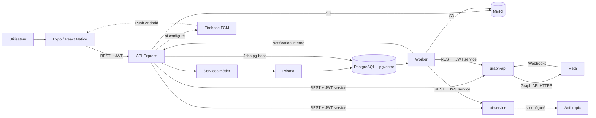
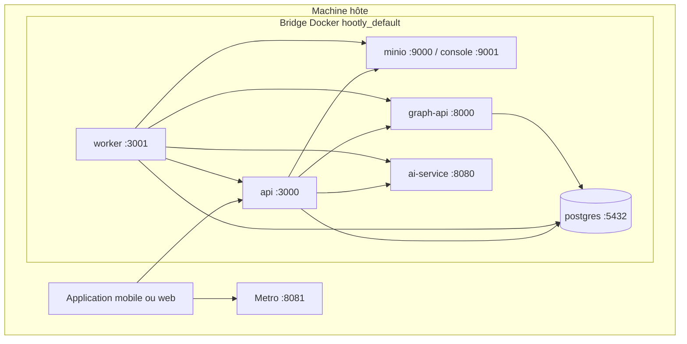
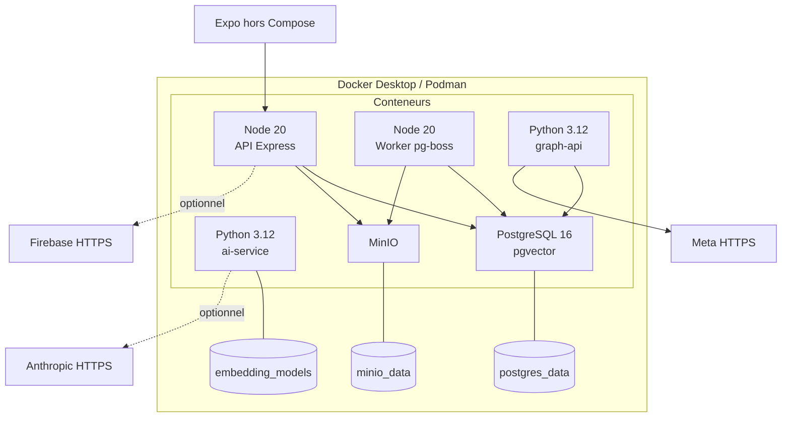
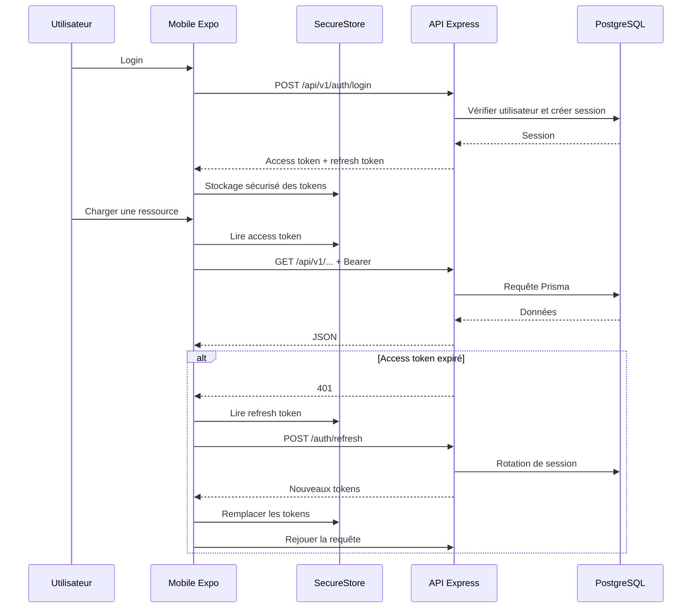
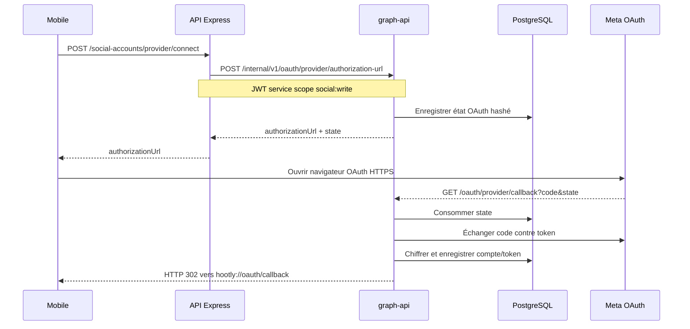
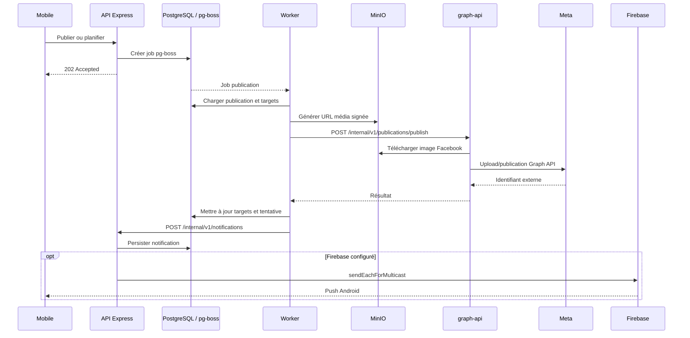

# Phase 2 — Architecture, services et fonctionnement réel

## 1. Conclusions principales

L'architecture réellement implémentée est la suivante :

- le client Expo appelle exclusivement l'API Express pour les données métier ;
- Express et le worker utilisent des JWT de service pour appeler graph-api et ai-service ;
- graph-api est le seul service qui dialogue directement avec Meta ;
- Express est le seul service qui dialogue avec Firebase Admin ;
- PostgreSQL sert simultanément de base métier, de stockage pgvector et de transport de files pg-boss ;
- MinIO stocke les médias, ensuite transmis à Facebook ou rendus accessibles à Instagram par URL signée ;
- il n'existe actuellement ni reverse proxy, ni TLS local, ni WebSocket actif, ni CI/CD.

Au moment de l'inspection, les six conteneurs Compose étaient actifs et sains. Un serveur Metro Expo répondait également sur le port 8081, mais la présence d'une application ouverte sur un appareil n'a pas été démontrée.

## 2. Matrice des communications

| Source | Destination | Protocole/transport | Authentification | Usage | Preuve |
|---|---|---|---|---|---|
| Mobile | API Express | HTTP REST, JSON | Bearer JWT utilisateur | Toutes les données métier | `social-media/src/data/api.ts` |
| Mobile | API Express | HTTP multipart/XHR | Bearer JWT | Médias et documents | `social-media/src/data/api.ts` |
| Mobile | stockage local sécurisé | Expo SecureStore | Stockage natif | Access/refresh tokens | `social-media/src/lib/secureStorage.ts` |
| Mobile Android | Firebase/FCM | SDK natif via expo-notifications | Token FCM | Réception push | `social-media/src/lib/pushNotifications.ts` |
| Mobile | Meta OAuth | Navigateur système, HTTPS | OAuth 2 | Autorisation Facebook/Instagram | `social-media/app/settings/social-accounts.tsx` |
| API | PostgreSQL | Protocole PostgreSQL/TCP | Chaîne `DATABASE_URL` | Données métier | `services/api/src/db/prisma.js` |
| API | PostgreSQL/pg-boss | Protocole PostgreSQL/TCP | `DATABASE_URL` | Production de jobs | `services/api/src/lib/jobs.js` |
| API | MinIO | API S3 sur HTTP local | Clé/secret S3 | Upload, suppression, URL signée | `services/api/src/lib/storage.js` |
| API | graph-api | HTTP REST/JSON | JWT audience `social-service`, scopes | OAuth, comptes, commentaires, concurrence | `services/api/src/lib/socialServiceClient.js` |
| API | ai-service | HTTP REST/JSON | JWT audience `ai-service`, scopes | NLP, RAG, génération, explications | `services/api/src/lib/aiServiceClient.js` |
| API | Firebase | Firebase Admin SDK, normalement HTTPS | Compte de service | Envoi FCM | `services/api/src/notifications/push.js` |
| Worker | PostgreSQL | Protocole PostgreSQL/TCP, driver `pg` | `DATABASE_URL` | Lecture/écriture métier | `services/worker/src/db.js` |
| Worker | PostgreSQL/pg-boss | Protocole PostgreSQL/TCP | `DATABASE_URL` | Consommation et crons | `services/worker/index.js` |
| Worker | graph-api | HTTP REST/JSON | JWT de service | Publication, commentaires, métriques, concurrence | `services/worker/src/social-account-client.js` |
| Worker | ai-service | HTTP REST/JSON | JWT scope `ai:analyze` | Analyse de commentaires | `services/worker/src/ai-client.js` |
| Worker | API Express | HTTP REST/JSON | JWT scope `notifications:write` | Création et envoi de notifications | `services/worker/src/notifications-client.js` |
| Worker | MinIO | API S3 | Clé/secret S3 | Nettoyage et signature média | `services/worker/src/storage.js` |
| graph-api | PostgreSQL | Protocole PostgreSQL/TCP, psycopg | `DATABASE_URL` | OAuth, tokens, commentaires, métriques | `graph-api/db/pool.py` |
| graph-api | Facebook Graph API | HTTPS Graph API | Access token Meta | Posts, commentaires, insights | `graph-api/modules/facebook/clients/facebook_client.py` |
| graph-api | Instagram API | HTTPS Graph API | Access token Meta | Publication, commentaires, insights | `graph-api/modules/instagram/client.py` |
| Meta | graph-api | Webhook HTTP/HTTPS | Signature HMAC + verify token | Commentaires et suppressions | `graph-api/api/routes/webhook_routes.py` |
| Meta OAuth | graph-api | Redirection HTTP 302 | `code` + `state` | Callback OAuth | `graph-api/api/routes/oauth_routes.py` |
| graph-api | Mobile | Deep link `hootly://` | État OAuth consommé | Résultat OAuth | `graph-api/modules/oauth/redirect.py` |
| graph-api | URL média signée | HTTP GET | Signature S3 dans l'URL | Téléchargement image Facebook | `graph-api/modules/facebook/provider.py` |
| Meta Instagram | URL média signée | HTTP/HTTPS GET par Meta | Signature S3 dans l'URL | Import du média Instagram | `graph-api/modules/instagram/provider.py` |
| ai-service | Anthropic | HTTPS via SDK | Clé API | Génération LLM optionnelle | `services/ai-service/modules/generation/llm.py` |
| ai-service | Modèles locaux | Système de fichiers | — | NLP scikit-learn, embeddings | `services/ai-service/modules/nlp/pipeline.py` |

### Communications explicitement absentes

- Aucun accès direct mobile → PostgreSQL.
- Aucun accès direct mobile → graph-api ou ai-service.
- Aucun appel Express → Meta direct.
- Aucun appel worker → Firebase direct.
- Aucun JDBC.
- Aucun driver MongoDB.
- Aucun Redis.
- Aucun WebSocket ou Socket.IO réellement démarré.

## 3. Services internes

### 3.1 Application Expo/React Native

- **Nom :** Hootly mobile.
- **Technologies :** Expo 55, React 19.2, React Native 0.83, Expo Router, TypeScript.
- **Dossier :** `social-media/`.
- **Rôle :** interface utilisateur, stockage sécurisé des tokens, OAuth par navigateur, réception push Android.
- **Configuration :** `package.json`, `app.json`, `tsconfig.json`, `.env.example`.
- **Point d'entrée :** `expo-router/entry`, puis `app/_layout.tsx`.
- **Commandes :**
  - `npm --prefix social-media start`
  - `npm --prefix social-media run android`
  - `npm --prefix social-media run ios`
  - `npm --prefix social-media run web`
- **Port :** Metro utilise actuellement `8081`.
- **Dépendances :** API Express, Expo SecureStore, expo-notifications, navigateur OAuth.
- **Services appelés :** API Express, Meta par navigateur OAuth et services Firebase natifs sur Android.
- **Services qui l'appellent :** Firebase/FCM et redirection OAuth graph-api par deep link.
- **Variables :** `EXPO_PUBLIC_API_URL`, `EXPO_ROUTER_APP_ROOT`.
- **Données manipulées :** utilisateur, marque, publications, commentaires, médias, analytics, concurrents, notifications, documents RAG et tokens utilisateur.

| Statut | Conclusion |
|---|---|
| Présent dans le code | **CONFIRMÉ** |
| Configuré | **CONFIRMÉ** |
| Réellement référencé/appelé | **CONFIRMÉ** |
| Démarrable | **CONFIRMÉ** |
| En cours d'exécution | **PARTIELLEMENT CONFIRMÉ** : Metro répond `200 packager-status:running` sur `8081`; aucun appareil connecté n'a été démontré |

Le web utilise `sessionStorage`, alors qu'Android/iOS utilisent SecureStore avec `WHEN_UNLOCKED_THIS_DEVICE_ONLY`.

### 3.2 API publique Express

- **Nom :** `hootly-api`.
- **Technologies :** Node.js 20, Express 5, Prisma 6, Zod, pg-boss, AWS SDK, Firebase Admin.
- **Dossier :** `services/api/`.
- **Rôle :** façade publique et couche métier principale.
- **Configuration :** `services/api/package.json`, `Dockerfile`, `schema.prisma`, `compose.yaml`.
- **Point d'entrée :** `services/api/src/server.js`.
- **Commande locale :** `npm --prefix services/api start`.
- **Commande conteneur :** `npx prisma migrate deploy && npm start`.
- **Port :** `3000`.
- **Dépendances obligatoires déclarées :** PostgreSQL, MinIO, URLs graph-api et ai-service, JWT utilisateur et stockage S3.
- **Dépendance optionnelle :** Firebase.
- **Services appelés :** PostgreSQL avec Prisma et pg-boss, MinIO/S3, graph-api, ai-service, Firebase si configuré.
- **Services qui l'appellent :** application mobile/web et worker sur `/internal/v1/notifications`.
- **Variables principales :** `PORT`, `DATABASE_URL`, `SOCIAL_SERVICE_URL`, `AI_SERVICE_URL`, variables JWT, `SERVICE_JWT_SECRET`, `PGBOSS_SCHEMA`, `S3_*`, `MEDIA_*`, `RAG_MIN_SIMILARITY` et variables Firebase.
- **Données :** toutes les entités Prisma, audit, sessions, médias, publications, approbations, commentaires, analyses, notifications, embeddings et concurrents.

| Statut | Conclusion |
|---|---|
| Présent | **CONFIRMÉ** |
| Configuré | **CONFIRMÉ** pour la base, le stockage, graph-api, IA et JWT |
| Réellement référencé/appelé | **CONFIRMÉ** |
| Démarrable | **CONFIRMÉ** |
| En cours d'exécution | **CONFIRMÉ** : processus `node src/server.js`, conteneur healthy, `/health` et `/ready` à 200 |
| Firebase actif | **NON** : `firebaseConfigured=false` dans le conteneur actuel |

La readiness Express vérifie uniquement la présence des variables. Elle ne vérifie pas une requête réelle vers PostgreSQL, MinIO, graph-api ou ai-service.

### 3.3 Worker pg-boss

- **Nom :** `hootly-worker`.
- **Technologies :** Node.js 20, pg-boss, driver `pg`, AWS SDK.
- **Dossier :** `services/worker/`.
- **Rôle :** exécution asynchrone et planification.
- **Configuration :** `package.json`, `Dockerfile`, `services/shared/jobs.js`, `compose.yaml`.
- **Point d'entrée :** `services/worker/index.js`.
- **Commande :** `npm --prefix services/worker start`.
- **Port :** `3001`, uniquement pour health/readiness/opérations.
- **Dépendances :** PostgreSQL, MinIO, graph-api en mode live, ai-service, API Express pour les notifications.
- **Services appelés :** PostgreSQL, MinIO, graph-api, ai-service et API Express.
- **Services qui l'appellent :** pg-boss par les jobs produits dans PostgreSQL et les sondes d'exploitation.
- **Variables :** `PORT`, `DATABASE_URL`, `PG_POOL_MAX`, `PGBOSS_SCHEMA`, `SOCIAL_SERVICE_URL`, `SOCIAL_PROVIDER_MODE`, `AI_SERVICE_URL`, `API_SERVICE_URL`, `SERVICE_JWT_SECRET`, `S3_*` et variables média.
- **Données :** publications, targets, tentatives, médias temporaires, comptes sociaux, commentaires, analyses, métriques, concurrents, notifications et audit.

#### Jobs définis dans la source

| Job | Déclenchement |
|---|---|
| Publication planifiée | date du job |
| Publication immédiate | action utilisateur |
| Retry de publication | délai contrôlé |
| Nettoyage média | chaque heure |
| Refresh OAuth | chaque jour à 03:00 |
| Synchronisation commentaires | toutes les 15 minutes |
| Analyse commentaires | toutes les 5 minutes |
| Synchronisation métriques | toutes les 30 minutes |
| Synchronisation concurrents | 04:00 et 16:00 |
| Posts concurrents | enchaînement de job |
| Métriques concurrents | enchaînement de job |

| Statut | Conclusion |
|---|---|
| Présent | **CONFIRMÉ** |
| Configuré | **CONFIRMÉ** |
| Réellement référencé/appelé | **CONFIRMÉ** |
| Démarrable | **CONFIRMÉ** |
| En cours d'exécution | **CONFIRMÉ** : `node index.js`, health/readiness à 200, pg-boss `UP` |
| Conforme à la source actuelle | **NON** : runtime à 8 files contre 11 dans la source |

Les trois traitements concurrents existent dans le code mais pas dans le worker actif. Les jobs concurrents envoyés actuellement risquent donc de rester sans consommateur.

### 3.4 graph-api

- **Nom :** Social Graph API.
- **Technologies :** Python 3.12, FastAPI, HTTPX, psycopg 3, PyJWT, cryptography.
- **Dossier :** `graph-api/`.
- **Rôle :** frontière d'intégration avec Meta.
- **Configuration :** `core/config.py`, `.env.example`, `requirements.txt`, Dockerfile.
- **Point d'entrée :** `graph-api/main.py`.
- **Commande :** `uvicorn main:app --host 0.0.0.0 --port 8000`.
- **Port :** `8000`.
- **Dépendances :** PostgreSQL, Meta Graph API, URL média signée, secrets JWT et chiffrement.
- **Services appelés :** PostgreSQL, Facebook Graph API, Instagram Graph API et URLs médias S3/MinIO.
- **Services qui l'appellent :** API Express, worker, Meta pour OAuth/webhooks et navigateur OAuth.
- **Variables :** `GRAPH_API_BASE_URL`, credentials Facebook/Instagram, `META_WEBHOOK_VERIFY_TOKEN`, `PUBLIC_BASE_URL`, `DATABASE_URL`, `SERVICE_JWT_SECRET`, variables de chiffrement, timeouts, polling, CORS et limites.
- **Données :** comptes sociaux, états OAuth, tokens chiffrés, permissions, idempotence de service, commentaires/webhooks, métriques et identifiants externes Meta.

| Statut | Conclusion |
|---|---|
| Présent | **CONFIRMÉ** |
| Configuré | **CONFIRMÉ** selon `/ready` : Meta, base et chiffrement présents |
| Réellement référencé/appelé | **CONFIRMÉ dans le code** |
| Démarrable | **CONFIRMÉ** |
| En cours d'exécution | **CONFIRMÉ** : Uvicorn actif, health/readiness à 200 |
| Appel Meta réellement réussi | **À VÉRIFIER À L'EXÉCUTION** |

La readiness ne contacte ni Meta ni PostgreSQL. Aucun appel externe Meta n'a été volontairement déclenché pendant cette analyse.

### 3.5 ai-service

- **Nom :** Hootly AI Service.
- **Technologies :** Python 3.12, FastAPI, scikit-learn, LangGraph, FastEmbed, pypdf, python-docx, SDK Anthropic.
- **Dossier :** `services/ai-service/`.
- **Rôle :** service IA sans base propre.
- **Configuration :** `core/config.py`, `requirements.txt`, Dockerfile.
- **Point d'entrée :** `services/ai-service/main.py`.
- **Commande :** `uvicorn main:app --host 0.0.0.0 --port 8080`.
- **Port :** `8080`.
- **Dépendances obligatoires :** artefacts joblib entraînés dans l'image et secret JWT de service.
- **Dépendances optionnelles :** cache FastEmbed et Anthropic.
- **Services appelés :** Anthropic uniquement en mode LLM ; aucune base de données.
- **Services qui l'appellent :** API Express et worker.
- **Variables :** `AI_MODEL_MODE`, `ARTIFACTS_DIR`, `SERVICE_JWT_SECRET`, `AI_GENERATION_MODE`, `ANTHROPIC_API_KEY`, `GENERATION_MODEL`, `FASTEMBED_CACHE_PATH`, limites de contenu/réponse/hashtags et CORS.
- **Données :** textes, contexte de marque/publication, faits analytics, documents, chunks et vecteurs ; aucun stockage métier permanent.

| Statut | Conclusion |
|---|---|
| Présent | **CONFIRMÉ** |
| Configuré | **CONFIRMÉ en mode NLP local** |
| Réellement référencé/appelé | **CONFIRMÉ** |
| Démarrable | **CONFIRMÉ** |
| En cours d'exécution | **CONFIRMÉ** : Uvicorn actif, `/ready` indique `mode=local` |
| Anthropic configuré | **NON** |
| Génération LLM active | **NON** ; mode reçu comme chaîne vide, donc repli local |

### 3.6 PostgreSQL et pgvector

- **Nom :** `postgres`.
- **Technologie :** PostgreSQL 16 Alpine + pgvector 0.8.2.
- **Dossier de build :** `services/postgres/`.
- **Rôle :** base relationnelle, vecteurs et backend de files.
- **Configuration :** `services/postgres/Dockerfile`, `schema.prisma`, migrations, Compose.
- **Point d'entrée :** entrypoint officiel PostgreSQL.
- **Commande :** lancée par Compose.
- **Port :** `5432`.
- **Volume :** `hootly_postgres_data`.
- **Appelé par :** API/Prisma, API/pg-boss, worker/pg, worker/pg-boss et graph-api/psycopg.
- **Variables :** `POSTGRES_DB`, `POSTGRES_USER`, `POSTGRES_PASSWORD`, `DATABASE_URL`.
- **Données :** toutes les tables Prisma, embeddings vectoriels et files pg-boss.

| Statut | Conclusion |
|---|---|
| Présent/configuré/démarrable | **CONFIRMÉ** |
| En cours d'exécution | **CONFIRMÉ**, health Docker sain |
| Réellement utilisé | **CONFIRMÉ** : connexions actives de l'API (`172.19.0.2`) et du worker (`172.19.0.4`) |

Le pool graph-api est paresseux : aucune connexion permanente provenant de son IP n'était visible au moment exact de l'inspection.

### 3.7 MinIO

- **Nom :** `minio`.
- **Technologie :** MinIO compatible S3.
- **Rôle :** stockage privé des médias.
- **Configuration :** `compose.yaml`.
- **Point d'entrée :** `minio server /data --console-address :9001`.
- **Ports :** `9000` pour l'API S3 et `9001` pour la console.
- **Volume :** `hootly_minio_data`.
- **Services appelants :** API, worker, graph-api indirectement par URL signée Facebook et Meta indirectement par URL signée Instagram.
- **Variables :** `MINIO_ROOT_USER`, `MINIO_ROOT_PASSWORD`, `S3_*`, `MEDIA_BUCKET`.
- **Données :** fichiers médias et objets temporaires.

| Statut | Conclusion |
|---|---|
| Présent/configuré/démarrable | **CONFIRMÉ** |
| Réellement utilisé | **CONFIRMÉ dans le code** |
| En cours d'exécution | **CONFIRMÉ**, conteneur healthy et endpoint live accessible |

#### Point d'attention sur les URL signées

Une seule variable `S3_PUBLIC_ENDPOINT` sert à produire les URL visibles par le téléphone, les URL que graph-api doit télécharger et les URL qu'Instagram doit pouvoir télécharger depuis Internet. Ces trois consommateurs n'ont pas nécessairement la même visibilité réseau. Une valeur telle que `localhost` peut fonctionner pour le web local tout en étant inaccessible depuis graph-api ou Meta. Ce chemin doit être validé lors d'une publication réelle.

## 4. Services externes

### Meta/Facebook/Instagram

- **Technologie :** OAuth 2 et Graph API v25 sur HTTPS.
- **Port :** 443 externe.
- **Appelé par :** graph-api ; navigateur mobile pour l'autorisation.
- **Appelle :** callbacks et webhooks publics graph-api.
- **Configuration runtime :** déclarée présente par `/ready`.
- **Utilisation réelle démontrée pendant cette phase :** non.
- **Données :** tokens OAuth, pages, comptes Instagram, publications, commentaires, audiences et métriques.

### Firebase Cloud Messaging

- **Technologie :** Firebase Admin SDK côté serveur, expo-notifications côté Android.
- **Port :** HTTPS 443 géré par les SDK.
- **Appelé par :** API Express.
- **Appelle :** application Android.
- **Présent dans le code :** oui.
- **Configuré dans le conteneur actif :** **non**.
- **Envoi réel possible actuellement :** non ; `NotificationPushService` effectue un no-op contrôlé.
- **Source de vérité :** PostgreSQL et API REST, pas Firebase.

### Anthropic

- **Technologie :** SDK Python, transport HTTPS.
- **Port :** 443 externe.
- **Appelé par :** ai-service, conditionnellement.
- **Présent dans le code :** oui.
- **Configuré actuellement :** **non**.
- **Actif actuellement :** **non**.
- **Repli :** générateur local.

### Socket.IO

- **Présent :** uniquement sous forme de contrat.
- **Configuré :** non.
- **Référencé par du code serveur :** non.
- **Démarrable :** non.
- **En cours d'exécution :** non.

## 5. Infrastructure

### Dockerfiles

| Image | Base | Construction | Entrée |
|---|---|---|---|
| API | `node:20-alpine` | `npm ci`, Prisma generate | migrations puis `npm start` |
| Worker | `node:20-alpine` | `npm ci`, copie shared | `npm start` |
| graph-api | `python:3.12-slim` | pip requirements | Uvicorn 8000 |
| ai-service | `python:3.12-slim` | pip + entraînement/évaluation | Uvicorn 8080 |
| PostgreSQL | `postgres:16-alpine` | compile pgvector 0.8.2 | entrypoint PostgreSQL |
| MinIO | image officielle | pas de build local | serveur MinIO |

Le build PostgreSQL nécessite un accès réseau pour cloner pgvector. Le build IA entraîne les modèles à chaque reconstruction.

### Réseau

**État dynamique confirmé :**

- réseau : `hootly_default` ;
- driver : `bridge` ;
- portée : locale ;
- conteneurs connectés : 6.

| Conteneur | Adresse observée |
|---|---|
| API | `172.19.0.2/16` |
| ai-service | `172.19.0.3/16` |
| worker | `172.19.0.4/16` |
| PostgreSQL | `172.19.0.5/16` |
| graph-api | `172.19.0.6/16` |
| MinIO | `172.19.0.7/16` |

Ces adresses sont dynamiques et ne doivent pas être utilisées dans la configuration. Les noms DNS Compose sont la bonne interface.

### Ports exposés sur l'hôte

| Port | Service |
|---:|---|
| 3000 | API publique |
| 3001 | Worker health/opérations |
| 5432 | PostgreSQL |
| 8000 | graph-api |
| 8080 | ai-service |
| 8081 | Metro Expo, hors Compose |
| 9000 | MinIO S3 |
| 9001 | Console MinIO |

Tous les ports Compose sont publiés sur `0.0.0.0` et IPv6. Il n'existe pas de segmentation réseau par service.

### Volumes

| Volume | Montage | Données |
|---|---|---|
| `hootly_postgres_data` | `/var/lib/postgresql/data` | base métier, vecteurs et pg-boss |
| `hootly_minio_data` | `/data` | objets médias |
| `hootly_embedding_models` | `/models` | cache FastEmbed |

### Healthchecks

| Service | Vérification | Portée réelle |
|---|---|---|
| PostgreSQL | `pg_isready` | serveur PostgreSQL joignable |
| MinIO | `/minio/health/live` | processus MinIO vivant |
| API | `/health` | processus Express vivant |
| Worker | `/health` | serveur HTTP vivant |
| graph-api | `/health` | processus Uvicorn vivant |
| ai-service | `/health` | processus Uvicorn vivant |

Les healthchecks Docker utilisent les sondes de liveness, pas toujours `/ready`.

Conséquences :

- l'API peut être healthy sans Firebase ;
- graph-api peut être healthy sans Meta configuré ;
- le worker peut être healthy avant le démarrage de pg-boss ;
- ai-service peut être healthy sans artefacts valides, mais `/ready` détecte ce cas.

### Ordre Compose

1. PostgreSQL et MinIO démarrent.
2. API attend leur health.
3. Worker attend également leur health.
4. graph-api attend seulement PostgreSQL.
5. ai-service n'a aucun `depends_on`.

L'API et le worker n'attendent pas formellement graph-api ou ai-service. Leur configuration contient leurs URL, mais Compose ne garantit pas que ces services soient prêts avant eux.

L'API applique les migrations à son démarrage, alors que graph-api et le worker peuvent commencer dès que PostgreSQL est sain. Le worker possède une boucle de retry pour pg-boss. graph-api ouvre son pool à la demande.

### Reverse proxy et TLS

**ABSENTS.**

Aucun Nginx, Traefik, Caddy, HAProxy ou ingress n'a été trouvé. En local, les échanges interconteneurs utilisent HTTP, tous les ports sont publiés directement et aucun certificat TLS n'est géré.

Pour un déploiement réel, il faudrait au minimum terminer TLS, exposer uniquement l'API publique et les callbacks/webhooks nécessaires, garder les services internes privés et ne pas exposer PostgreSQL, MinIO admin, worker et ai-service sur Internet.

### CI/CD et environnements

#### Développement

**CONFIRMÉ** : `.env.example`, Compose, scripts PowerShell Docker/Podman, Metro séparé et seed de démonstration.

#### Test

**CONFIRMÉ** : tests Node et pytest, mocks Meta, flags d'intégration et scripts ciblés.

#### Préproduction et production

**ABSENTS DU REPOSITORY** : fichiers d'environnement dédiés, pipeline, manifests Kubernetes, Terraform, stratégie de déploiement, reverse proxy, gestionnaire de secrets et stratégie de sauvegarde formalisée.

## 6. Démarrage complet attendu

1. Copier `.env.example` vers `.env`.
2. Configurer PostgreSQL, MinIO, JWT, chiffrement et Meta.
3. Configurer une URL publique graph-api compatible avec les callbacks OAuth et webhooks.
4. Configurer une URL média réellement accessible aux consommateurs concernés.
5. Copier `social-media/.env.example` vers `social-media/.env`.
6. Installer les dépendances mobiles.
7. Exécuter `./scripts/start.ps1`.
8. Le script détecte Docker ou Podman puis lance `compose up --build --detach`.
9. Les images sont construites : pgvector est compilé, Prisma Client est généré et les modèles scikit-learn sont entraînés et évalués.
10. PostgreSQL et MinIO deviennent sains.
11. L'API applique les migrations Prisma puis démarre.
12. Le worker ouvre les files pg-boss et installe les crons.
13. graph-api et ai-service démarrent sous Uvicorn.
14. Exécuter éventuellement `./scripts/seed.ps1`.
15. Vérifier avec `./scripts/verify-readiness.ps1 -RequireMeta`.
16. Démarrer Metro avec `npm --prefix social-media start`.
17. Ouvrir l'application sur Android, iOS ou web.

## 7. Diagrammes

### 7.1 Architecture globale

### 7.2 Architecture réseau et services

### 7.3 Diagramme de déploiement

### 7.4 Communication frontend/backend

### 7.5 Communication OAuth avec Meta

### 7.6 Publication et notification

## 8. Vérification dynamique

Relevé effectué le **16 septembre 2026 vers 15:37–15:40, heure de Moscou**.

| Composant | Processus/preuve | Résultat |
|---|---|---|
| Mobile/Metro | `GET :8081/status` | `200`, `packager-status:running` |
| API | `node src/server.js` | healthy, ready |
| Worker | `node index.js` | healthy, ready, pg-boss UP |
| graph-api | Python 3.12/Uvicorn | healthy, ready |
| ai-service | Python 3.12/Uvicorn | healthy, modèle local prêt |
| PostgreSQL | processus serveur + backends clients | healthy, connexions actives |
| MinIO | `minio server /data` | healthy, live endpoint accessible |
| Firebase | test booléen sans lire les credentials | `firebaseConfigured=false` |
| Anthropic | configuration booléenne | `anthropicConfigured=False` |
| Meta | configuration requise présente | aucun appel externe effectué |
| Réseau | inspection Docker | bridge local, 6 conteneurs |
| Volumes | inspection Docker | 3 volumes nommés |

## 9. Fonctionnement global simplifié

Quand toute l'application est lancée, le téléphone ou le navigateur exécute l'application Expo et envoie toutes ses requêtes métier à l'API Express sur le port 3000. Express authentifie l'utilisateur, applique la logique métier, lit et écrit dans PostgreSQL avec Prisma, stocke les médias dans MinIO et envoie les tâches longues dans pg-boss.

Le worker écoute ces tâches dans PostgreSQL. Il publie les contenus, synchronise les commentaires et métriques, lance les analyses IA, nettoie les médias et crée les notifications. Pour parler aux réseaux sociaux, l'API et le worker appellent graph-api sur le port 8000 avec un JWT de service. graph-api récupère les tokens Meta chiffrés dans PostgreSQL puis appelle Facebook ou Instagram en HTTPS. Meta renvoie également ses callbacks OAuth et webhooks à graph-api.

Pour l'IA, l'API et le worker appellent ai-service sur le port 8080. Celui-ci utilise actuellement ses modèles locaux scikit-learn, LangGraph et FastEmbed ; Anthropic n'est pas actif. Les notifications sont toujours enregistrées dans PostgreSQL par Express. L'envoi push Firebase est prévu, mais il est désactivé dans le runtime observé faute de credentials configurés.

PostgreSQL, MinIO, Express, le worker, graph-api et ai-service tournent dans le même réseau Docker. L'application Expo et Metro tournent en dehors de Compose.
