# Phase 3 — Audit fonctionnel complet

Date de l'audit : 16 septembre 2026  
Périmètre : application mobile Expo, API Express, worker pg-boss, graph-api, ai-service, PostgreSQL/pgvector, MinIO, Meta et Firebase.  
Méthode : lecture statique avec suivi des appels depuis les écrans jusqu'aux écritures et services externes, complétée par les preuves d'exécution recueillies en Phase 2.

## 1. Conclusion fonctionnelle

Hootly est une application de community management multi-marque. Une personne authentifiée peut créer ou sélectionner une marque, connecter des comptes Facebook/Instagram, préparer et faire approuver des publications, les planifier ou les publier, synchroniser et traiter les commentaires, utiliser l'IA pour analyser les messages et préparer des réponses, enrichir l'IA avec une base documentaire, consulter des notifications, des statistiques et une veille concurrentielle.

Le noyau fonctionnel est réel : les écrans appellent une façade HTTP unique, l'API Express applique les permissions, écrit dans PostgreSQL et délègue les opérations asynchrones au worker. Les appels Meta passent exclusivement par graph-api. Les calculs NLP/RAG passent par ai-service. Les composants mobiles ne contiennent pas de données métier fictives pour ces parcours.

Les limites majeures sont les suivantes :

- la récupération de mot de passe crée bien un jeton, mais aucun email ne le transmet à l'utilisateur ;
- l'upload/suppression d'avatar existe dans l'API, mais l'écran annonce explicitement une version future ;
- les notifications push sont implémentées, mais Firebase n'était pas configuré dans le runtime inspecté et la branche mobile native n'enregistre que les appareils Android ;
- les appels Meta réels n'ont pas été déclenchés pendant l'audit : OAuth, publication, réponse, métriques et concurrence restent à valider avec de vrais comptes ;
- le code du worker contient les trois files de concurrence, mais le conteneur actif observé en Phase 2 ne consommait que 8 files sur 11 ;
- il n'existe pas de temps réel WebSocket : les écrans se mettent à jour par rechargement, retour au premier plan, push ou polling manuel ;
- l'inscription ne crée pas automatiquement de marque : le nouvel utilisateur arrive avec `brand` indéfini et doit en créer une dans les réglages ;
- aucun écran ne gère l'invitation, l'ajout ou le retrait des membres d'une marque.

## 2. Légende des statuts

| Statut | Sens retenu dans ce rapport |
|---|---|
| **OPÉRATIONNELLE D'APRÈS LE CODE** | Chaîne interface → API → métier → stockage complète, cohérente et couverte par des tests présents dans le dépôt. Cela ne prouve pas à lui seul un essai manuel de bout en bout. |
| **PARTIELLEMENT IMPLÉMENTÉE** | Une partie du parcours utilisateur ou serveur manque. |
| **IMPLÉMENTÉE MAIS NON TESTÉE** | Chaîne complète dans la source, sans preuve de test pertinente trouvée ou exécutée. |
| **CONFIGURÉE MAIS NON CONNECTÉE** | Branchement et configuration prévus, mais dépendance inactive dans l'environnement observé. |
| **INCOMPLÈTE** | Le résultat promis à l'utilisateur ne peut pas être atteint dans l'état actuel. |
| **POTENTIELLEMENT INUTILISÉE** | Route ou fonction présente sans appel trouvé depuis les parcours réels. |
| **À VÉRIFIER À L'EXÉCUTION** | Dépend de credentials, de données ou d'un service externe qui n'a pas été sollicité pendant l'audit. |

Les statuts portent sur la fonctionnalité, pas seulement sur l'existence d'un fichier. Les tests repérés sont notamment `services/api/test/*.test.js`, `services/worker/test/*.test.js`, `graph-api/tests/test_*.py`, `services/ai-service/tests/test_*.py` et quatre tests mobiles sous `social-media/test/`. Ils n'ont pas été relancés pendant cette Phase 3.

## 3. Acteurs et permissions

| Acteur | Capacités observées |
|---|---|
| Visiteur | Inscription, connexion, demande et consommation d'un lien de réinitialisation, consultation des pages légales. |
| `VIEWER` | Lecture de la marque, des publications, commentaires, connaissances, analytics, concurrents et notifications. |
| `COMMUNITY_MANAGER` | Capacités du viewer, plus création/modification de contenu, traitement des commentaires, IA, synchronisations, connaissances et concurrents. |
| `ADMIN` | Capacités de gestion, réglages de marque/IA et décision d'approbation. |
| `OWNER` | Rôle maximal côté interface ; propriétaire de marque, soumis aux contraintes de suppression/transfert. |
| Worker | JWT de service ; publication, synchronisations, analyse en arrière-plan et création de notifications internes. |
| Meta | Fournisseur OAuth/Graph API et producteur de webhooks. |

`requireAuthentication`, `requireBrandAccess(role)`, `loadPublication(role)`, `loadComment(role)` et `loadSuggestion(role)` constituent les contrôles serveur réels. Les masquages de boutons dans le mobile améliorent l'ergonomie, mais l'autorité finale reste l'API.

## 4. Infrastructure fonctionnelle commune

Pour toutes les fonctionnalités connectées, le client passe par `social-media/src/data/api.ts`. `fetchApi` ajoute le Bearer JWT, tente un rafraîchissement sur `401`, normalise l'enveloppe de réponse et remonte une `ApiError`. Les jetons sont conservés par `social-media/src/lib/secureStorage.ts` dans SecureStore sur mobile et `sessionStorage` sur le web.

`SessionProvider` (`social-media/src/store/SessionProvider.tsx`) porte `status`, `user`, `brand`, `unreadCount`, `restore`, `signIn`, `signOut` et `refreshUnreadCount`. `ComposerProvider` conserve le brouillon de publication entre le composeur, le sélecteur de média et les hashtags. `useAsync`, `useMutation` et `usePaginatedList` gèrent chargement, erreur, mutation et pagination ; il n'existe pas de Redux/Zustand.

Dans Express, les fichiers `routes.js` jouent simultanément le rôle de routeur et de contrôleur HTTP. Il n'existe pas de couche repository séparée : les services métier utilisent directement le client Prisma. Cette absence est indiquée ci-dessous par « Prisma direct ». graph-api utilise pour sa part des modules métier et `graph-api/db/*`; le worker utilise `services/worker/src/db.js` avec le driver `pg`.

## 5. Inventaire fonctionnel détaillé

### 5.1 Identité, session et profil

| Fonction et résultat | Utilisateur, écran, route et composants | État et service frontend | Endpoint, contrôleur et service métier | Repository, modèles, tables et externe | Permissions | Statut justifié |
|---|---|---|---|---|---|---|
| Inscription : crée un utilisateur et une session, puis ouvre l'accueil. Aucune marque n'est créée. | Visiteur ; `app/(auth)/register.tsx`, `/register` ; `RegisterScreen`, champs, consentements, `Button`. | `useMutation`, `SessionProvider.signIn`; `auth.register`. | `POST /api/v1/auth/register`; `auth/routes.js`; `register`, `issueSession` dans `auth/service.js`. | Prisma direct ; `User`, `UserSession`, `AuditLog` → `users`, `user_sessions`, `audit_logs`. | Public avec rate limiter. | **OPÉRATIONNELLE D'APRÈS LE CODE** ; création transactionnelle et tests `auth.test.js`. Onboarding de marque néanmoins séparé. |
| Connexion et restauration : valide les identifiants, stocke access/refresh tokens, recharge utilisateur, marque active et compteur. | Visiteur/utilisateur ; `/login`, `/` ; `LoginScreen`, `SplashRoute`. | `useMutation`, `SessionProvider.restore/signIn`; `auth.login`, `auth.me`, `brandsApi.getActive`, `notificationsApi.unreadCount`. | `POST /auth/login`, `GET /auth/me`, `POST /auth/refresh`; `login`, `currentUser`, `refresh`. | Prisma direct ; `User`, `UserSession`, `BrandMember`, `Notification`. | Login public ; `me` authentifié. | **OPÉRATIONNELLE D'APRÈS LE CODE** ; expiration/révocation et timeout de restauration gérés. |
| Déconnexion : révoque la session serveur, désassocie le token push puis efface les jetons locaux. | Utilisateur ; `/settings` ou `/profile`; `handleSignOut`. | `SessionProvider.signOut`; `unregisterForPushNotifications`, `auth.logout`, `clearSessionTokens`. | `POST /api/v1/auth/logout`; `logout`. | `UserSession` → `user_sessions`; Firebase uniquement pour le token local. | Authentifié. | **OPÉRATIONNELLE D'APRÈS LE CODE** ; nettoyage local exécuté même si l'appel distant échoue. |
| Mot de passe oublié/réinitialisé : crée un jeton haché puis accepte un token de deep link. | Visiteur ; `/forgot-password`, `/reset-password?token=...`; `ForgotPasswordScreen`, `ResetPasswordScreen`. | `useMutation`; `auth.requestPasswordReset`, `auth.resetPassword`. | `POST /auth/forgot-password`, `POST /auth/reset-password`; `requestPasswordReset`, `resetPassword`. | Prisma direct ; `PasswordResetToken`, `User`, `UserSession`, `AuditLog` → `password_reset_tokens`, `users`, `user_sessions`, `audit_logs`. Aucun fournisseur email. | Public, rate limited ; réponse anti-énumération. | **INCOMPLÈTE** ; le commentaire de `auth/service.js` confirme que le token n'est ni renvoyé ni envoyé. Seul un token obtenu autrement permet l'écran final. |
| Modification du mot de passe et gestion des sessions : remplace la session courante ou révoque une/autres sessions. | Utilisateur ; `/settings/security`; `SecurityScreen`, liste de sessions. | `useAsync`, `useMutation`, `SessionProvider.signOut`; `auth.changePassword`, `profile.listSessions/revokeSession/revokeAllSessions`. | `POST /auth/change-password`, `GET/DELETE /auth/sessions...`; `changePassword`, `listSessions`, `revokeSession`, `revokeAllSessions`. | `User`, `UserSession`, `AuditLog`. | Authentifié ; interdiction de révoquer arbitrairement la session d'autrui. | **OPÉRATIONNELLE D'APRÈS LE CODE** ; tests auth présents. |
| Lecture/modification du profil : prénom, nom, nom affiché, téléphone, langue, fuseau. | Utilisateur ; `/profile`; `ProfileScreen`, `DetailRow`, `TextField`, `SelectField`. | `useSession.user/setUser`, `useMutation`; `profile.update`. | `GET/PATCH /api/v1/profile`; `getProfile`, `updateProfile`. | `User`, `AuditLog` → `users`, `audit_logs`. | Authentifié. | **OPÉRATIONNELLE D'APRÈS LE CODE** ; tests `profile.test.js`. Le changement d'email annoncé par le texte n'a aucune procédure implémentée. |
| Avatar : API d'association/suppression d'un média de profil. | Utilisateur ; `/profile`; le `Pressable` appelle seulement un toast « prochaine version ». | Aucun appel frontend vers l'avatar. | `POST/DELETE /api/v1/profile/avatar`; `saveAvatar`, `deleteAvatar`. | `Media`, `User`, MinIO → `media`, `users`. | Authentifié. | **PARTIELLEMENT IMPLÉMENTÉE** ; backend présent mais non relié à l'écran. |
| Suppression de compte : vérifie le mot de passe, refuse si une marque possédée a d'autres membres, annule les planifications, déconnecte les réseaux, supprime les marques détenues seules, quitte les autres et désactive le compte. | Utilisateur ; `/settings/delete-account`; `DeleteAccountScreen`, double confirmation. | `useMutation`, `SessionProvider.signOut`; `auth.deleteAccount`. | `DELETE /api/v1/auth/account`; `deleteAccount`, puis `cancelSchedule`, `disconnectAccount`, `deleteBrand`. | Nombreuses tables métier, `users`, `user_sessions`, `brand_members`, `brands`, `scheduled_publications`, `social_accounts`, `audit_logs`; graph-api/Meta pour révocation. | Authentifié + mot de passe ; contraintes OWNER. | **À VÉRIFIER À L'EXÉCUTION** ; orchestration complète dans le code mais dépend d'une révocation Meta réelle et n'a pas de test de parcours mobile de bout en bout. |

### 5.2 Marques, rôles et réglages IA

| Fonction et résultat | Utilisateur, écran, route et composants | État et service frontend | Endpoint, contrôleur et service métier | Repository, modèles, tables et externe | Permissions | Statut justifié |
|---|---|---|---|---|---|---|
| Lister, créer et activer une marque : alimente le tenant courant. | Utilisateur ; `/settings/brand`; `BrandSettingsScreen`; accueil/réglages utilisent `useSession.brand`. | `useAsync`, `useMutation`, `SessionProvider.setBrand`; `brandsApi.list/create/setActive`. | `GET/POST /api/v1/brands`, `POST /brands/:brandId/activate`; `listBrands`, `createBrand`, `activateBrand`. | Prisma direct ; `Brand`, `BrandMember`, préférence d'utilisateur, `AuditLog` → `brands`, `brand_members`, `users`, `audit_logs`. | Authentifié ; créateur devient OWNER. | **OPÉRATIONNELLE D'APRÈS LE CODE** ; tests `brands.test.js`. L'inscription ne déclenche pas cette étape automatiquement. |
| Modifier l'identité d'une marque : nom, description, secteur, langue. | Admin/owner ; `/settings/brand`; formulaire et `save`. | `brandsApi.update`, `SessionProvider.setBrand`. | `PATCH /brands/:brandId`; `updateBrand`. | `Brand`, `AuditLog`. | `requireBrandAccess('ADMIN')`. | **OPÉRATIONNELLE D'APRÈS LE CODE**. |
| Configurer la voix IA : ton, formalité, longueur, salutations, termes interdits/recommandés et instructions. | Admin/owner ; `/settings/brand`; champs, chips de termes. | Même `brandsApi.update`, qui sépare identité et `aiSettings` et envoie `expectedVersion`. | `GET/PATCH /brands/:brandId/ai-settings`; `getAiSettings`, `updateAiSettings`. | `BrandAiSetting`, `Brand`, `AuditLog` → `brand_ai_settings`, `brands`, `audit_logs`. Consommé ensuite par ai-service. | Lecture membre ; écriture ADMIN+. | **OPÉRATIONNELLE D'APRÈS LE CODE** ; contrôle de version et tests marque. |
| Gérer les membres/invitations. | Aucun écran. La liste des membres sert seulement aux approbations. | `approvalsApi.members` en lecture. | `GET /api/v1/approvals/members` seulement. | `BrandMember` → `brand_members`. | Admin pour la liste d'approbation. | **INCOMPLÈTE** ; aucune création, invitation, modification ou suppression de membre trouvée. |

### 5.3 Comptes Facebook et Instagram

| Fonction et résultat | Utilisateur, écran, route et composants | État et service frontend | Endpoint, contrôleur et service métier | Repository, modèles, tables et externe | Permissions | Statut justifié |
|---|---|---|---|---|---|---|
| Lister les comptes, permissions et état de connexion. | Membre ; `/settings/social-accounts`; `SocialAccountsScreen`, `SocialAccountCard`, modal de permissions. | `useAsync`; `accountsApi.list`. | `GET /api/v1/social-accounts?brandId`; `listAccounts`. | `SocialAccount`, `SocialPermission` → `social_accounts`, `social_permissions`. | Accès à la marque. | **OPÉRATIONNELLE D'APRÈS LE CODE** ; tests API présents. |
| Connecter/reconnecter par OAuth : ouvre le navigateur, Meta rappelle graph-api, le token chiffré est stocké, puis un deep link renvoie au mobile. | Admin/owner ; `/settings/social-accounts`, `/oauth/callback`; `WebBrowser.openAuthSessionAsync`, `Linking.createURL`. | `accountsApi.connect/reconnect`; rechargement de la liste au retour. | `POST /social-accounts/:provider/connect` → `startConnect` → graph `POST /internal/v1/oauth/{provider}/authorization-url`; callbacks `GET /oauth/facebook/callback` et `/oauth/instagram/callback`. | Express/graph DB ; `OAuthState`, `OAuthToken`, `SocialAccount`, `SocialPermission`, `AuditLog` → tables homonymes mappées ; Meta OAuth HTTPS. | ADMIN+ et JWT de service entre Express/graph. | **À VÉRIFIER À L'EXÉCUTION** ; chaîne et tests mockés présents, aucun OAuth Meta réel prouvé. |
| Revalider/synchroniser un compte : rafraîchit token, profil et permissions. | Gestionnaire ; même écran, action `sync`. | `useMutation`; `accountsApi.sync`. | `POST /social-accounts/:id/sync`; `syncAccount` → graph `refresh-token`, `profile`, `permissions`. | `SocialAccount`, `OAuthToken`, `SocialPermission`, `AuditLog`; Meta Graph API. | Membre de la marque ; action exposée aux gestionnaires. | **À VÉRIFIER À L'EXÉCUTION** ; appel externe réel non observé. |
| Déconnecter : révoque côté Meta et supprime/désactive le lien local. | Admin/owner ; même écran ; confirmation. | `accountsApi.disconnect`. | `DELETE /social-accounts/:id`; `disconnectAccount` → graph `POST .../revoke`. | Tables OAuth/comptes/permissions ; Meta. | ADMIN+. | **À VÉRIFIER À L'EXÉCUTION**. |

### 5.4 Publications, médias, approbation et calendrier

| Fonction et résultat | Utilisateur, écran, route et composants | État et service frontend | Endpoint, contrôleur et service métier | Repository, modèles, tables et externe | Permissions | Statut justifié |
|---|---|---|---|---|---|---|
| Lister, filtrer, compter et consulter une publication. | Tout membre ; `/publications`, `/publications/:id`; `PublicationsScreen`, `PublicationCard`, `PublicationDetailScreen`. | `usePaginatedList`, `useAsync`; `publicationsApi.list/counts/get`. | `GET /api/v1/publications`, `/counts`, `/:id`; `listPublications`, `countPublications`, `getPublication`, `toPublicPublication`. | Prisma direct ; `Publication`, `PublicationTarget`, `PublicationMedia`, `Media`, `SocialMetric`, commentaires et approbations. | VIEWER+. | **OPÉRATIONNELLE D'APRÈS LE CODE** ; tests `publications.test.js`. |
| Composer un brouillon multi-réseau et conserver l'état entre sous-écrans. | CM+ ; `/publications/new`; `ComposerForm`, `ComposerProvider`, `MediaPreview`. | `ComposerProvider.patch/reset`, `useMutation`; `publicationsApi.create`. | `POST /api/v1/publications`; `createPublication`, `targetData`, `attachMediaToPublication`. | `publications`, `publication_targets`, `publication_media`, `media`, `audit_logs`. | COMMUNITY_MANAGER+. | **OPÉRATIONNELLE D'APRÈS LE CODE**. Le mode `approval` de l'écran crée d'abord le brouillon puis utilise le circuit d'approbation, car `publicationsApi.create` refuse tout mode autre que `draft`. |
| Importer/supprimer une image avec progression. | CM+ ; modal `/media-picker`; `MediaPickerScreen`, sélecteur Expo, barre de progression. | `ComposerProvider`; `mediaApi.upload/remove`; XHR multipart. | `POST/DELETE /api/v1/media`; `uploadMedia`, `deleteMedia`, puis attachement à la publication. | `Media`/`media`, `PublicationMedia`/`publication_media`; MinIO S3. | Authentifié + accès marque ; l'attachement vérifie l'auteur/marque. | **OPÉRATIONNELLE D'APRÈS LE CODE** ; tests `media.test.js`. Accessibilité externe de l'URL signée reste à valider pour Meta. |
| Générer hashtags et mots-clés à partir du texte, puis les appliquer au brouillon. | CM+ ; `/hashtags`; `HashtagsScreen`, chips. | `useAsync`, `ComposerProvider`; `publicationsApi.detectKeywords/generateHashtags`. | `POST /api/v1/publications/generate-hashtags`; `generateHashtags`. | Lit `BrandAiSetting`; appelle ai-service `/internal/v1/hashtags/generate`; pas de table dédiée. | COMMUNITY_MANAGER+ et accès marque. | **OPÉRATIONNELLE D'APRÈS LE CODE** en mode IA local ; tests génération présents. |
| Modifier ou supprimer un brouillon/publication autorisée. | Auteur/gestionnaire ; `/publications/:id/edit`, détail. | `useMutation`; `publicationsApi.update/remove`. | `PATCH/DELETE /publications/:id`; `updatePublication`, `deletePublication`, verrous métier. | Tables publication, média, planning, audit. | COMMUNITY_MANAGER+ ; transitions d'état contrôlées par `services/shared/publication-status.js`. | **OPÉRATIONNELLE D'APRÈS LE CODE**. |
| Demander, approuver, refuser, demander des changements, annuler et voir l'historique d'approbation. | CM demande/annule ; ADMIN/OWNER décide ; `/approvals`, détail, `/approval-history`; `PublicationApprovalPanel`. | `useAsync`, `usePaginatedList`, `useMutation`; `approvalsApi.members/list/request/decide/history`. | Routes `/publications/:id/{request-approval|approve|reject|request-changes|cancel-approval}` et `/approval-history`; `changeApproval`, `listApprovals`, `approvalHistory`. | `PublicationApproval`, `Publication`, `BrandMember`, `AuditLog` → `publication_approvals`, `publications`, `brand_members`, `audit_logs`; notifications produites. | VIEWER historique ; CM demande ; ADMIN décide. | **OPÉRATIONNELLE D'APRÈS LE CODE** ; tests API, intégration et mobile d'approbation présents. |
| Planifier, replanifier, annuler et parcourir le calendrier. | CM+ ; `/publications/:id/schedule`, `/calendar`; `CalendarMonth`, `RecommendedTimesCard`. | `useAsync/useMutation`; `publicationsApi.schedule/cancelSchedule/listForMonth`. | `POST/PATCH/DELETE /publications/:id/schedule`, `GET /calendar`; `schedulePublication`, `cancelSchedule`, `calendar`; job pg-boss daté. | `ScheduledPublication`, `Publication`, pg-boss → `scheduled_publications`, `publications`, schéma de jobs. | COMMUNITY_MANAGER+ ; publication approuvée et cible requises. | **OPÉRATIONNELLE D'APRÈS LE CODE** ; worker actif, mais résultat Meta final séparé. Le choix de rappel affiché par l'écran n'est pas envoyé à l'API et n'a donc aucun effet métier. |
| Publier immédiatement ou relancer un échec. | CM+ ; détail ou carte ; boutons `publishNow`, `retry`. | `useMutation`; `publicationsApi.publishNow/retry`; l'écran doit rafraîchir pour le résultat. | `POST /publications/:id/publish|retry`; `publishNow`, `retryPublication`, `enqueuePublication*`; worker `createDeliveryService`; graph `/internal/v1/publications/publish`. | `Publication`, `PublicationTarget`, `PublicationDeliveryAttempt`, `IdempotencyKey`, audit et jobs ; MinIO ; Meta Graph API. | COMMUNITY_MANAGER+, approbation valide, idempotence. | **À VÉRIFIER À L'EXÉCUTION** ; chaîne asynchrone complète et testée avec mocks, mais aucune publication Meta réelle prouvée. |

### 5.5 Commentaires et assistance IA

| Fonction et résultat | Utilisateur, écran, route et composants | État et service frontend | Endpoint, contrôleur et service métier | Repository, modèles, tables et externe | Permissions | Statut justifié |
|---|---|---|---|---|---|---|
| Lister, rechercher, filtrer et compter les commentaires. | Tout membre ; `/comments`; `CommentsScreen`, `CommentCard`, filtres réseau/sentiment/intention/priorité/statut. | `usePaginatedList`, `useAsync`; `commentsApi.list/counts`. | `GET /api/v1/comments`, `/counts`; `listComments`, `commentsCounts`. | `SocialComment`, dernière `CommentAnalysis`, dernière `ResponseSuggestion`, `PublicationTarget`, `SocialAccount`. | VIEWER+. | **OPÉRATIONNELLE D'APRÈS LE CODE** ; les filtres analytiques excluent logiquement les commentaires non analysés. |
| Synchroniser les commentaires à la demande ou par cron ; recevoir les webhooks Meta. | CM+ pour le bouton ; Meta pour webhook ; `/home`, `/comments`. | `commentsApi.sync`, puis `refresh`. | `POST /comments/sync` → `syncBrandComments` → graph `/internal/v1/comments/sync`; worker cron `comment-sync`; Meta `GET/POST /webhooks/meta`. | `SocialComment`, `WebhookEvent`, `PublicationTarget`, `SocialAccount` → `social_comments`, `webhook_events`, etc. ; Meta Graph API/webhook. | Accès marque ; JWT service ; signature HMAC webhook. | **À VÉRIFIER À L'EXÉCUTION** ; persistance et tests mockés présents, événement Meta réel non prouvé. |
| Consulter le détail/historique et changer le statut en traité, ignoré ou escaladé. | Viewer en lecture, CM en action ; `/comments/:id`, `/history`. | `useAsync/useMutation`; `commentsApi.get/history/setStatus`. | `GET /comments/:id[/history]`, `PATCH /status`, `POST /escalate`; `getComment`, `getCommentHistory`, `setCommentStatus`. | `SocialComment`, `CommentStatusHistory`, `AuditLog`, suggestions/réponses. | VIEWER lecture ; COMMUNITY_MANAGER mutation. | **OPÉRATIONNELLE D'APRÈS LE CODE** ; tests commentaires. |
| Analyser/réanalyser sentiment, intention et priorité. | CM+ ; détail commentaire ; bouton `analyse`. | `commentsApi.analyse`. | `POST /comments/:id/analyze|reanalyze`; `analyzeComment` → ai-service `/internal/v1/comments/analyze`. Le worker peut aussi lancer `comment-analysis`. | `CommentAnalysis`, `SocialComment`, historique, notification, audit → `comment_analyses`, `social_comments`; modèle scikit-learn local. | COMMUNITY_MANAGER+ ou JWT service pour l'IA. | **OPÉRATIONNELLE D'APRÈS LE CODE** en mode local ; routes et modèle testés. La qualité du modèle n'est pas évaluée ici. |
| Générer/régénérer une proposition RAG, modifier le texte, la sauvegarder et afficher l'historique. | CM+ ; `/comments/:id/response`, `/history`; éditeur, contrôles de ton/langue/instruction. | `useAsync/useMutation`; `commentsApi.generateResponse/saveResponse`. | `POST /response-suggestions`, `POST /ai/responses/:id/regenerate`, `PATCH /response-suggestions/:id`; `createSuggestion`, `updateSuggestion`, `latestSuggestion`, `listSuggestions`. | `ResponseSuggestion`, `KnowledgeChunk`, `ValidatedResponseExample`, `BrandAiSetting`, `AiFeedback`; ai-service embed/generate/safety. | COMMUNITY_MANAGER+. | **OPÉRATIONNELLE D'APRÈS LE CODE** en repli local ; tests RAG, génération, sécurité et éditeur présents. Anthropic est **CONFIGURÉ MAIS NON CONNECTÉ** dans le runtime. |
| Accepter/rejeter une proposition et enregistrer un feedback. | CM+ ; même éditeur. | `commentsApi.acceptResponse/rejectResponse`. | `POST /ai/responses/:id/accept`, `POST /response-suggestions/:id/reject`; `approveSuggestion` ou `rejectSuggestion`, `recordFeedback`, `indexPendingExamples`. | `ResponseSuggestion`, `AiFeedback`, `ValidatedResponseExample`, `KnowledgeChunk`, audit. | COMMUNITY_MANAGER+. | **OPÉRATIONNELLE D'APRÈS LE CODE** ; les exemples validés ré-alimentent la récupération RAG. |
| Approuver puis envoyer la réponse sur Meta. | CM+ ; bouton `approveAndSend`. | Deux appels séquentiels dans `commentsApi.approveAndSend`: approbation, puis réponse. | `POST /response-suggestions/:id/approve`, puis `POST /comments/:id/reply`; `approveSuggestion`, `replyToComment`; graph `/internal/v1/comments/reply`. | `ResponseSuggestion`, `SentResponse`, `SocialComment`, `AuditLog`, idempotence ; Meta Graph API. | COMMUNITY_MANAGER+ ; seule une suggestion approuvée peut partir. | **À VÉRIFIER À L'EXÉCUTION** ; garde-fou complet et tests mockés, envoi Meta réel non prouvé. |

### 5.6 Base de connaissances et qualité IA

| Fonction et résultat | Utilisateur, écran, route et composants | État et service frontend | Endpoint, contrôleur et service métier | Repository, modèles, tables et externe | Permissions | Statut justifié |
|---|---|---|---|---|---|---|
| Lister et consulter les documents de marque. | Tout membre ; `/knowledge`, `/knowledge/:id`; liste paginée. | `useAsync`; `knowledgeApi.list/get`. | `GET /api/v1/knowledge`, `GET /:id`; `listDocuments`, `ownedDocument`, `publicDocument`. | `KnowledgeDocument`, `KnowledgeChunk` → `knowledge_documents`, `knowledge_chunks`. | VIEWER+. | **OPÉRATIONNELLE D'APRÈS LE CODE** ; tests connaissances. |
| Créer/modifier/supprimer un document texte et l'indexer. | CM+ ; `/knowledge/new`, `/knowledge/:id`. | `useMutation`; `knowledgeApi.create/update/remove/reindex`. | `POST/PUT/DELETE /knowledge...`, `POST /:id/reindex`; `createDocument`, `updateDocument`, `deleteDocument`, `indexDocument`. | Prisma direct + SQL pgvector ; documents/chunks/audit ; ai-service `/knowledge/prepare` et `/knowledge/embed`. | COMMUNITY_MANAGER+. | **OPÉRATIONNELLE D'APRÈS LE CODE** ; statut PENDING/INDEXING/READY/FAILED et révision optimiste. |
| Importer PDF, DOCX, TXT ou CSV (10 Mo), extraire puis indexer. | CM+ ; éditeur de nouveau document ; sélecteur Expo. | Multipart `knowledgeApi.upload`. | `POST /knowledge/upload`; route Multer → ai-service `/knowledge/extract` → `createDocument/indexDocument`. | Même tables et pgvector ; ai-service pypdf/python-docx. | COMMUNITY_MANAGER+. | **OPÉRATIONNELLE D'APRÈS LE CODE** ; tests extraction/connaissances. |
| Récupérer des passages et exemples similaires pour une réponse. | Pas d'écran autonome ; utilisé automatiquement par la génération. | Aucun service mobile direct pour `retrieve`; la génération déclenche le flux. | `POST /api/v1/ai/retrieve`; `retrieve`, `queryEmbedding`, `similarExamples`; également appel interne de `createSuggestion`. | Requête SQL vectorielle sur `knowledge_chunks` et `validated_response_examples`; ai-service embeddings. | COMMUNITY_MANAGER+ et accès marque. | Le chemin intégré est **OPÉRATIONNEL D'APRÈS LE CODE** ; la route directe est **POTENTIELLEMENT INUTILISÉE** par le mobile. |
| Consulter les statistiques de qualité des réponses IA. | Membre ; `/ai-feedback`; `AiFeedbackScreen`. | `useAsync`; alias `knowledgeApi.stats`. | `GET /api/v1/ai/feedback/stats`; `feedbackStats`. | `ResponseSuggestion`, `AiFeedback`, `CommentAnalysis`. | VIEWER+. | **OPÉRATIONNELLE D'APRÈS LE CODE** ; statistiques calculées sur les vraies traces. L'export dataset existe côté API mais n'a aucun écran. |

### 5.7 Notifications

| Fonction et résultat | Utilisateur, écran, route et composants | État et service frontend | Endpoint, contrôleur et service métier | Repository, modèles, tables et externe | Permissions | Statut justifié |
|---|---|---|---|---|---|---|
| Lister/filtrer, compter, marquer lue/tout lu et ouvrir la ressource cible. | Utilisateur ; `/notifications`, badge accueil ; `NotificationCard`, `PushNotificationsBridge`. | `useAsync`, `SessionProvider.unreadCount`; `notificationsApi.list/unreadCount/markRead/markAllRead`. | `GET /notifications`, `/unread-count`, `PATCH /:id/read`, `POST /read-all`; services homonymes. | `Notification` → `notifications`; `hrefFor` calcule une route Expo réelle. | Notification strictement rattachée à l'utilisateur. | **OPÉRATIONNELLE D'APRÈS LE CODE** ; tests notifications et navigation REST. |
| Régler types, priorité minimale, son, vibration et heures silencieuses. | Utilisateur ; `/settings/notifications`. | `useAsync/useMutation`; `notificationsApi.getPreferences/updatePreferences/resetPreferences`. | `GET/PATCH /notification-settings`; `getNotificationSettings`, `updateNotificationSettings`, `notificationPreferenceAllows`. | `NotificationSetting` → `notification_settings`. | Authentifié. | **OPÉRATIONNELLE D'APRÈS LE CODE**. Le bouton « notification de test » ne crée qu'un toast local. |
| Enregistrer le terminal et recevoir/ouvrir un push. | Utilisateur Android ; pont global dans `_layout.tsx`. | `registerForPushNotifications`, refresh token, écoute premier plan/tap ; `notificationsApi.registerDeviceToken/removeDeviceToken`. | `POST/DELETE /device-tokens`; producteurs internes → `createNotification` → `pushPersistedNotification` → Firebase Admin. | `DeviceToken`, `Notification`, préférences ; Firebase Cloud Messaging. | Authentifié ; worker appelle `/internal/v1/notifications` avec scope `notifications:write`. | **CONFIGURÉE MAIS NON CONNECTÉE** dans le runtime : `firebaseConfigured=false`. iOS est **PARTIELLEMENT IMPLÉMENTÉE**, le code d'enregistrement cible Android. |

### 5.8 Accueil et analytics

| Fonction et résultat | Utilisateur, écran, route et composants | État et service frontend | Endpoint, contrôleur et service métier | Repository, modèles, tables et externe | Permissions | Statut justifié |
|---|---|---|---|---|---|---|
| Tableau de bord : compteurs, commentaires prioritaires, prochaines publications, comptes sociaux et aperçu 30 jours. | Membre ; `/home`; `HomeScreen`, `MetricCard`, `CommentCard`, `PublicationCard`. | Plusieurs `useAsync`; `dashboardApi.*`, `accountsApi.list`, `analyticsApi.overview`. | `GET /dashboard/summary|priority-comments|upcoming-publications` et routes analytics. | Agrégats Prisma sur publications/commentaires/comptes/métriques. | Accès à la marque. | **OPÉRATIONNELLE D'APRÈS LE CODE** ; affichage composé de données serveur. |
| Vue analytics : résumé, timeline, top publications, sentiments et détail d'une publication. | Membre ; `/analytics`, `/analytics/publications/:id`; graphiques/cartes et `PublicationRow`. | `analyticsApi.overview` lance quatre requêtes en parallèle ; `forPublication`. | `GET /analytics/summary`, `/timeline`, `/top-publications`, `/sentiments`, `/publications/:id`; fonctions `analyticsSummary`, `analyticsTimeline`, `analyticsTopPublications`, `analyticsSentiments`, `publicationAnalytics`. | `SocialMetric`, `Publication`, `PublicationTarget`, `SocialComment`, `CommentAnalysis`, suggestions/réponses. | VIEWER+. | **OPÉRATIONNELLE D'APRÈS LE CODE** ; tests analytics. Les métriques réelles dépendent d'une synchro Meta. |
| Synchroniser les métriques. | CM+ ; actions explicites de rafraîchissement. | `analyticsApi.sync`. | `POST /analytics/sync`; `syncBrandMetrics` → job `metrics-sync` → graph `/internal/v1/metrics/sync`. | `SocialMetric`, comptes/targets, pg-boss ; Meta insights. | COMMUNITY_MANAGER+. | **À VÉRIFIER À L'EXÉCUTION** ; worker actif et tests mockés, succès Meta réel non prouvé. |
| Générer une analyse IA, consulter son historique/détail et donner un feedback utile/non utile. | Viewer en lecture/feedback ; CM pour générer ; panneau dans `/analytics`. | `AnalyticsInsightPanel`, `useAsync/useMutation`; `analyticsApi.insights/generateInsight/insightHistory/insightDetail/insightFeedback`. | Routes `/analytics/insights...`; `analyticsInsights`, `generateAnalyticsInsight`, `insightHistory`, `insightDetail`, `saveInsightFeedback`; ai-service `/analytics/explain`. | `AnalyticsInsight`, `AnalyticsInsightFeedback` → `analytics_insights`, `analytics_insight_feedback`; ai-service local ou Anthropic. | Lecture membre ; génération COMMUNITY_MANAGER+. | **OPÉRATIONNELLE D'APRÈS LE CODE** en mode local, avec repli déterministe si l'IA échoue ; tests API/mobile/IA. |
| Calculer les meilleurs créneaux et expliquer le choix. | Membre ; carte `RecommendedTimesCard` dans la planification. | `analyticsApi.bestTimes/explainBestTimes`; le créneau choisi renseigne l'heure du formulaire. | `GET /analytics/best-times`, `POST /best-times/explain`; `analyticsBestTimes`, `explainBestTimes`; ai-service. | Métriques/publications ; aucun modèle dédié ; explication IA non persistée. | VIEWER+. | **OPÉRATIONNELLE D'APRÈS LE CODE** ; minimum de 3 publications par créneau et tests dédiés. |
| Comparaison réseau et priorités agrégées. | Aucun écran ne les appelle directement. | Aucune méthode mobile dédiée trouvée. | `GET /analytics/networks-comparison`, `/priorities`; `analyticsNetworksComparison`, `analyticsPriorities`. | Agrégats métriques/commentaires. | VIEWER+. | **POTENTIELLEMENT INUTILISÉE** ; routes testables mais hors parcours mobile actuel. |

### 5.9 Veille concurrentielle

| Fonction et résultat | Utilisateur, écran, route et composants | État et service frontend | Endpoint, contrôleur et service métier | Repository, modèles, tables et externe | Permissions | Statut justifié |
|---|---|---|---|---|---|---|
| Vérifier un handle Meta sans l'enregistrer, puis ajouter, modifier, lister ou supprimer un concurrent. | Viewer liste ; CM gère ; `/competitors`, `/competitors/new`, `/competitors/:id`; `CompetitorCard`. | `useAsync/useMutation`; `competitorsApi.verify/create/update/list/detail/remove`. | `POST /competitors/verify`, CRUD `/competitors`; `verifyCompetitor`, `createCompetitor`, `updateCompetitor`, `listCompetitors`, `getCompetitor`, `deleteCompetitor`. | `Competitor`, métriques/posts ; graph `/internal/v1/competitors/profile`; Meta. | VIEWER lecture ; COMMUNITY_MANAGER écriture. | **À VÉRIFIER À L'EXÉCUTION** ; code et tests mockés présents, vérification Meta réelle non prouvée. |
| Synchroniser profil, publications et audience d'un concurrent, puis consulter ses indicateurs/posts. | CM déclenche ; tous lisent ; fiche concurrent. | `competitorsApi.sync/posts/analytics`. | `POST /competitors/:id/sync` → `requestCompetitorSync`; worker `createCompetitorSync` → graph profile/posts/audience ; `GET /posts`, `/analytics` → `listCompetitorPosts`, `competitorAnalytics`. | `Competitor`, `CompetitorPost`, `CompetitorMetric`, pg-boss ; Meta Graph API. | CM synchro ; VIEWER lecture. | **PARTIELLEMENT IMPLÉMENTÉE** dans l'environnement observé : source complète et tests présents, mais le worker actif ne consommait pas les 3 files concurrentes. Rebuild/redémarrage puis essai réel requis. |
| Comparer la marque aux concurrents et demander une synthèse IA. | Membre ; `/analytics/competitors`; tableau/cartes. | `competitorsApi.comparison/explainComparison`. | `GET /competitors/comparison`, `POST /comparison/explain`; `competitorsComparison`, `explainComparison`; ai-service `/analytics/competitors/explain`. | Publications/métriques de marque + `competitor_posts`, `competitor_metrics`; explication non persistée. | VIEWER+. | Calcul local **OPÉRATIONNEL D'APRÈS LE CODE** si données présentes ; collecte préalable **À VÉRIFIER À L'EXÉCUTION** ; explication locale testée. |

### 5.10 Fonctions statiques et surfaces non reliées

| Fonction | Réalité observée | Statut |
|---|---|---|
| Conditions d'utilisation et confidentialité | Écrans locaux `/legal/terms` et `/legal/privacy`, accessibles depuis l'inscription et les réglages ; pas de backend. | **OPÉRATIONNELLE D'APRÈS LE CODE**. |
| Changement d'email | Le profil affiche qu'une procédure dédiée existe, mais aucune route, fonction ou écran correspondant n'a été trouvé. | **INCOMPLÈTE**. |
| Rappel avant publication | Le sélecteur `reminder` existe dans l'écran de planification, mais sa valeur n'est jamais envoyée au backend. | **INCOMPLÈTE**. |
| Temps réel WebSocket | Un contrat peut évoquer le temps réel, mais aucun client, serveur ou port WebSocket n'est implémenté. | **CONFIGURÉE MAIS NON CONNECTÉE** au mieux ; fonctionnellement absente. |
| Routes publiques `/facebook/*` de graph-api | Elles sont implémentées et testées, mais les parcours Hootly passent par `/internal/v1`; aucun appel depuis le mobile, Express ou le worker n'a été trouvé. | **POTENTIELLEMENT INUTILISÉE** par l'application principale. |
| `GET /social-accounts/oauth/status` | Endpoint serveur présent ; l'écran callback mobile se fie aux paramètres du deep link et recharge les comptes, sans appel trouvé vers ce statut. | **POTENTIELLEMENT INUTILISÉE**. |
| Export `GET /api/v1/ai/feedback/dataset` | API CM présente pour l'évaluation, sans méthode dans `data/api.ts` ni écran. | **POTENTIELLEMENT INUTILISÉE** côté utilisateur. |

## 6. Traces réelles représentatives

### 6.1 Connexion et restauration

`Button` de `LoginScreen` → `submit` → `auth.login` → `fetchApi(POST /api/v1/auth/login)` → routeur `auth/routes.js` → `login` → `prisma.user.findUnique` + `bcrypt.compare` → `issueSession` → tables `users`/`user_sessions` → réponse access/refresh tokens → `SessionProvider.signIn` → SecureStore/sessionStorage → chargement parallèle `brandsApi.getActive` et `notificationsApi.unreadCount` → `router.replace('/home')`.

Au redémarrage : `SplashRoute` → `SessionProvider.restore` → `readToken` → `auth.me` avec timeout de 8 secondes → `currentUser` → utilisateur + marque active + non-lus → redirection `/home`. Un jeton expiré déclenche une seule tentative `POST /auth/refresh` dans `fetchApi`.

### 6.2 Création d'une publication avec média et hashtags

`ComposerForm` → `/media-picker` → `mediaApi.upload` → XHR multipart `POST /api/v1/media` → `uploadMedia` → validation image → objet MinIO temporaire + ligne `media` → `ComposerProvider.patch({media})` → `/hashtags` → `detectKeywords/generateHashtags` → ai-service → application au brouillon → `submit('draft')` → `publicationsApi.create` → `POST /api/v1/publications` → `createPublication` → résolution des comptes par réseau + transaction `publications`, `publication_targets`, `publication_media` → état mobile réinitialisé → détail du brouillon.

### 6.3 Publication asynchrone

Bouton « Publier maintenant » → confirmation → `publicationsApi.publishNow` → `POST /publications/:id/publish` → `publishNowLocked` vérifie approbation et transition → état `PUBLISHING` + job pg-boss → worker `createDeliveryService` → média signé si nécessaire → `social-http-provider` → graph-api `/internal/v1/publications/publish` → client Facebook/Instagram → mise à jour de chaque `publication_target`, tentative et identifiant externe → statut global calculé → notification interne Express → rafraîchissement manuel de l'écran.

### 6.4 Commentaire assisté par IA

`CommentCard` → détail → `analyse` → `POST /comments/:id/analyze` → `analyzeComment` → ai-service classifie sentiment/intention/priorité → `comment_analyses` + historique/notification → écran mis à jour → `/response` → `generate` → `createSuggestion` → contexte marque + publication + historique + chunks pgvector + exemples validés → ai-service génération puis safety-check → `response_suggestions` → éditeur → `approveAndSend` → approbation/feedback → `POST /comments/:id/reply` → contrôle que la suggestion est approuvée → graph-api → Meta → `sent_responses` + commentaire traité → interface mise à jour.

## 7. Parcours utilisateur reconstruits

### 7.1 Première utilisation

1. L'application charge les polices et conserve le splash natif.
2. `SessionProvider.restore` cherche un jeton. Sans jeton, `/` redirige vers `/login`.
3. L'utilisateur s'inscrit ou se connecte.
4. Après inscription, aucune marque n'existe automatiquement. L'accueil peut donc s'afficher sans contexte exploitable ; l'utilisateur doit ouvrir Réglages → Marque et créer une marque.
5. La marque créée devient le tenant actif et conditionne toutes les listes et permissions suivantes.
6. L'utilisateur connecte Facebook ou Instagram via le navigateur OAuth.
7. De retour par `hootly://oauth/callback`, la liste des comptes est rechargée.

### 7.2 Produire et publier du contenu

1. Depuis l'accueil ou Publications, l'utilisateur ouvre `/publications/new`.
2. Le brouillon reste dans `ComposerProvider` pendant le choix du média et des hashtags.
3. La création enregistre publication, cibles par réseau et relation média.
4. Le community manager demande une approbation ; un admin approuve, refuse ou demande des changements.
5. Une publication approuvée peut être planifiée ou publiée immédiatement.
6. Express dépose un job ; le worker publie réellement via graph-api et Meta.
7. Les résultats par réseau sont enregistrés ; en cas d'échec l'utilisateur peut relancer un réseau ou tous les échecs.
8. L'interface n'est pas poussée en WebSocket : elle montre le nouvel état après rafraîchissement/rechargement.

### 7.3 Modérer et répondre

1. Les commentaires entrent par synchronisation planifiée/manuelle ou webhook Meta.
2. Le tableau et la liste les classent par état et, une fois analysés, par sentiment/intention/priorité.
3. Le gestionnaire analyse, ignore, escalade ou traite un commentaire.
4. L'éditeur de réponse assemble réglages de marque, contexte de publication, historique, documents et exemples acceptés.
5. ai-service génère et contrôle une proposition ; l'humain l'édite, l'accepte ou la rejette.
6. Une approbation explicite est requise avant l'envoi Meta.
7. Le texte final, le feedback, l'envoi et les changements d'état restent auditables.

### 7.4 Piloter l'activité

1. L'accueil agrège les urgences, prochaines publications, comptes connectés et métriques.
2. Analytics lit les données déjà stockées ; une lecture ne déclenche pas implicitement une collecte lourde.
3. Une synchronisation explicite crée un job Meta de métriques.
4. Les analyses IA sont calculées depuis des faits serveur, persistées et évaluables par feedback.
5. Les créneaux recommandés sont calculés localement à partir de l'historique puis peuvent recevoir une explication IA.
6. La veille concurrentielle suit le même schéma, mais son worker actif doit être remis en conformité avec la source avant de considérer la collecte comme fiable.

## 8. Intégrations externes

### 8.1 Meta/Facebook/Instagram

Action utilisateur → mobile → Express → graph-api → Meta → réponse transformée → PostgreSQL → réponse/rafraîchissement mobile.

- OAuth : navigateur système, redirection Meta, callback graph-api, token chiffré dans `oauth_tokens`, permissions/comptes persistés, deep link mobile.
- Publication : job worker, contenu/média adapté par cible, graph-api, identifiants externes et tentatives persistés.
- Commentaires : synchronisation et webhook, normalisation dans `social_comments` ; les réponses repartent via graph-api.
- Analytics : collecte d'insights dans `social_metrics` ; les écrans ne contactent jamais Meta directement.
- Concurrents : graph-api récupère profil, posts et audience avec le token d'un compte social de la marque.

### 8.2 IA locale et Anthropic

Action utilisateur → Express/worker → ai-service → pipeline local ou Anthropic optionnel → validation/normalisation → stockage Express → affichage.

Le runtime inspecté annonçait le mode NLP local et aucune clé Anthropic. Les analyses, embeddings, règles de sécurité, hashtags et explications disposent de replis locaux ; la génération LLM externe n'était pas active.

### 8.3 Firebase

Événement serveur/worker → `createNotification` dans Express → table `notifications` → filtrage préférences/heures silencieuses → Firebase Admin → FCM → `expo-notifications` Android → actualisation du compteur → appui → marquage lu puis navigation vers `href`.

Dans l'environnement observé, la notification en base fonctionne, mais l'étape Firebase est inactive faute de configuration. Aucun enregistrement natif iOS équivalent n'est implémenté.

### 8.4 MinIO

Sélection de fichier → multipart Express → validation → objet MinIO privé → ligne `media` → rattachement à une publication → URL signée courte → graph-api/Meta lit le média au moment de publier. Pour Instagram, Meta doit pouvoir joindre cette URL depuis Internet ; l'accessibilité du `MEDIA_PUBLIC_BASE_URL` local n'a pas été prouvée.

## 9. Diagrammes de séquence des fonctionnalités majeures

### 9.1 Authentification et session

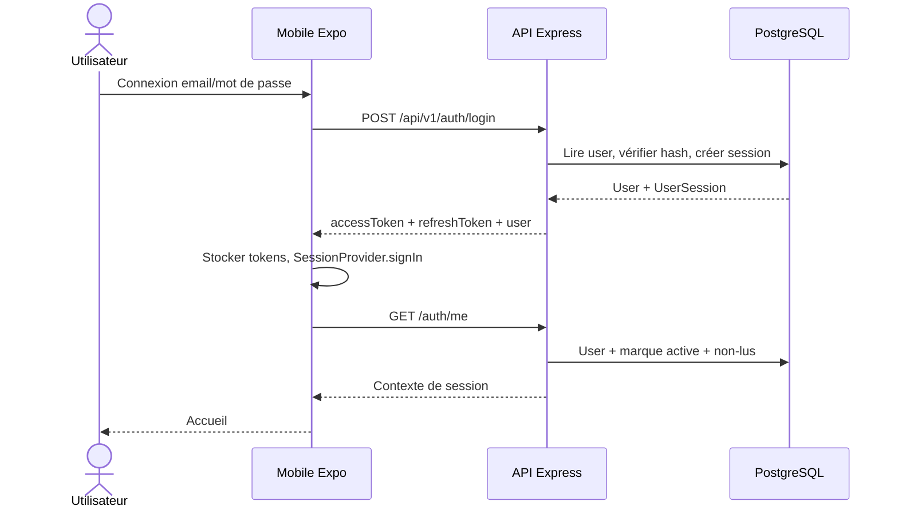

### 9.2 Création et configuration d'une marque

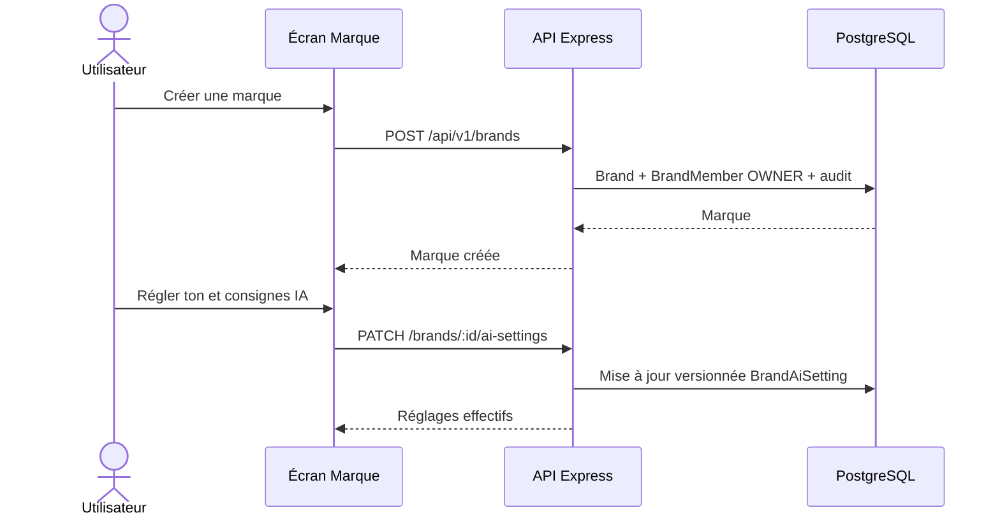

### 9.3 Connexion OAuth Meta

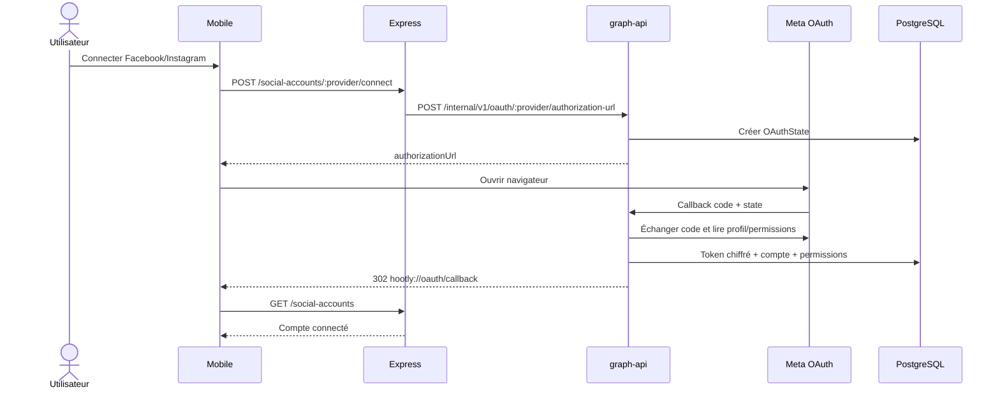

### 9.4 Composition, média et hashtags

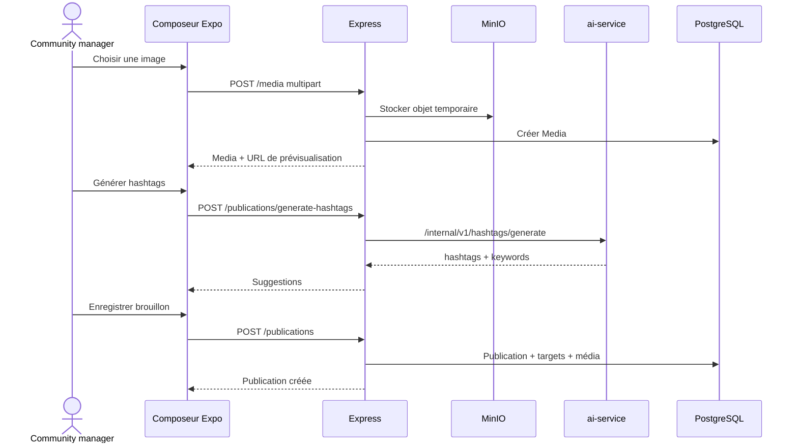

### 9.5 Approbation et planification

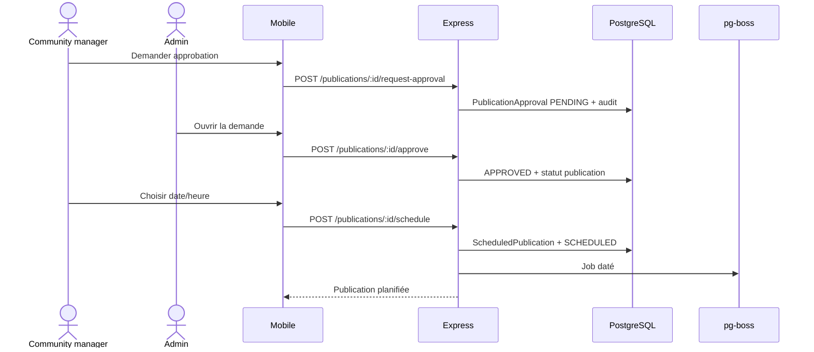

### 9.6 Publication vers Meta

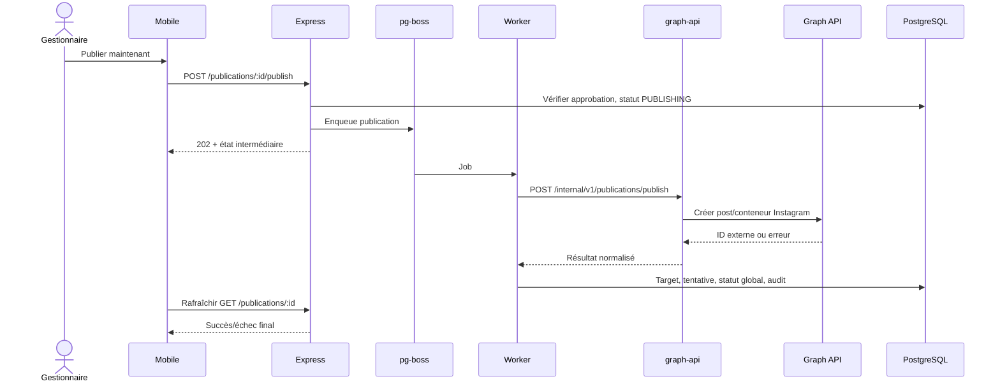

### 9.7 Synchronisation et analyse d'un commentaire

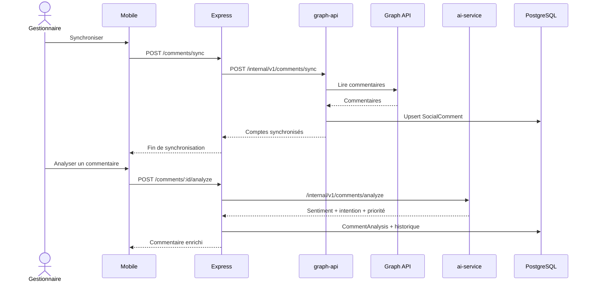

### 9.8 Génération RAG et réponse à un commentaire

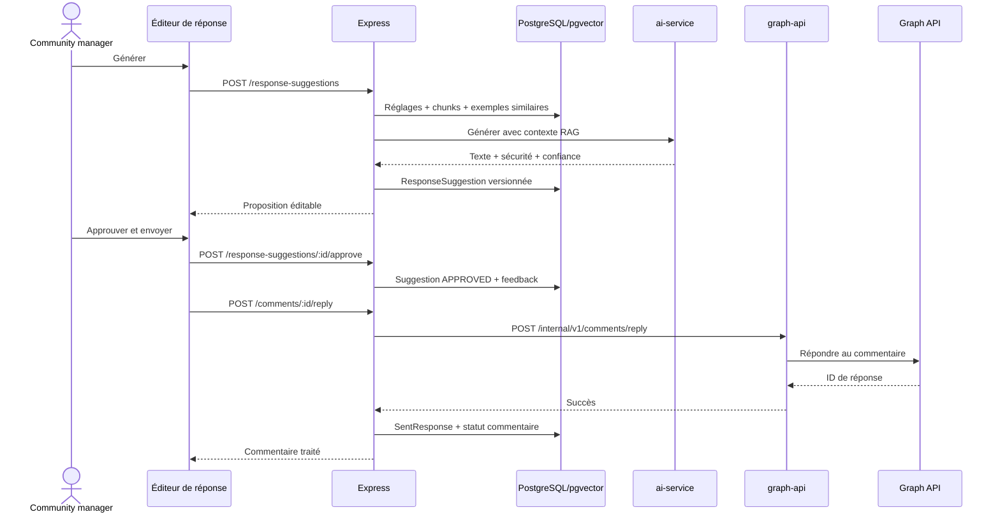

### 9.9 Base de connaissances

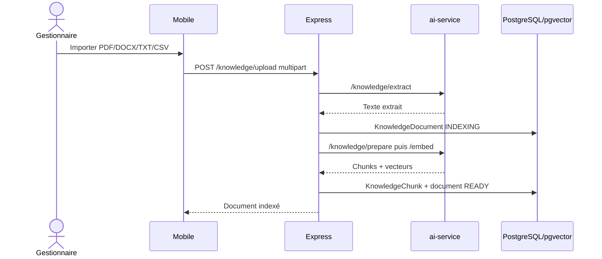

### 9.10 Notification persistée et push

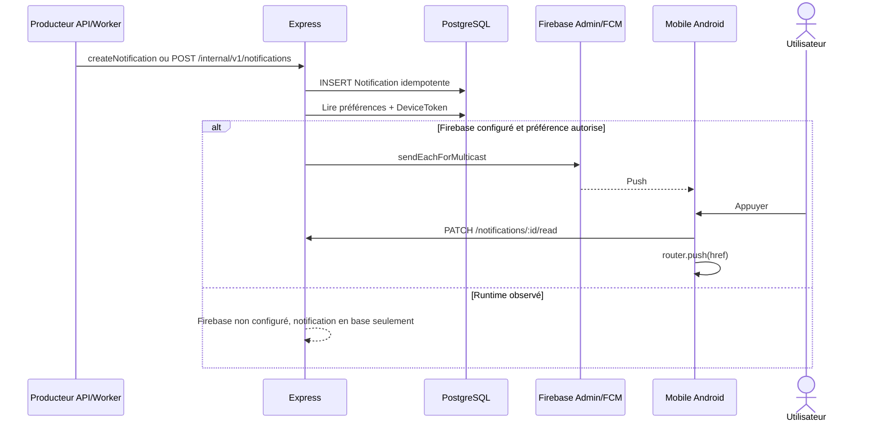

### 9.11 Analytics et insight IA

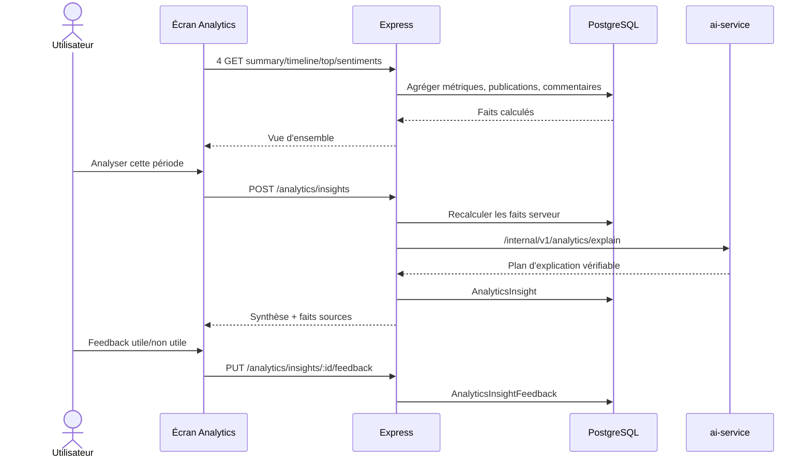

### 9.12 Veille concurrentielle

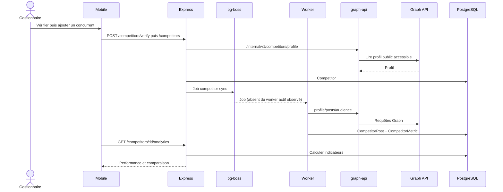

## 10. Matrice synthétique des statuts

| Domaine | Fonctionnalités solides d'après le code | Limites principales |
|---|---|---|
| Identité | Inscription, connexion, refresh, profil, sessions, mot de passe courant, suppression orchestrée | Reset oublié sans email ; avatar et changement d'email non reliés |
| Marques | CRUD essentiel, activation, rôles, réglages IA versionnés | Pas d'onboarding automatique ni de gestion des membres |
| Comptes sociaux | OAuth, liste, permissions, revalidation, déconnexion | Validation live Meta requise |
| Publications | Brouillon, média, hashtags, édition, approbation, planning, jobs, retry | Résultat Meta live à prouver ; rappel sans effet ; pas de temps réel |
| Commentaires/IA | Synchronisation, filtres, états, analyse locale, RAG, feedback, garde d'approbation | Webhooks et réponses Meta live à prouver ; Anthropic inactif |
| Connaissances | CRUD, upload, extraction, embeddings pgvector, réindexation | Route retrieve et dataset sans surface utilisateur directe |
| Notifications | Persistance, préférences, compteur, navigation, API push | Firebase runtime inactif ; iOS partiel |
| Analytics | Agrégats, détails, sync, insights persistés, feedback, meilleurs horaires | Données Meta réelles nécessaires ; deux routes sans UI |
| Concurrents | CRUD, vérification, calculs, comparaison et explications | Trois consommateurs absents du worker actif observé |

## 11. Vision fonctionnelle sans lire le code

Quand l'application est utilisée normalement, l'utilisateur s'authentifie puis travaille dans le contexte d'une marque. Il connecte ses comptes Facebook ou Instagram, prépare une publication avec une image et des hashtags, la soumet éventuellement à un administrateur, puis choisit une date ou lance la publication immédiatement. Express contrôle l'identité, le rôle et les transitions d'état ; PostgreSQL conserve la vérité métier ; le worker exécute les tâches différées ; graph-api est la seule passerelle vers Meta.

En parallèle, Hootly importe les commentaires des réseaux. Le gestionnaire peut les filtrer, les analyser et demander une réponse. Cette réponse tient compte du ton de la marque, de la publication, de l'historique, des documents internes et des réponses déjà validées. L'humain reste obligatoire : le serveur refuse d'envoyer une suggestion qui n'a pas été approuvée. Les décisions et résultats sont conservés pour l'audit et pour améliorer les prochains exemples RAG.

L'accueil et les analytics relisent les données collectées, sans déclencher silencieusement de gros traitements. Les synchronisations externes sont explicites ou planifiées. Les notifications existent toujours en base et peuvent ouvrir directement la bonne ressource ; le push mobile dépend toutefois d'une configuration Firebase absente du runtime inspecté. La veille concurrentielle est développée de bout en bout dans la source, mais le worker en cours d'exécution doit être reconstruit ou redémarré pour charger ses trois files avant qu'elle soit fiable.

En résumé : le produit constitue un socle fonctionnel cohérent et largement relié de l'interface jusqu'à PostgreSQL. Les risques restants ne sont pas des zones floues : ils se concentrent sur l'onboarding de marque, le mot de passe oublié, l'avatar/email, Firebase/iOS, l'absence de temps réel, la dérive du worker concurrentiel et surtout la validation avec de vrais comptes Meta.
