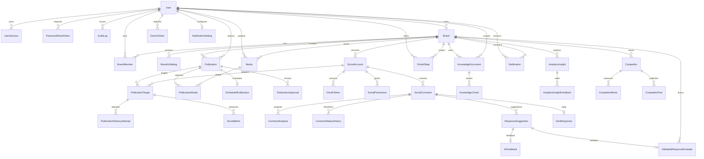
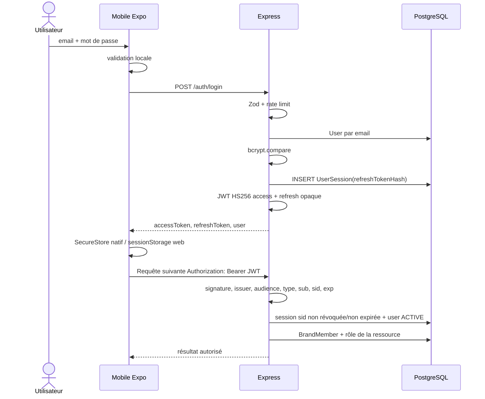

# Phase 4 — Backend, API, database, authentification et intégrations

Date de l'audit : 16 septembre 2026  
Périmètre : `services/api`, `services/worker`, `services/shared`, `graph-api`, `services/ai-service`, client Expo appelant et infrastructure Compose.  
Méthode : suivi statique des routes réellement montées, des appels frontend et interservices, du schéma Prisma et des migrations. Les preuves d'exécution de la Phase 2 sont réutilisées ; aucun secret n'est reproduit et aucun appel externe sensible n'a été déclenché.

## 1. Résumé exécutif

Le backend est constitué de trois API et d'un worker :

- Express est l'API publique, la couche d'autorisation et le cœur métier ;
- graph-api est la frontière Meta et possède aussi une ancienne API Facebook publique ;
- ai-service fournit NLP, génération, sécurité, embeddings et explications ;
- le worker consomme 11 files pg-boss et expose une petite API d'exploitation.

La base PostgreSQL/pgvector est commune aux services. Prisma possède le schéma et les migrations, Express utilise Prisma directement, graph-api et le worker utilisent du SQL brut sur une partie des mêmes tables. Il n'existe pas de couche repository autonome dans Express : les services métier sont aussi la couche d'accès aux données. graph-api possède en revanche des repositories SQL dédiés dans `graph-api/db`.

L'authentification utilisateur est correctement structurée autour d'un JWT d'accès court, d'un refresh token opaque haché en base, de sessions révocables et d'une rotation avec détection de rejeu. Les appels internes utilisent des JWT HS256 courts avec audience et scopes. Meta OAuth utilise un `state` aléatoire, haché, expirant et consommable une fois ; les tokens Meta sont chiffrés en AES-256-GCM.

Quatre faiblesses sont confirmées par le code :

1. les routes `/facebook/*` de graph-api sont montées sans authentification, y compris les écritures et suppressions Meta ;
2. ces mêmes routes acceptent des fichiers sans plafond applicatif avant lecture complète ;
3. `mobileRedirectUri` n'est pas limité à un schéma/hôte autorisé et devient directement la cible du `302` OAuth ;
4. `/internal/v1/jobs/health` du worker n'applique aucune authentification malgré son nom et un commentaire annonçant le contraire.

Les deux premières sont particulièrement graves parce que Compose publie graph-api sur le port hôte `8000` et que son client historique utilise le token de Page global configuré dans le service.

## 2. Cartographie des couches backend

### 2.1 API Express

| Couche | Emplacement | Responsabilité et dépendances |
|---|---|---|
| Point d'entrée/configuration | `services/api/src/server.js` | Configure JSON 1 Mo, request ID, health/readiness/OpenAPI, monte les routeurs et démarre le port 3000. Pas de middleware CORS ni Helmet. |
| Controllers/routes | `src/{auth,profile,brands,media,publications,approvals,social-accounts,comments,response-suggestions,knowledge,ai-feedback,notifications,analytics,dashboard,competitors}/routes.js` | Parse Zod, applique les middlewares, appelle un service, choisit le statut HTTP et l'enveloppe de réponse. Les handlers sont inline : aucune classe Controller distincte. |
| Services métier | `src/*/service.js`, `analytics/insights.js`, `competitors/analytics.js` | Transactions, règles d'état, autorisations dépendantes de la ressource, agrégations, audit, appels IA/Meta, création de jobs et mapping public. |
| Repositories | Aucun dossier repository | Accès Prisma direct depuis les services. `src/db/prisma.js` expose un singleton `PrismaClient`. `knowledge/service.js` utilise aussi `$queryRaw`/`$executeRaw` pour pgvector. |
| Entities/models | `services/api/prisma/schema.prisma` | 39 modèles Prisma, 29 enums, relations, contraintes et index déclaratifs. |
| DTO/validation | `src/*/schemas.js` | Objets Zod stricts ou bornés pour body/query/params. Multer valide séparément les formulaires média et connaissance. |
| Mappers | `toPublicUser`, `toPublicBrand`, `toPublicMedia`, `toPublicPublication(s)`, `toPublicComment`, `toPublicSuggestion`, `toPublicNotification`, `toPublicCompetitor/Metric/Post` | Empêchent d'exposer hash, tokens, clés objet privées et représentation DB en majuscules. `social-media/src/data/api.ts` effectue le second mapping API → modèles mobiles. |
| Filters | Schémas de query + fonctions `where` | `accessibleWhere`, `whereFor`, filtres commentaires/analytics/concurrents, pagination, périodes et réseau. Ce sont des filtres fonctionnels, pas des servlet filters. |
| Middlewares/guards | `auth/middleware.js`, `brands/middleware.js`, middlewares publication/commentaire/suggestion/notification | Vérification JWT + session DB, rôle de marque, chargement anti-IDOR et réponse 404 pour une ressource d'un autre tenant. |
| Exceptions | `lib/http.js::HttpError`, `errorHandler` | Erreurs stables `{error:{code,message,details?,requestId}}`; masque les erreurs internes en 500 générique. |
| Utilitaires | `lib/audit.js`, `idempotency.js`, `jobs.js`, `socialMetrics.js`, `analytics/*Facts.js`, `bestTimes.js`, `services/shared/*` | Audit, idempotence, production pg-boss, calcul de statuts et métriques, inspection média. |
| Clients externes | `lib/socialServiceClient.js`, `aiServiceClient.js`, `storage.js`, `firebase.js`, `notifications/push.js` | JWT de service, timeouts, traduction d'erreur, S3/MinIO, Firebase Admin. |
| Jobs produits | `lib/jobs.js` | Publication immédiate/planifiée, retry, sync analytics et concurrence. PostgreSQL/pg-boss est le transport. |

### 2.2 Worker

| Couche | Emplacement | Responsabilité |
|---|---|---|
| Entrée/orchestration | `services/worker/index.js` | Démarre pg-boss, enregistre consommateurs et crons, expose health/readiness/opérations sur 3001. |
| Services de jobs | `delivery.js`, `cleanup-media.js`, `token-refresh.js`, `comment-sync.js`, `comment-analysis.js`, `metrics-sync.js`, `competitor-sync.js` | Un module par famille de tâche, construit par injection de dépendances pour les tests. |
| Repository | `src/db.js` | Pool `pg`, fonction `query`; SQL brut sur publications, commentaires, analyses, métriques et concurrents. |
| Clients | `social-http-provider.js`, `social-account-client.js`, `competitor-client.js`, `ai-client.js`, `notifications-client.js`, `storage.js` | graph-api, ai-service, Express interne et MinIO. |
| Contrats partagés | `services/shared/jobs.js`, `publication-status.js`, `media-inspect.js` | Noms de files, transitions, délais de retry, clés singleton et validation d'image. |

Files déclarées :

| File | Producteur/déclencheur | Consommateur |
|---|---|---|
| `publish-scheduled-publication` | Planification Express/date pg-boss | `createDeliveryService` |
| `publish-publication-now` | Bouton publier | `createDeliveryService` |
| `retry-failed-publication` | Action retry/retry différé | `createDeliveryService` |
| `cleanup-temporary-media` | Cron horaire | `createMediaCleanup` |
| `refresh-expiring-oauth-tokens` | Cron 03:00 | `createTokenRefresh` |
| `sync-social-comments` | Cron toutes les 15 min | `createCommentSync` |
| `analyze-social-comments` | Cron toutes les 5 min | `createCommentAnalysis` |
| `sync-social-metrics` | Cron toutes les 30 min/action API | `createMetricsSync` |
| `sync-competitor` | Cron 04:00/16:00/action API | `createCompetitorSync` étape profil |
| `sync-competitor-posts` | Enchaînement concurrence | Étape publications |
| `sync-competitor-metrics` | Enchaînement concurrence | Étape audience/métriques |

La Phase 2 a observé un runtime worker ne chargeant que 8 files sur 11 : les trois files concurrentes étaient absentes du processus actif malgré leur présence dans la source.

### 2.3 graph-api

| Couche | Emplacement | Responsabilité |
|---|---|---|
| Entrée/configuration | `graph-api/main.py`, `core/config.py` | FastAPI, SlowAPI, request ID, CORS optionnel à liste explicite, gestionnaires d'erreur, montage des routeurs. |
| Controllers/routes | `api/routes/*.py` | Health, OAuth callbacks, webhook, API interne, gestion des comptes et API Facebook historique. |
| Services | `modules/facebook/services/*`, `modules/oauth/*`, `modules/webhooks/*`, `modules/competitors/*`, providers Facebook/Instagram | OAuth, normalisation Graph API, publication, commentaires, insights, webhooks et concurrence. |
| Repositories | `db/*_repository.py`, `db/pool.py` | SQL psycopg sur OAuth, comptes, permissions, cibles, commentaires, réponses, métriques, idempotence et webhooks. |
| DTO/entities | Pydantic dans `modules/*/schemas*.py` | Validation et sérialisation camelCase des échanges internes/publics. Les entités persistées restent celles de Prisma. |
| Mappers | Services/providers | Transforment réponses Meta hétérogènes en contrats `PublishResponse`, `CommentsSyncResponse`, profils, posts et métriques communs. |
| Guards | `core/security.py::require_service_jwt` | Audience `social-service`, type `service`, scopes `social:read`/`social:write`. Non appliqué aux routes `/facebook/*`. |
| Exceptions | `GraphAPIError`, handlers FastAPI | Traduction Meta/réseau vers codes stables, timeout 504, indisponibilité 503, token à reconnecter. |
| Sécurité spécialisée | `core/crypto.py`, webhook signature, idempotency repository | AES-GCM des tokens, SHA-256 du state, HMAC webhook, cache idempotent de publication/réponse. |

### 2.4 ai-service

| Couche | Emplacement | Responsabilité |
|---|---|---|
| Entrée/configuration | `services/ai-service/main.py`, `core/config.py` | FastAPI, rate limit, request ID, CORS explicite, handlers. |
| Routes | `api/routes/{internal,assistance,knowledge,analytics,health}.py` | Analyse, génération, safety, hashtags, extraction/chunking/embedding, explications. |
| Services/modules | `modules/nlp`, `generation`, `workflow`, `knowledge`, `analytics`, `safety` | Scikit-learn local, LangGraph, gabarits/Claude, FastEmbed, extraction de documents et validation des chiffres générés. |
| Repository | Aucun | Service sans stockage permanent ; Express persiste les résultats. Cache modèles sur volume local. |
| DTO | Pydantic dans les routes et `modules/*/schemas.py` | Bornes sur textes, listes, fichiers base64 et objets analytiques. |
| Guard | `core/security.py` | JWT audience `ai-service`, type `service`, scopes `ai:analyze`, `ai:generate`, `ai:knowledge`. |
| Exceptions | `AIServiceError` | Erreurs stables ; replis locaux pour génération/explications externes. |

## 3. Catalogue des endpoints Express réellement exposés

Abréviations d'authentification : **Public** = aucun Bearer requis ; **U** = JWT utilisateur + session active ; **V/CM/A/O** = rôle minimal VIEWER/COMMUNITY_MANAGER/ADMIN/OWNER ; **S** = JWT de service et scope. Les sorties métier sont enveloppées dans `{data,meta.requestId}` sauf `204`.

### 3.1 Opérations, identité et profil

| Method | Endpoint | Auth | Controller | Service | Input | Output | Frontend caller |
|---|---|---|---|---|---|---|---|
| GET | `/health` | Public | `server.js` | — | — | liveness | Aucun, sondes |
| GET | `/ready` | Public | `server.js` | config seulement | — | ready ou variables manquantes | Aucun, sondes |
| GET | `/openapi.json` | Public | `server.js` | — | — | document OpenAPI partiel | Aucun |
| POST | `/api/v1/auth/register` | Public + limite | `auth/routes.js` | `register` | email, password, identité, langue, timezone | session + user | `auth.register` |
| POST | `/api/v1/auth/login` | Public + limite | idem | `login` | email, password | session + user | `auth.login` |
| POST | `/api/v1/auth/refresh` | Public + limite | idem | `refresh` | refreshToken | nouvelle session/tokens | `fetchApi` automatiquement |
| POST | `/api/v1/auth/logout` | U | idem | `logout` | — | 204 | `auth.logout` |
| GET | `/api/v1/auth/me` | U | idem | `currentUser` | — | user, marque active, non-lus | `auth.me` |
| POST | `/api/v1/auth/forgot-password` | Public + limite | idem | `requestPasswordReset` | email | 202 accepted | `auth.requestPasswordReset` |
| POST | `/api/v1/auth/reset-password` | Public + limite | idem | `resetPassword` | token, password | 204 | `auth.resetPassword` |
| POST | `/api/v1/auth/change-password` | U | idem | `changePassword` | currentPassword, newPassword | nouvelle session/tokens | `auth.changePassword` |
| GET | `/api/v1/auth/sessions` | U | idem | `listSessions` | — | sessions actives | `profile.listSessions` |
| DELETE | `/api/v1/auth/sessions/:id` | U | idem | `revokeSession` | UUID | 204 | `profile.revokeSession` |
| DELETE | `/api/v1/auth/sessions` | U | idem | `revokeAllSessions` | — | 204 | `profile.revokeAllSessions` |
| DELETE | `/api/v1/auth/account` | U | idem | `deleteAccount` | password | 204 | `auth.deleteAccount` |
| GET | `/api/v1/profile` | U | `profile/routes.js` | `getProfile` | — | user public | **Aucun appel trouvé** (`profile.get` défini seulement) |
| PATCH | `/api/v1/profile` | U | idem | `updateProfile` | identité/téléphone/langue/timezone | user public | `profile.update` |
| GET | `/api/v1/profile/preferences` | U | idem | `getPreferences` | — | JSON preferences | **Aucun appel trouvé** |
| PATCH | `/api/v1/profile/preferences` | U | idem | `updatePreferences` | JSON validé | preferences | **Aucun appel trouvé** |
| POST | `/api/v1/profile/avatar` | U | idem | `saveAvatar` | mediaId | user/avatar | **Aucun appel trouvé** |
| DELETE | `/api/v1/profile/avatar` | U | idem | `deleteAvatar` | — | 204 | **Aucun appel trouvé** |

### 3.2 Marques et médias

| Method | Endpoint | Auth | Controller | Service | Input | Output | Frontend caller |
|---|---|---|---|---|---|---|---|
| GET | `/api/v1/brands` | U | `brands/routes.js` | `listBrands` | active/search/page | page de marques | `brandsApi.list/getActive` |
| POST | `/api/v1/brands` | U | idem | `createBrand` | nom, description, industry, langue | marque OWNER active | `brandsApi.create` |
| POST | `/api/v1/brands/:brandId/activate` | U+V | idem | `activateBrand` | UUID | marque active | **Méthode `setActive` définie mais jamais appelée** |
| GET | `/api/v1/brands/:brandId/ai-settings` | U+V | idem | `getAiSettings` | UUID | réglages courants | Indirect/non utilisé seul |
| PATCH | `/api/v1/brands/:brandId/ai-settings` | U+A | idem | `updateAiSettings` | expectedVersion + patch | nouvelle version | `brandsApi.update` |
| GET | `/api/v1/brands/:brandId` | U+V | idem | `getBrand` | UUID | marque | Repli interne de `brandsApi.update` |
| PATCH | `/api/v1/brands/:brandId` | U+A | idem | `updateBrand` | identité de marque | marque | `brandsApi.update` |
| DELETE | `/api/v1/brands/:brandId` | U+V puis O dans service | idem | `deleteBrand` | UUID | 204 | **Aucun appel trouvé** |
| POST | `/api/v1/media` | U | `media/routes.js` | `uploadMedia` | multipart file, brandId, purpose | média + URL signée | `mediaApi.upload` |
| GET | `/api/v1/media/:mediaId` | U/propriétaire | idem | `getMedia` | UUID | métadonnées + URL | **Aucun appel trouvé** |
| DELETE | `/api/v1/media/:mediaId` | U/propriétaire | idem | `deleteMedia` | UUID | 204 | `mediaApi.remove` défini mais **aucun appel d'écran trouvé** |

### 3.3 Publications, calendrier et approbations

| Method | Endpoint | Auth | Controller | Service | Input | Output | Frontend caller |
|---|---|---|---|---|---|---|---|
| POST | `/api/v1/publications/generate-hashtags` | U+V | `response-suggestions/routes.js` | `generateHashtags` | brandId, text, preserve | hashtags, keywords | `generateHashtags/detectKeywords` |
| GET | `/api/v1/publications` | U | `publications/routes.js` | `listPublications` | filtres/page | page publications autorisées | `publicationsApi.list` |
| GET | `/api/v1/publications/counts` | U | idem | `countPublications` | filtres | compteurs | `publicationsApi.counts` |
| POST | `/api/v1/publications` | U+CM | idem | `createPublication` | contenu, langue, hashtags, mediaIds, targets | publication | `publicationsApi.create` |
| GET | `/api/v1/publications/:id` | U+V | idem | `getPublication` | UUID | publication détaillée | `publicationsApi.get` |
| PATCH | `/api/v1/publications/:id` | U+CM | idem | `updatePublication` | patch contenu/média/targets | publication | `publicationsApi.update` |
| DELETE | `/api/v1/publications/:id` | U+CM | idem | `deletePublication` | UUID | 204 | `publicationsApi.remove` |
| POST | `/api/v1/publications/:id/schedule` | U+CM | idem | `schedulePublication` | scheduledAt, timezone | planning/publication | `publicationsApi.schedule` |
| PATCH | `/api/v1/publications/:id/schedule` | U+CM | idem | `schedulePublication` | idem | replanification | **Aucun appel trouvé** |
| DELETE | `/api/v1/publications/:id/schedule` | U+CM | idem | `cancelSchedule` | — | publication | `cancelSchedule` |
| POST | `/api/v1/publications/:id/publish` | U+CM | idem | `publishNow` + idempotence | header Idempotency-Key optionnel/généré | 202 jobId + publication | `publishNow` |
| POST | `/api/v1/publications/:id/retry` | U+CM | idem | `retryPublication` + idempotence | provider optionnel | 202 jobId + publication | `retry` |
| GET | `/api/v1/calendar` | U | idem | `calendar` | from, to | publications | `listForMonth` |
| POST | `/api/v1/publications/:id/request-approval` | U+CM | `approvals/routes.js` | `changeApproval` | reviewerId/comment optionnels | publication | `approvalsApi.request` |
| POST | `/api/v1/publications/:id/approve` | U+A | idem | `changeApproval` | approvalId, comment? | publication | `approvalsApi.decide` |
| POST | `/api/v1/publications/:id/reject` | U+A | idem | `changeApproval` | approvalId, comment requis | publication | idem |
| POST | `/api/v1/publications/:id/request-changes` | U+A | idem | `changeApproval` | approvalId, comment requis | publication | idem |
| POST | `/api/v1/publications/:id/cancel-approval` | U+CM | idem | `changeApproval` | approvalId | publication | idem |
| GET | `/api/v1/publications/:id/approval-history` | U+V | idem | `approvalHistory` | page/pageSize | événements | `approvalsApi.history` |
| GET | `/api/v1/approvals/members` | U+V | idem | `approvalMembers` | brandId | membres | `approvalsApi.members` |
| GET | `/api/v1/approvals` | U ; A si brandId ciblé | idem | `listApprovals` | brandId/status/auteur/reviewer/page | page demandes | `approvalsApi.list` |

### 3.4 Comptes sociaux et commentaires

| Method | Endpoint | Auth | Controller | Service | Input | Output | Frontend caller |
|---|---|---|---|---|---|---|---|
| GET | `/api/v1/social-accounts/oauth/status` | U | `social-accounts/routes.js` | `getOAuthStatus` | state | PENDING/COMPLETED/EXPIRED | **Aucun appel trouvé** |
| GET | `/api/v1/social-accounts` | U+V | idem | `listAccounts` | brandId | comptes/permissions | `accountsApi.list` |
| POST | `/api/v1/social-accounts/:id/sync` | U+V dans service | idem | `syncAccount` | UUID | compte revalidé | `accountsApi.sync` |
| DELETE | `/api/v1/social-accounts/:id` | U+A dans service | idem | `disconnectAccount` | UUID | 204 | `accountsApi.disconnect` |
| POST | `/api/v1/social-accounts/:provider/connect` | U+A | idem | `startConnect` | brandId, mobileRedirectUri | URL/state OAuth | `accountsApi.connect/reconnect` |
| GET | `/api/v1/comments` | U+V | `comments/routes.js` | `listComments` | brandId + filtres/page | page commentaires | `commentsApi.list` |
| GET | `/api/v1/comments/counts` | U+V | idem | `commentsCounts` | brandId | compteurs | `commentsApi.counts` |
| POST | `/api/v1/comments/sync` | U+V | idem | `syncBrandComments` | brandId | comptes synchronisés | `commentsApi.sync` |
| GET | `/api/v1/comments/:id` | U+V | idem | `getComment` | UUID | commentaire enrichi | `commentsApi.get` |
| GET | `/api/v1/comments/:id/history` | U+V | idem | `getCommentHistory` | UUID | événements/suggestions/envois | `commentsApi.history` |
| PATCH | `/api/v1/comments/:id/status` | U+CM | idem | `setCommentStatus` | status, note? | commentaire | `commentsApi.setStatus` |
| POST | `/api/v1/comments/:id/escalate` | U+CM | idem | `setCommentStatus` | note? | commentaire escaladé | **Aucun appel trouvé** ; le mobile utilise PATCH status |
| POST | `/api/v1/comments/:id/analyze` | U+CM | idem | `analyzeComment` | — | commentaire + analyse | `commentsApi.analyse` |
| POST | `/api/v1/comments/:id/reanalyze` | U+CM | idem | `analyzeComment` | — | nouvelle analyse | idem |
| POST | `/api/v1/comments/:id/reply` | U+CM | idem | `replyToComment` | aucun texte libre | commentaire/réponse envoyée | `approveAndSend` |

### 3.5 Suggestions IA, connaissances et feedback

Le même `responseSuggestionRouter` est monté sous deux bases : **B1** = `/api/v1/response-suggestions` et **B2** = `/api/v1/ai/responses`. Chaque ligne `B` ci-dessous représente donc deux endpoints réellement exposés, même lorsque le frontend n'en utilise qu'un.

| Method | Endpoint réel | Auth | Controller/service | Input | Output | Frontend caller |
|---|---|---|---|---|---|---|
| POST | `B1/` et `B2/` | U+CM | `createSuggestion` | commentId, texte ou options IA | suggestion 201 | B1 via `generateResponse/saveResponse`; B2 **non appelé** |
| GET | `B1/` et `B2/` | U+V | `listSuggestions` | commentId | versions | **Aucun appel direct** |
| GET | `B1/:id` et `B2/:id` | U+V | `toPublicSuggestion` | UUID | suggestion | **Aucun appel direct** |
| PATCH | `B1/:id` et `B2/:id` | U+CM | `updateSuggestion` | text/tone/language | nouvelle version | B1 via `saveResponse`; B2 non appelé |
| POST | `B1/:id/approve` et `B2/:id/approve` | U+CM | `approveSuggestion` | texte/feedback optionnels | suggestion approuvée | B1 appelé ; B2 non appelé |
| POST | `B1/:id/accept` et `B2/:id/accept` | U+CM | `approveSuggestion` | idem | suggestion approuvée | B2 appelé ; B1 non appelé |
| POST | `B1/:id/edit` et `B2/:id/edit` | U+CM | `approveSuggestion` | text requis | correction approuvée | **Aucun appel trouvé** |
| POST | `B1/:id/reject` et `B2/:id/reject` | U+CM | `rejectSuggestion` | feedback optionnel | suggestion rejetée | B1 appelé ; B2 non appelé |
| POST | `B1/:id/regenerate` et `B2/:id/regenerate` | U+CM | `createSuggestion` | options | nouvelle version 201 | B2 appelé ; B1 non appelé |
| GET | `/api/v1/knowledge` | U+V | `knowledge/routes.js::listDocuments` | brandId/page | documents | `knowledgeApi.list` |
| POST | `/api/v1/knowledge` | U+CM | `createDocument/indexDocument` | document texte | document indexé | `knowledgeApi.create` |
| POST | `/api/v1/knowledge/upload` | U+CM | extraction + `createDocument` | multipart ≤10 Mo | document indexé | `knowledgeApi.upload` |
| GET | `/api/v1/knowledge/:id` | U+V et propriétaire du document | `ownedDocument` | UUID | document + contenu | `knowledgeApi.get` |
| PUT | `/api/v1/knowledge/:id` | U+CM/propriétaire | `updateDocument` | revision + contenu | document réindexé | `knowledgeApi.update` |
| POST | `/api/v1/knowledge/:id/reindex` | U+CM/propriétaire | `indexDocument` | UUID | document | `knowledgeApi.reindex` |
| DELETE | `/api/v1/knowledge/:id` | U+CM/propriétaire | `deleteDocument` | UUID | 204 | `knowledgeApi.remove` |
| POST | `/api/v1/ai/retrieve` | U+CM | `ai-feedback/routes.js::retrieve` | brandId, query, limit | passages + scores | **Aucun appel direct** ; récupération intégrée dans la génération |
| GET | `/api/v1/ai/feedback/stats` | U+V | `feedbackStats` | brandId | statistiques | `knowledgeApi.stats` |
| GET | `/api/v1/ai/feedback/dataset` | U+CM | `evaluationDataset` | brandId/page | dataset JSON | **Aucun appel trouvé** |

### 3.6 Notifications

| Method | Endpoint | Auth | Controller/service | Input | Output | Frontend caller |
|---|---|---|---|---|---|---|
| GET | `/api/v1/notifications` | U | `listNotifications` | filter/page | page notifications du user | `notificationsApi.list` |
| GET | `/api/v1/notifications/unread-count` | U | `unreadCount` | — | count | SessionProvider |
| PATCH | `/api/v1/notifications/:id/read` | U/propriétaire | `markRead` | UUID | notification | `markRead` |
| POST | `/api/v1/notifications/read-all` | U | `markAllRead` | — | nombre modifié | `markAllRead` |
| POST | `/api/v1/device-tokens` | U | `registerDeviceToken` | token, platform | token public | pont push Android |
| DELETE | `/api/v1/device-tokens` | U | `removeDeviceToken` | token dans body | 204 | déconnexion |
| GET | `/api/v1/notification-settings` | U | `getNotificationSettings` | — | préférences | écran réglages |
| PATCH | `/api/v1/notification-settings` | U | `updateNotificationSettings` | patch | préférences | écran réglages/reset |
| POST | `/internal/v1/notifications` | S `notifications:write` | `internal-routes.js::createNotification` | événement/destinataire | notification 201 | Worker uniquement |

### 3.7 Analytics, dashboard et concurrents

| Method | Endpoint | Auth | Controller/service | Input | Output | Frontend caller |
|---|---|---|---|---|---|---|
| GET | `/api/v1/analytics/insights` | U+V | `analyticsInsights` | brandId, period, network | faits instantanés | Méthode définie, **aucun appel trouvé** |
| POST | `/api/v1/analytics/insights` | U+CM | `generateAnalyticsInsight` | mêmes filtres | insight persisté 201 | `generateInsight` |
| GET | `/api/v1/analytics/insights/history` | U+V | `insightHistory` | filtres/page | historique | `insightHistory` |
| GET | `/api/v1/analytics/insights/feedback/stats` | U+V | `insightFeedbackStats` | filtres | agrégats feedback | `insightFeedbackStats` |
| GET | `/api/v1/analytics/insights/:id` | U+V | `insightDetail` | brandId | insight | `insightDetail` |
| PUT | `/api/v1/analytics/insights/:id/feedback` | U+V | `saveInsightFeedback` | useful, comment | feedback | `insightFeedback` |
| POST | `/api/v1/analytics/sync` | U+CM | `syncBrandMetrics` | brandId | 202 queued | Méthode `analyticsApi.sync`, **aucun appel d'écran trouvé** |
| GET | `/api/v1/analytics/summary` | U+V | `analyticsSummary` | période/réseau | totaux/deltas | `overview` |
| GET | `/api/v1/analytics/timeline` | U+V | `analyticsTimeline` | brandId/réseau | buckets 4 semaines | `overview` |
| GET | `/api/v1/analytics/top-publications` | U+V | `analyticsTopPublications` | filtres/limit | top publications | `overview` |
| GET | `/api/v1/analytics/networks-comparison` | U+V | `analyticsNetworksComparison` | filtres | ventilation réseau | **Aucun appel trouvé** |
| GET | `/api/v1/analytics/sentiments` | U+V | `analyticsSentiments` | filtres | répartition | `overview` |
| GET | `/api/v1/analytics/priorities` | U+V | `analyticsPriorities` | filtres | répartition | **Aucun appel trouvé** |
| GET | `/api/v1/analytics/publications/:id` | U+V | `publicationAnalytics` | brandId | détail publication | `forPublication` |
| GET | `/api/v1/analytics/best-times` | U+V | `analyticsBestTimes` | réseau/période/timezone | 3 créneaux | `bestTimes` |
| POST | `/api/v1/analytics/best-times/explain` | U+V | `explainBestTimes` | mêmes paramètres | texte/générateur | `explainBestTimes` |
| GET | `/api/v1/dashboard/summary` | U+V | `dashboardSummary` | brandId | compteurs | accueil |
| GET | `/api/v1/dashboard/priority-comments` | U+V | `dashboardPriorityComments` | brandId | 3 commentaires | accueil |
| GET | `/api/v1/dashboard/upcoming-publications` | U+V | `dashboardUpcomingPublications` | brandId | 3 publications | accueil |
| GET | `/api/v1/competitors` | U+V | `listCompetitors` | filtres/page | concurrents | `competitorsApi.list` |
| POST | `/api/v1/competitors` | U+CM | `createCompetitor` | brandId/platform/handle | concurrent + queued | `create` |
| POST | `/api/v1/competitors/verify` | U+CM | `verifyCompetitor` | handle | profil/statut | `verify` |
| GET | `/api/v1/competitors/comparison` | U+V | `competitorsComparison` | période/platform/limit | comparaison | `comparison` |
| POST | `/api/v1/competitors/comparison/explain` | U+V | `explainComparison` | mêmes filtres | synthèse IA | `explainComparison` |
| GET | `/api/v1/competitors/:id` | U+V | `getCompetitor` | brandId | détail | `detail` |
| PATCH | `/api/v1/competitors/:id` | U+CM | `updateCompetitor` | brandId + patch | concurrent | Méthode définie, **aucun écran trouvé** |
| DELETE | `/api/v1/competitors/:id` | U+CM | `deleteCompetitor` | brandId | 204 | `remove` |
| POST | `/api/v1/competitors/:id/sync` | U+CM | `requestCompetitorSync` | brandId | 202 queued | `sync` |
| GET | `/api/v1/competitors/:id/posts` | U+V | `listCompetitorPosts` | période/page | posts | `posts` |
| GET | `/api/v1/competitors/:id/analytics` | U+V | `competitorAnalytics` | période | indicateurs | `analytics` |

### 3.8 Endpoints Express sans appel frontend apparent

La comparaison a été faite contre `social-media/src/data/api.ts` puis contre les appels réels depuis `app/` et `src/`.

- profil GET autonome, préférences de profil et avatar ;
- activation et suppression de marque ;
- lecture/suppression directe d'un média ;
- `PATCH` de replanification ;
- statut OAuth de secours ;
- raccourci `/comments/:id/escalate` ;
- liste/détail direct des suggestions et plusieurs alias du double montage ;
- `/ai/retrieve` et export du dataset de feedback ;
- lecture instantanée `/analytics/insights`, synchronisation analytics, comparaison réseau et priorités ;
- modification d'un concurrent.

Une route non appelée n'est pas nécessairement morte : certaines sont des API d'administration, de compatibilité ou de secours. Le double montage complet du routeur de suggestions augmente toutefois inutilement la surface exposée.

## 4. Catalogue graph-api

### 4.1 Routes d'exploitation, OAuth et webhook

| Method | Endpoint | Auth | Controller/service | Input → output | Caller |
|---|---|---|---|---|---|
| GET | `/health`, `/ready` | Public | `health.py` | liveness/config readiness | Compose/scripts |
| GET | `/openapi.json`, `/docs`, `/redoc` | Public | FastAPI automatique | documentation | Aucun runtime métier |
| GET | `/oauth/facebook/callback` | `state` OAuth, pas JWT | `callback_service.handle_facebook_callback` | code/state/error → 302 deep link | Meta/navigateur |
| GET | `/oauth/instagram/callback` | idem | `handle_instagram_callback` | idem | Meta/navigateur |
| GET | `/webhooks/meta` | verify token Meta | `webhook_challenge` | challenge → texte | Meta |
| POST | `/webhooks/meta` | HMAC `x-hub-signature-256` | `process_payload` | événement brut → 200 | Meta |

### 4.2 Routes internes protégées

| Method | Endpoint | Scope | Service | Input → output | Caller |
|---|---|---|---|---|---|
| POST | `/internal/v1/oauth/:provider/authorization-url` | `social:write` | `oauth_service.create_authorization_url` | user/brand/redirect → URL/state | Express |
| POST | `/internal/v1/publications/publish` | `social:write` + Idempotency-Key | `internal_service.publish` | cible/contenu/média → ID externe | Worker |
| POST | `/internal/v1/comments/sync` | `social:read` | `internal_service.sync_comments` | compte + posts → compteurs | Express/worker |
| POST | `/internal/v1/comments/reply` | `social:write` + Idempotency-Key | `internal_service.reply_comment` | compte/commentaire/texte → reply ID | Express |
| POST | `/internal/v1/metrics/sync` | `social:read` | `internal_service.sync_metrics` | compte + publications → compteurs | Worker |
| POST | `/internal/v1/competitors/profile` | `social:read` | `competitor_service.profile` | compte source/platform/handle → profil/statut | Express/worker |
| POST | `/internal/v1/competitors/posts` | `social:read` | `competitor_service.posts` | handle/limites → posts | Worker |
| POST | `/internal/v1/accounts/audience` | `social:read` | `competitor_service.account_audience` | compte source → followers | Worker |
| GET | `/internal/v1/social-accounts/:id/profile` | `social:read` | `account_service.get_profile` | id → profil actualisé | Express |
| POST | `/internal/v1/social-accounts/:id/refresh-token` | `social:write` | `account_service.refresh_token` | id → statut/expiration | Express/worker |
| GET | `/internal/v1/social-accounts/:id/permissions` | `social:read` | `account_service.get_permissions` | id → permissions | Disponible, aucun appel courant trouvé |
| POST | `/internal/v1/social-accounts/:id/revoke` | `social:write` | `account_service.revoke` | id → statut | Express |

### 4.3 API Facebook historique non protégée

Toutes ces routes utilisent le singleton `facebook_client`, donc le Page ID et le Page access token globaux du service. Aucune ne dépend de `require_service_jwt` ni d'une authentification utilisateur.

| Method | Endpoint | Input → output |
|---|---|---|
| GET/POST | `/facebook/posts` | filtres → posts ; message/fichiers → post créé |
| PUT/DELETE | `/facebook/posts/:postId` | message → post modifié ; suppression |
| GET/POST | `/facebook/scheduled-posts` | pagination → planifiés ; message/date/fichiers → planifié |
| PUT/DELETE | `/facebook/scheduled-posts/:postId` | modification/suppression |
| GET | `/facebook/posts/:postId/comments` | pagination → commentaires |
| GET | `/facebook/comments/:commentId/replies` | pagination → réponses |
| POST | `/facebook/comments/:commentId/reply` | message → réponse créée |
| GET | `/facebook/posts/:postId/stats` | réactions/commentaires/partages |
| GET | `/facebook/community-managers/stats` | agrégats par auteur |
| GET | `/facebook/posts/:postId/analytics` | analytics |
| GET | `/facebook/posts/:postId/insights` | stats + insights |
| GET/POST | `/facebook/stories` | liste ; fichier/message → story |
| DELETE | `/facebook/stories/:storyId` | suppression |

Aucun appel depuis Express, le worker ou le mobile n'a été trouvé : les parcours modernes utilisent `/internal/v1`.

## 5. Catalogue ai-service et worker

### 5.1 ai-service

| Method | Endpoint | Auth | Input → output | Caller |
|---|---|---|---|---|
| GET | `/health`, `/ready` | Public | état/modèles | Compose/scripts |
| GET | `/openapi.json`, `/docs`, `/redoc` | Public | documentation FastAPI | Aucun métier |
| POST | `/internal/v1/comments/analyze` | `ai:analyze` | texte/commentId → sentiment, intention, priorité, confiance | Express/worker |
| GET | `/internal/v1/models/info` | `ai:analyze` | — → versions/hyperparamètres/métriques | **Aucun appel trouvé** |
| POST | `/internal/v1/responses/generate` | `ai:generate` | contexte RAG/marque/commentaire → suggestion | Express |
| POST | `/internal/v1/workflows/comment-assistance` | `ai:generate` | même contexte → état complet | **Aucun appel trouvé** |
| POST | `/internal/v1/responses/safety-check` | `ai:generate` | texte/règles → blocked/warnings | Express |
| POST | `/internal/v1/hashtags/generate` | `ai:generate` | texte/marque/preserve → hashtags/keywords | Express |
| POST | `/internal/v1/knowledge/extract` | `ai:knowledge` | base64/nom/MIME → texte | Express |
| POST | `/internal/v1/knowledge/prepare` | `ai:knowledge` | contenu → chunks | Express |
| POST | `/internal/v1/knowledge/embed` | `ai:knowledge` | ≤32 textes/kind → vecteurs 384 | Express |
| POST | `/internal/v1/analytics/explain` | `ai:generate` | faits → synthèse validée | Express |
| POST | `/internal/v1/analytics/best-times/explain` | `ai:generate` | créneaux/faits → texte | Express |
| POST | `/internal/v1/analytics/competitors/explain` | `ai:generate` | comparaison → synthèse/recommandations | Express |

### 5.2 Worker operations API

| Method | Endpoint | Auth | Output | Caller |
|---|---|---|---|---|
| GET | `/health` | Public | liveness | Compose |
| GET | `/ready` | Public | dépendances + liste des files | scripts |
| GET | `/internal/v1/jobs/health` | **Aucune** | statut, nombre/noms de files, démarrage, dernière erreur | script/readiness potentiel |
| GET | `/openapi.json` | Public | documentation | Aucun |

## 6. Modèle de données

### 6.1 Vue d'ensemble

- PostgreSQL 16 est la source de vérité.
- `pgvector` stocke les embeddings `vector(384)`.
- pg-boss utilise son propre schéma PostgreSQL pour les files et crons.
- Prisma possède le DDL ; graph-api/worker dépendent des noms SQL mappés et des defaults UUID conservés dans les migrations.
- Deux index HNSW et deux index partiels importants existent uniquement dans les migrations : exemples/chunks vectoriels, une marque active par utilisateur et une approbation PENDING par publication.

### 6.2 Dictionnaire des 39 tables

| Modèle / table | Champs importants | Relations et index importants | Fonctionnalités |
|---|---|---|---|
| `User` / `users` | email unique, passwordHash, identité, langue, timezone, preferences, avatarMediaId, status | 1-N sessions/membres/publications ; index status | Auth, profil, ownership |
| `UserSession` / `user_sessions` | refreshTokenHash, deviceName, expiresAt, revokedAt, replacedBySessionId | FK user cascade ; indexes user+revoked, expiration | Login, refresh, révocation |
| `PasswordResetToken` / `password_reset_tokens` | tokenHash, expiresAt, usedAt | FK user ; index user+expiration | Reset password |
| `AuditLog` / `audit_logs` | action, resourceType/Id, requestId, metadata | user nullable ; indexes chronologique/ressource | Traçabilité |
| `Brand` / `brands` | ownerUserId, nom, industry, langue, status, deletedAt | owner restrict ; indexes owner/deleted | Tenant/marque |
| `BrandMember` / `brand_members` | brandId, userId, role, isActive | unique brand+user ; index rôle ; index partiel DB un actif/user | Rôles et marque sélectionnée |
| `BrandAiSetting` / `brand_ai_settings` | version, tone, formality, règles/termes/instructions | unique brand+version | Contexte IA versionné |
| `Media` / `media` | owner/brand, bucket, objectKey unique, MIME/taille/dimensions, purpose/status | avatar/publication ; indexes owner/brand+date | Upload/MinIO |
| `Publication` / `publications` | brand/auteur, content, hashtags, status, revisions, scheduledAt/publishedAt | targets/media/schedule/approvals ; indexes statut/dates | Contenu/calendrier |
| `PublicationApproval` / `publication_approvals` | requester/reviewer, revision, status, commentaires, dates | FK publication/users ; index partiel une PENDING | Workflow d'approbation |
| `PublicationTarget` / `publication_targets` | compte, provider, contenu adapté, statut, externalId, erreurs/tentatives | unique publication+compte ; indexes provider/statut/externalId | Livraison par réseau |
| `PublicationMedia` / `publication_media` | publicationId, mediaId, position | uniques média/position | Jointure contenu-média |
| `ScheduledPublication` / `scheduled_publications` | date/timezone, jobId, status, auteur | 1-1 publication ; index status+date | Planification pg-boss |
| `PublicationDeliveryAttempt` / `publication_delivery_attempts` | numéro, idempotencyKey, statut, erreur, externalId, dates | unique target+attempt ; index statut | Retry/audit livraison |
| `IdempotencyKey` / `idempotency_keys` | endpoint/key, user, requestHash, réponse, expiration | unique endpoint+key | Idempotence API publique |
| `SocialAccount` / `social_accounts` | brand, provider, externalId, profil, status/authMethod, syncs, audience | unique provider+externalId ; tokens/permissions/targets/comments | Comptes Meta |
| `OAuthToken` / `oauth_tokens` | version/status, access/refresh chiffrés, keyVersion, scopes, expiration/erreur | unique compte+version ; jamais exposé à Express | Credentials Meta |
| `SocialPermission` / `social_permissions` | permission, status, checkedAt | unique compte+permission | Diagnostic permissions |
| `OAuthState` / `oauth_states` | stateHash, user/brand/provider, redirect, consumed/expiry | stateHash unique | Anti-CSRF OAuth |
| `ServiceIdempotencyKey` / `service_idempotency_keys` | endpoint/key, requestHash, réponse, expiry | unique endpoint+key | Idempotence graph-api |
| `SocialComment` / `social_comments` | compte/externalIds, auteur/contenu, status, deletedOnPlatform, latestAnalysisId | unique compte+externalComment ; index status | Inbox commentaires |
| `CommentStatusHistory` / `comment_status_history` | from/to, acteur, note, date | FK commentaire/user | Historique modération |
| `WebhookEvent` / `webhook_events` | provider, payloadHash, rawPayload, status/erreur | unique provider+hash | Déduplication webhook |
| `SentResponse` / `sent_responses` | commentaire unique, compte, contenu, auteur, status/externalReplyId/erreur | 1-1 commentaire ; index statut | Réponse Meta |
| `CommentAnalysis` / `comment_analyses` | sentiment, intent, priority, confidences, urgence, modèle/dataset | N-1 commentaire + pointeur latest ; indexes priorité/sentiment | NLP |
| `ResponseSuggestion` / `response_suggestions` | version, textes original/généré/final, sources, exemples, stratégie, statut, safety | unique commentaire+version ; feedback/exemple 1-1 | RAG/réponse humaine |
| `KnowledgeDocument` / `knowledge_documents` | owner, brand, titre/type/source/contenu, status/revision/model | chunks cascade ; index user+brand+date | Corpus RAG |
| `KnowledgeChunk` / `knowledge_chunks` | contenu, vector(384), chunkIndex, metadata | unique document+index ; HNSW cosine | Recherche sémantique |
| `AiFeedback` / `ai_feedback` | responseId unique, type, reason/rating/comment, finalResponse/editDistance | 1-1 suggestion, auteur | Qualité IA |
| `ValidatedResponseExample` / `validated_response_examples` | brand, réponse, commentaire/final, analyse, vector(384) | response unique ; HNSW cosine | Exemples RAG validés |
| `Notification` / `notifications` | user/brand, type/priorité, titre/message, ressource, eventId, readAt | unique event+user ; indexes non-lus/date | Centre de notifications |
| `DeviceToken` / `device_tokens` | token unique, platform, disabled/lastSeen | FK user | FCM |
| `NotificationSetting` / `notification_settings` | toggles, son/vibration, heures silencieuses, priorité min | PK/FK user | Préférences push |
| `SocialMetric` / `social_metrics` | target, collectedAt, réactions/commentaires/partages/reach/impressions | index target+date | Analytics append-only |
| `AnalyticsInsight` / `analytics_insights` | marque/réseau/période, snapshot, summary/recommendations/explanation, model/status | index brand+filtres+date | Insight IA persisté |
| `AnalyticsInsightFeedback` / `analytics_insight_feedback` | insight/user, useful, comment | unique insight+user | Évaluation insight |
| `Competitor` / `competitors` | brand/platform/externalId/username/profil/status/erreurs/sync | unique brand+platform+username | Veille concurrentielle |
| `CompetitorMetric` / `competitor_metrics` | date, followers/posts/interactions, engagementRate | index concurrent+date | Historique concurrent |
| `CompetitorPost` / `competitor_posts` | externalPostId, message/média/permalink/date/interactions/rate | unique concurrent+post ; index date | Posts concurrents |

### 6.3 Relations principales — Mermaid ER

### 6.4 Migrations

| Migration | Contenu principal |
|---|---|
| `20260731000000_auth_initial` | users, sessions, reset, audit |
| `20260804000000_profile_brands` | profil, marques, membres, IA, médias ; index partiel marque active |
| `20260830000000_publications_media_scheduler` | publications, targets, média, planning, tentatives, idempotence |
| `20260912000000_social_accounts_oauth` | comptes, tokens chiffrés, permissions, state, idempotence service |
| `20260912010000_webhooks_comments_replies` | commentaires, historique, webhooks, réponses |
| `20260913000000_comment_analyses` | analyses NLP append-only + pointeur latest |
| `20260913010000_response_suggestions` | suggestions versionnées |
| `20260913020000_notifications_device_tokens` | notifications, FCM, préférences |
| `20260913030000_social_metrics` | métriques sociales append-only et index analytics |
| `20260914010000_rag_human_feedback` | extension vector, corpus, chunks, feedback, exemples et HNSW |
| `20260914120000_publication_approval` | approbations, révisions, index partiel PENDING |
| `20260915010000_analytics_insights` | insights persistés et feedback |
| `20260916000000_competitor_analysis` | concurrents, posts, métriques, audience du compte de marque |

Les migrations conservent volontairement `gen_random_uuid()` pour les écritures SQL brutes. Une régénération mécanique par `prisma migrate diff` pourrait proposer de supprimer ces defaults et casser graph-api/worker : c'est une dépendance opérationnelle importante.

### 6.5 Quelle fonctionnalité utilise quelle donnée

| Fonction | Lecture principale | Écriture principale |
|---|---|---|
| Login/refresh | `users`, `user_sessions` | `user_sessions`, `audit_logs` |
| Profil/marque/rôles | `users`, `brands`, `brand_members`, `brand_ai_settings` | mêmes tables + audit |
| OAuth social | `oauth_states`, comptes/tokens/permissions | `social_accounts`, `oauth_tokens`, `social_permissions` |
| Publication | marque/comptes/médias/réglages | `publications`, targets, media, schedule, attempts, idempotence |
| Approbation | publication, membres | `publication_approvals`, revision/statut publication, notifications |
| Commentaires | comptes/targets/commentaires | `social_comments`, historique, webhook events |
| Analyse/réponse | commentaire, analyse, réglages, chunks, exemples | analyses, suggestions, feedback, exemples validés, réponses envoyées |
| Notifications | événements métier, préférences/tokens | notifications, device tokens, settings |
| Analytics | publications/targets/social_metrics/commentaires | métriques, insights et feedback |
| Concurrence | compte source, publications/métriques de marque | competitors, posts, metrics, audience compte |

## 7. Authentification et autorisation

### 7.1 Login complet

### 7.2 JWT utilisateur

- HS256, secret `JWT_ACCESS_SECRET` exigé et placeholders refusés.
- Claims : `sub=userId`, `sid=sessionId`, `tokenType=access`, `iss`, `aud`, `iat`, `exp`.
- TTL par défaut lu de configuration, court pour l'access token ; refresh beaucoup plus long.
- `requireAuthentication` ne se contente pas de la signature : il relit `user_sessions` et `users.status`, permettant révocation immédiate.
- Le refresh token n'est pas un JWT : `sessionId` + 48 octets aléatoires base64url, hash bcrypt en base.
- Rotation : nouvelle session, ancienne révoquée, lien `replacedBySessionId`. Toute réutilisation/incohérence révoque toutes les sessions actives de l'utilisateur et écrit un audit.
- Mot de passe : bcrypt coût 12 ; reset révoque toutes les sessions.

### 7.3 Stockage client

- Android/iOS : Expo SecureStore avec `WHEN_UNLOCKED_THIS_DEVICE_ONLY`.
- Web : `sessionStorage`, effacé à la fermeture de l'onglet mais accessible à tout JavaScript exécuté dans l'origine.
- `fetchApi` ajoute le Bearer, effectue une seule rotation sur 401, remplace les deux tokens puis rejoue la requête.
- La déconnexion désenregistre le token FCM, révoque la session et efface le stockage local, même si le serveur est indisponible.

### 7.4 Rôles, permissions et guards

Hiérarchie : `VIEWER < COMMUNITY_MANAGER < ADMIN < OWNER` dans `brands/middleware.js`.

- `requireBrandAccess` charge le membership et masque les autres tenants en 404.
- Les middlewares publication/commentaire/suggestion résolvent d'abord la marque depuis la ressource, puis contrôlent le rôle : protection anti-IDOR correcte dans ces chemins.
- Les notifications sont contrôlées directement par `userId`.
- Les suppressions de marque ont un second contrôle OWNER dans le service.
- Les transitions de publication sont centralisées dans `services/shared/publication-status.js`.
- Il n'existe pas de Firebase Auth : Firebase n'est utilisé que pour FCM.

### 7.5 JWT interservices

- Secret partagé `SERVICE_JWT_SECRET`, HS256, durée 120 secondes côté Express/worker.
- Audiences distinctes : `social-service`, `ai-service`, `api-service`.
- Claim `type=service`, `scope[]`, `sub` et `jti` aléatoire.
- Scopes : `social:read`, `social:write`, `ai:analyze`, `ai:generate`, `ai:knowledge`, `notifications:write`.
- Un JWT utilisateur ne peut pas ouvrir une route interne même en cas de secret mal configuré identique, car `type=service` est exigé.

### 7.6 OAuth Meta

1. Un ADMIN authentifié demande une URL à Express.
2. Express transmet userId, brandId et redirect mobile avec JWT `social:write`.
3. graph-api génère un state cryptographique, ne stocke que son SHA-256 avec expiration.
4. Le navigateur ouvre Meta ; Meta rappelle graph-api.
5. Le state est consommé atomiquement et ne peut plus être rejoué.
6. graph-api échange le code contre des tokens, lit comptes/profils/permissions.
7. Les tokens sont chiffrés AES-256-GCM avec version de clé et enregistrés dans `oauth_tokens`.
8. Le navigateur reçoit un `302` vers le deep link, sans token dans l'URL.

### 7.7 Filters, CORS et secrets

- Express n'ajoute aucun CORS. Ce n'est pas un CORS permissif ; en revanche un build web servi depuis une autre origine ne pourra pas appeler l'API sans proxy/configuration supplémentaire.
- graph-api et ai-service n'activent CORS que si `CORS_ALLOWED_ORIGINS` est renseigné ; méthodes et headers sont explicitement limités.
- Les `.env` sont ignorés par Git ; seuls les fichiers `.env.example` sont suivis.
- Aucun secret réel hardcodé n'a été trouvé par la recherche ciblée. Les valeurs ne sont pas reproduites ici.
- Compose injecte les credentials par variables d'environnement. Tous les services techniques sont néanmoins publiés sur l'hôte en développement.

## 8. Intégrations externes

### 8.1 Meta Facebook/Instagram

| Aspect | Implémentation |
|---|---|
| Configuration | App IDs/secrets, Page ID/token historique, Graph base URL versionnée, URL publique callback, webhook verify token, clé de chiffrement et DB. |
| Authentification | OAuth 2 navigateur ; Page/IG access token vers Meta ; JWT `social-service` pour entrer dans graph-api ; HMAC pour webhook. |
| Endpoints Meta appelés | Dialogue OAuth, `oauth/access_token`, `me/accounts`, `me/permissions`, profil/permissions ; `/{page}/feed`, photos, videos, posts, comments, replies, insights, stories ; `/{ig}/media`, `media_publish`, status de conteneur, comments/replies/insights ; profils/posts/audience concurrents. |
| Données envoyées | Codes OAuth, tokens dans paramètres HTTPS, contenu/hashtags, médias ou URL signée, commentaire de réponse, IDs externes, champs/curseurs Graph. |
| Données reçues | Tokens/scopes/expiration, profils, permissions, IDs de posts/réponses, statuts de conteneur, commentaires, métriques, posts concurrents et erreurs Meta. |
| Transformation | Providers communs, Pydantic, normalisation Facebook/Instagram vers contrats internes ; mappage des erreurs et `REAUTHENTICATION_REQUIRED`. |
| Stockage | Tokens chiffrés, comptes/permissions, targets/external IDs, commentaires/webhooks, réponses, métriques et concurrence. |
| Erreurs | Timeouts, réseau, JSON invalide, rate limit/Retry-After, token expiré ; idempotence sur publish/reply ; retries worker. |

### 8.2 MinIO/S3

| Aspect | Implémentation |
|---|---|
| Configuration/auth | Endpoint interne/public, région, access key/secret, bucket, TTL/taille. Credentials seulement côté API/worker. |
| Appels | Head/CreateBucket, Put/Copy/DeleteObject, GetObject présigné. |
| Données | Images de publication/avatar ; métadonnées en table `media`, octets dans MinIO. |
| Transformation | Inspection magic bytes/dimensions, nom de clé temporaire puis publication, URL signée sans exposer la clé S3. |
| Erreurs | `storage_unavailable`, nettoyage horaire des temporaires, suppression best-effort selon parcours. |

### 8.3 Firebase Cloud Messaging

| Aspect | Implémentation |
|---|---|
| Configuration/auth | Project ID, client email, private key dans Firebase Admin ; aucune Firebase Auth. |
| Appel | `messaging().sendEachForMulticast`. |
| Données | Token appareil, notificationId/type/priorité/ressource/href et contenu visible. |
| Stockage | `notifications` reste la vérité ; `device_tokens` stocke les tokens et désactive les tokens périmés. |
| Erreurs | No-op si non configuré, erreurs par token loguées sans valeur de token, stale tokens désactivés. |
| Runtime Phase 2 | `firebaseConfigured=false` : persistance active, livraison push inactive. |

### 8.4 Anthropic

| Aspect | Implémentation |
|---|---|
| Configuration/auth | Mode `llm`, clé API et modèle via environnement/SDK. |
| Appel | SDK `Anthropic.messages.create`. |
| Données | Prompt système, commentaire, contexte marque/publication, documents/exemples et instruction ; réponse texte. |
| Transformation | Validation de sécurité, limites de longueur, validation des nombres analytics ; repli sur gabarit local. |
| Stockage | ai-service ne persiste rien ; Express conserve suggestion/insight/feedback. |
| Erreurs | Auth, rate limit, statut, connexion et refus sont capturés ; fallback local. Phase 2 : non configuré. |

### 8.5 Intégrations absentes

Aucun Google API, Google Sign-In, Slack, MongoDB, Redis, JDBC ou Firebase Auth n'est présent. FastEmbed et les modèles scikit-learn sont locaux, pas des API externes pendant l'exécution normale.

## 9. Audit sécurité

### 9.1 Vulnérabilités confirmées

#### V-01 — API Facebook privilégiée sans authentification — criticité haute

**Preuve :** `graph-api/main.py` monte `facebook_router`; `facebook_routes.py` ne contient aucun `Depends(require_service_jwt)` ni autre guard. Les routes permettent lecture, création, modification et suppression de posts, planifiés, commentaires et stories. `FacebookClient()` utilise le Page ID et le Page access token globaux. `compose.yaml` publie `8000:8000`.

**Impact :** toute personne pouvant atteindre ce port peut agir avec les droits du token Meta configuré, lire des données et altérer/supprimer du contenu.

**Correction recommandée :** supprimer ces routes du déploiement principal ou appliquer un JWT de service/administrateur à l'ensemble du routeur ; ne pas publier graph-api hors réseau interne ; révoquer/faire tourner le token si l'API a déjà été exposée à un réseau non fiable.

#### V-02 — Uploads publics sans limite explicite sur graph-api — criticité haute

**Preuve :** les endpoints Facebook de posts, planifiés et stories acceptent `UploadFile`; les services appellent `await file.read()` sans plafond de taille. Ils sont couplés à V-01 et la limitation IP intervient au niveau applicatif.

**Impact :** consommation disque/mémoire/bande passante et appels Meta coûteux, jusqu'au déni de service.

**Correction recommandée :** authentifier d'abord le routeur, imposer une limite au proxy/serveur ASGI et en code, limiter nombre/type/taille avant lecture complète, puis supprimer l'exposition hôte inutile.

#### V-03 — Redirection OAuth arbitraire — criticité moyenne

**Preuve :** `connectSchema` valide `mobileRedirectUri` uniquement par longueur ; graph-api le stocke tel quel ; `build_redirect` concatène les paramètres et le retourne comme cible `RedirectResponse(302)`.

**Impact :** un ADMIN authentifié peut faire produire au domaine OAuth Hootly une redirection vers un domaine/schéma arbitraire, exploitable pour phishing ou détournement de parcours. L'URL d'autorisation partageable peut aussi lier le compte Meta de la personne qui consent à la marque portée par le state.

**Correction recommandée :** allowlist stricte des schémas (`hootly://`) et domaines HTTPS approuvés, comparaison URL parsée, liaison explicite du parcours à l'appareil/session et écran de confirmation du compte/marque après callback.

#### V-04 — Endpoint worker dit interne mais non authentifié — criticité faible

**Preuve :** `services/worker/index.js` répond directement à `/internal/v1/jobs/health` sans vérifier d'Authorization ; Compose publie `3001:3001`. Le commentaire indique que l'authentification devait être ajoutée, mais elle ne l'est pas.

**Impact :** fuite des noms de files, heure de démarrage et dernière erreur, utile à la reconnaissance et au diagnostic non autorisé.

**Correction recommandée :** JWT de service ou exposition uniquement sur réseau interne ; ne retourner qu'un état minimal sur une sonde publique.

### 9.2 Risques potentiels et durcissements

| Risque | Observation | Pourquoi ce n'est pas classé confirmé | Recommandation |
|---|---|---|---|
| Ports techniques publiés | PostgreSQL 5432, MinIO 9000/9001, graph 8000, AI 8080 et worker 3001 sont liés à l'hôte. | L'accessibilité depuis Internet dépend du pare-feu et de l'environnement de déploiement. | Profils Compose dev/prod, bind loopback en dev, réseau interne en prod, TLS/proxy. |
| HTTP interne sans TLS | Les URL Compose sont HTTP et les JWT/tokens circulent sur le réseau Docker. | Réseau local isolé dans l'environnement observé. | mTLS/service mesh ou réseau privé strict en production. |
| Secret JWT de service partagé | Un secret signe les trois audiences. | Les audiences/scopes sont bien vérifiés ; aucun secret compromis observé. | Clés distinctes par émetteur/destinataire ou asymétriques, rotation avec `kid`. |
| Stockage web des tokens | Access et refresh tokens sont dans `sessionStorage`. | Aucune XSS confirmée. | CSP stricte, audit XSS/dépendances ; envisager BFF/cookie HttpOnly pour le web. |
| Absence de headers de sécurité Express | `x-powered-by` est désactivé, mais Helmet/CSP/HSTS ne sont pas configurés. | Un reverse proxy peut les ajouter, mais aucun proxy n'est présent dans le dépôt. | Ajouter les headers au niveau API/proxy selon environnement. |
| Autorisations de synchronisation larges | Un VIEWER peut lancer `/comments/sync` et `/social-accounts/:id/sync`; un VIEWER peut générer hashtags/explications. | Cela peut être une décision produit, aucune politique contraire formelle n'est codée. | Confirmer la matrice métier et relever à CM si ces actions ont coût/effet de bord. |
| Données webhook brutes | `webhook_events.raw_payload` conserve le payload Meta, potentiellement personnel. | Aucun défaut de chiffrement DB ou accès non autorisé démontré. | Rétention, minimisation, chiffrement disque, purge et politique RGPD. |
| URL média consommable par Meta | Les URLs signées dépendent de `S3_PUBLIC_ENDPOINT`; un mauvais endpoint peut exposer MinIO ou échouer. | Aucune URL réelle inspectée. | Domaine HTTPS dédié, TTL minimal, bucket privé, tests depuis Internet. |
| SSRF interne via média | graph-api télécharge une `mediaUrl` reçue sur route interne de publication. | La route exige JWT service et l'URL vient normalement du worker. | Allowlist du domaine média et blocage IP privées/redirections inattendues. |
| Rate limiting derrière proxy | Limiteurs basés sur IP ; `trust proxy` Express n'est pas configuré. | Aucun reverse proxy actuel. | Configuration proxy explicite et store distribué en production. |
| Logs d'erreurs tiers | Le code évite texte/token et redige les URLs Meta, mais logue certains `error.message`. | Aucun secret effectivement logué trouvé. | Logger structuré avec redaction globale et tests de non-divulgation. |
| Documentation API incomplète | L'OpenAPI Express est manuel et omet/duplique certains chemins par rapport au montage réel. | C'est une dette de fiabilité, pas une fuite critique. | Générer l'OpenAPI depuis les routeurs/schemas et tester la dérive. |
| Readiness superficielle | Express/graph vérifient surtout la présence de config, pas les dépendances. | Ne crée pas directement une faille de sécurité. | Readiness bornée vers DB/stockage/services, liveness séparée. |

### 9.3 Contrôles positifs observés

- aucun secret réel suivi par Git dans les fichiers d'environnement ;
- mots de passe, refresh tokens, reset tokens et state OAuth jamais stockés en clair ;
- tokens Meta chiffrés avec AEAD et version de clé ;
- JWT vérifiés avec algorithme fixé, audience et type ;
- session relue en base à chaque requête utilisateur ;
- rate limits dédiés sur credentials/reset et limites globales FastAPI ;
- erreurs 500 masquées et request IDs propagés ;
- contrôle tenant par ressource avec 404 anti-énumération ;
- webhook Meta signé et dédupliqué ;
- idempotence publication/réponse ;
- média Express limité, inspecté et stocké privé ;
- logs Meta redigent `access_token` et les logs IA n'incluent pas le texte des commentaires.

## 10. Conclusion technique

Le cœur Express est correctement découpé pour un monorepo de cette taille : routeurs minces, Zod, services transactionnels, Prisma, audit, idempotence et clients externes isolés. L'absence de repository Express est un choix réel, pas un oubli de cartographie ; elle réduit le nombre de couches mais couple chaque service à Prisma. graph-api a une séparation plus classique routes/services/repositories parce qu'il partage la base sans Prisma. ai-service reste stateless.

Le modèle relationnel couvre proprement identité, multi-tenant, publication, OAuth, modération, IA/RAG, notifications, analytics et concurrence. Le principal risque de maintenance est le partage du DDL entre Prisma et des écritures SQL brutes : les defaults UUID, noms mappés et index spécifiques doivent être protégés par des tests de migration.

L'authentification principale est robuste d'après le code. La priorité sécurité n'est pas de réécrire le login : elle est de fermer ou supprimer immédiatement l'API Facebook historique, borner ses uploads, valider les redirections OAuth et protéger l'API d'exploitation du worker. Ensuite viennent le cloisonnement réseau, la séparation des secrets de service, les headers et la politique de conservation des données.
