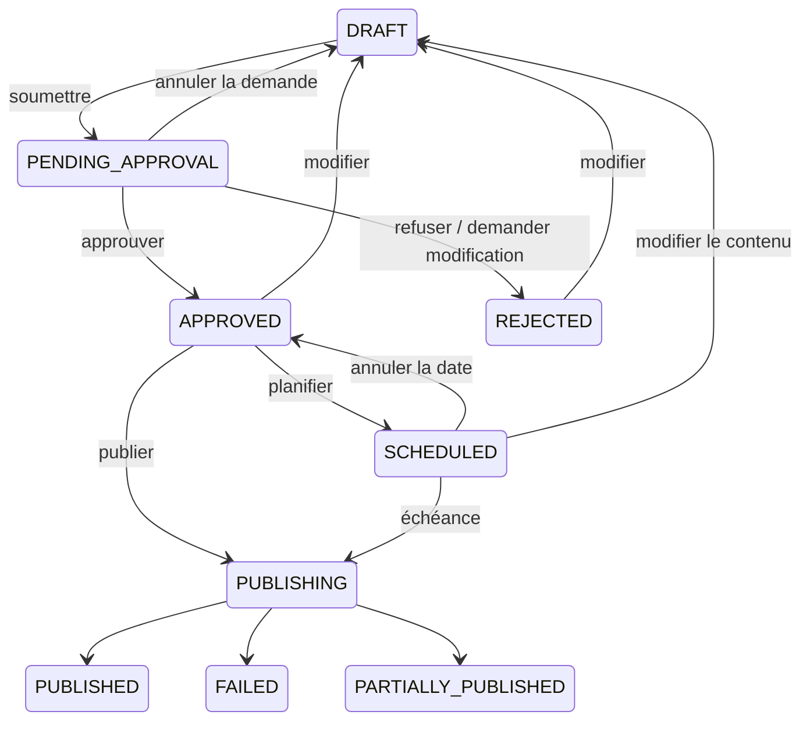

# Workflow d’approbation des publications

Une publication doit être approuvée par un `ADMIN` ou `OWNER` de sa marque avant toute planification, publication immédiate ou relance. La création enregistre toujours un brouillon, y compris pour un responsable.

## Parcours

1. Un membre avec le rôle `COMMUNITY_MANAGER` minimum prépare le brouillon et choisit ses réseaux.
2. Dans la fiche publication, il choisit un approbateur facultatif et ajoute éventuellement un commentaire. Sans affectation, tous les responsables actifs sont notifiés.
3. Le responsable ouvre **Publications → Approbations**, filtre les demandes, consulte le contenu commun, les variantes par réseau et le média, puis approuve, refuse ou demande des modifications. Un refus ou une demande de modification exige un commentaire.
4. Après approbation, le CM peut publier ou planifier. Après refus, **Modifier et renvoyer** ouvre l’éditeur ; enregistrer remet la publication en brouillon et permet une nouvelle soumission.

Tout responsable de la même marque peut traiter une demande assignée. La décision conserve l’identité du responsable effectif ; le journal conserve aussi l’affectation initiale. Le choix d’un approbateur ne crée pas une restriction d’accès supplémentaire entre administrateurs. Un responsable peut approuver sa propre publication : la spécification n’impose pas de séparation des auteurs et validateurs.

## États et protection du contenu



Une demande en attente bloque l’édition et la suppression, même pour un responsable. Son annulation est autorisée à l’auteur, au demandeur (CM minimum) et aux responsables. `VIEWER` conserve uniquement les lectures.

Toute édition incrémente `contentRevision`, efface `approvedRevision`, annule une éventuelle planification et remet le statut à `DRAFT`. Une simple annulation de date conserve l’approbation. Un contenu déjà publié, partiellement publié ou en cours d’envoi reste verrouillé ; les relances réutilisent exactement la version approuvée et ignorent les cibles déjà envoyées.

Les mutations prennent un verrou PostgreSQL sur la publication et relisent son état après acquisition. Une décision doit porter l’`approvalId` affiché : une ancienne requête réseau ne peut pas approuver une nouvelle soumission. L’index partiel `publication_approvals_one_pending` garantit une seule demande ouverte.

La création des jobs utilise la transaction Prisma. Chaque job transporte la révision autorisée. Le worker la compare à la révision du contenu et à une approbation persistée, puis vérifie encore avant chaque cible. Il refuse les anciens jobs sans révision, les approbations invalidées et les dates remplacées. Les refus d’envoi sont journalisés avec leur motif ; une planification dont l’approbation est invalide est annulée.

## API et données

Contrat détaillé : [public-api.yaml](../contracts/openapi/public-api.yaml).

| Route | Corps / filtres |
| --- | --- |
| `POST /publications/:id/request-approval` | `reviewerId?`, `comment?` |
| `POST /publications/:id/approve` | `approvalId`, `comment?` |
| `POST /publications/:id/reject` | `approvalId`, `comment` |
| `POST /publications/:id/request-changes` | `approvalId`, `comment` |
| `POST /publications/:id/cancel-approval` | `approvalId`, `comment?` |
| `GET /publications/:id/approval-history` | `page`, `pageSize` |
| `GET /approvals` | `brandId?`, `status`, `authorId?`, `reviewerId?`, `page`, `pageSize` |
| `GET /approvals/members` | `brandId` |

Toutes ces routes sont préfixées par `/api/v1`. La pagination serveur commence à 1. Les commentaires sont limités à 2 000 caractères. Les transitions invalides retournent `409`, les refus de rôle `403` et les ressources d’une autre marque `404`. Publier sans validation retourne `409 approval_required`.

`PublicationApproval` conserve une ligne par soumission, avec sa révision, le demandeur, le reviewer, le commentaire de demande, la décision et ses dates. `AuditLog` conserve les actions par ajout, avec acteur, timestamp, commentaire et statuts avant/après. Aucune route ne permet de réécrire cet historique ; modifier le contenu ne le supprime pas. La fiche mobile donne accès à son historique paginé, y compris les événements d’envoi du worker.

Les réponses publication ajoutent `authorId`, `approval`, `approvalValid` et les statuts `pending_approval`, `approved`, `rejected`. Les nouvelles notifications sont `publication_approval_requested`, `publication_approved`, `publication_rejected`, `publication_changes_requested`. La demande notifie le reviewer ou les responsables ; la décision notifie l’auteur de la publication.

Les notifications sont persistées dans la transaction de décision, dédupliquées par `(eventId, userId)` et liées à la fiche publication. Le push est déclenché après commit selon `publicationApproval`, le seuil de priorité et les heures silencieuses. Désactiver le push conserve l’historique dans l’application. Firebase non configuré n’empêche aucune décision.

## Migration et vérifications

Migration : `20260914120000_publication_approval`. Elle ajoute la table, les relations, les index, les enums et la préférence `publication_approval`. Aucune variable d’environnement supplémentaire.

Les contenus existants ne sont pas approuvés automatiquement. Les brouillons suivent le nouveau parcours. Pour une ancienne publication planifiée ou échouée, enregistrer une modification la ramène au brouillon et permet sa validation. Les publications déjà envoyées gardent leur historique ; les anciennes publications partiellement envoyées ne sont pas relançables sans validation et leur contenu reste verrouillé. Mettre à jour l’API et le worker ensemble pour appliquer les contrôles aux jobs déjà en file.

```powershell
npm --prefix services/api test
npm --prefix services/worker test
npm --prefix social-media test
npm --prefix social-media run typecheck
npm --prefix social-media run lint
docker compose build api worker
docker compose stop worker
docker compose up --detach --no-deps api
# Attendre que l’API ait appliqué les migrations avant de démarrer le worker.
docker compose up --detach --no-deps worker
node scripts/test-approval-integration.mjs
```

L’intégration utilise PostgreSQL réel et les vraies routes HTTP. Elle crée puis supprime ses utilisateurs, marques, publications et son schéma pg-boss isolé. Elle couvre les rôles, l’isolation par marque, les doubles soumissions/décisions, les demandes périmées, les corrections, les notifications, l’historique et les contrôles SQL du worker. Aucun appel réel à Meta.
